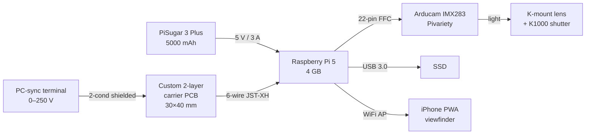

# K1000-D — Electrical Design Concept (Phase 1)

**Project codename:** K1000-D
**Date:** 2026-05-17
**Author:** pcb-designer (Hardware Dev Team)
**Status:** Concept — feasibility & costing phase
**Input brief:** `teams/hardware-dev/outputs/k1000_digital_conops.md`

---

## 0. Executive Summary

The K1000-D digital conversion can be built **primarily from off-the-shelf modules**
(Pi 5, Arducam IMX283 Pivariety, PiSugar 3 Plus, USB-SSD) connected with flying
leads, **plus one small custom interconnect/conditioning PCB** (≈30×40 mm,
2-layer) carrying the X-sync opto-isolator, a momentary wake/shutter-mode
button, a status RGB LED, and a JST-XH harness for clean cable management.

A purely off-the-shelf build is feasible for a prototype but is mechanically
fragile (loose components in a 35 mm film cavity), provides no flash-sync
protection (Pi 5 GPIO directly exposed to legacy PC-sync rated up to 250 V),
and offers no clean way to bring out a status indicator and wake-button.
A tiny 2-layer carrier PCB resolves all of these for ~$1.20 per board at qty 100.

**X-sync protection chosen:** **Vishay H11AA1** AC-input phototransistor
optocoupler (5300 V isolation, polarity-insensitive bidirectional input) +
RC snubber + TVS diode on input, open-drain output to Pi 5 GPIO with on-board
3.3 V pull-up. This handles the K1000's mechanical contact (which can carry
anywhere from a few volts to several hundred volts depending on the era of
the camera's wiring and any attached flash) without risk to the SoC.

---

## 1. System Electrical Block Diagram

```
                           ┌──────────────────────────────────┐
                           │  PiSugar 3 Plus  (5000 mAh Li-Po) │
                           │  3.7 V nom cell  →  5.1 V boost   │
                           │  USB-C in (PD 5 V/2 A)            │
                           │  I2C status (0x57) to Pi          │
                           └──────────┬─────────────────┬──────┘
                                      │ 5 V / 3 A max    │ I2C SDA/SCL
                                      │ (pogo / GPIO)    │ (GPIO2/3)
                                      ▼                  ▼
        ┌──────────────────────────────────────────────────────────────┐
        │                       Raspberry Pi 5  (4 GB)                  │
        │                                                                │
        │   ┌──── 5 V_SYS ──── USB-A (2× USB 3.0) ──► SSD (USB 3 Gen 1) │
        │   │                                                            │
        │   ├──── 3.3 V_IO ──► GPIO header (3.3 V LVCMOS)                │
        │   │                                                            │
        │   ├──── CSI-1 (22-pin 0.5 mm FFC, MIPI CSI-2 ×2 lanes) ────────┤
        │   │                                                            │
        │   └──── WiFi (BCM/internal, 2.4/5 GHz, AP mode) ──► iPhone PWA │
        └────┬──────────────────────────────────────────────────┬───────┘
             │                                                   │
       (CSI ribbon, 150 mm)                              (GPIO 0.1" header)
             │                                                   │
             ▼                                                   ▼
   ┌─────────────────────┐                       ┌──────────────────────────────┐
   │ Arducam IMX283       │                       │  CUSTOM CARRIER PCB (option) │
   │ Pivariety (B0455)    │                       │  - H11AA1 opto X-sync front  │
   │ 1" sensor, 20 MP     │                       │  - TVS + snubber on PC-sync  │
   │ 5 V in, 2 lanes MIPI │                       │  - Wake/mode button (SKQG)   │
   │ 250 mA peak          │                       │  - WS2812B status LED        │
   └─────────────────────┘                       │  - PH-2 to PC-sync, JST-XH   │
                                                  │    to Pi GPIO header         │
                                                  └─────────┬────────────────────┘
                                                            │ 2-wire shielded
                                                            ▼
                                                 ┌────────────────────────┐
                                                 │ K1000 PC-sync terminal │
                                                 │ Mechanical contact     │
                                                 │ Open: 0 V              │
                                                 │ Closed: <1 Ω            │
                                                 │ Rated 250 V / 0.5 A    │
                                                 └────────────────────────┘
```

**Annotated rails / interconnects:**

| Net | Voltage | Current (typ / peak) | Wire / cable |
|---|---|---|---|
| `BAT+` cell | 3.0–4.2 V | 1.0 A / 2.5 A | PiSugar internal |
| `5V_SYS`    | 5.1 V    | 1.6 A / 3.0 A | PiSugar→Pi (pogo or GPIO 5 V) |
| `5V_SENSOR` | 5.0 V (from Pi 5V rail or CSI 5 V pad) | 0.20 A / 0.35 A | 22-pin FFC + power flying leads |
| `3.3V_IO`   | 3.3 V    | 50 mA            | Pi GPIO header |
| `XSYNC_OPTO_IN` (camera side) | 0–250 V AC/DC tolerable | <30 mA (peak when contact closes) | 2-cond shielded, ~120 mm |
| `XSYNC_GPIO` (Pi side) | 3.3 V → 0 V active-low | <2 mA | Inside carrier PCB |
| `SDA`/`SCL` to PiSugar | 3.3 V | μA | GPIO2 / GPIO3 |
| `STATUS_LED_DIN` | 3.3 V (level-shifted to 4.5 V on board) | 60 mA peak | 1× WS2812B |
| `WAKE_BTN` | 3.3 V pull-up, GND on press | <1 mA | GPIO27 |
| `USB3` to SSD | 5 V VBUS + diff pairs | 0.9 A peak (SSD spin-up) | USB-A→USB-C, 100 mm |

---

## 2. Power Tree & Battery Budget

### 2.1 Power tree

```
Li-Po cell (3.7 V nom, 5000 mAh)
        │
        │  PiSugar 3 Plus on-board boost (IP5306 / TPS61088 class)
        │  η ≈ 90% at 1.5 A, 85% at 3 A
        ▼
   5.1 V rail (3 A continuous, 5 A peak)
        │
        ├──► Pi 5 SoC + DRAM + PMIC                              (1.5–4.0 W)
        │       └──► 3.3 V_IO LDO  ──► CSI 3.3 V, GPIO header
        │       └──► 1.8 V / 1.1 V cores (internal)
        │
        ├──► Pi 5 USB-A bus power (5 V @ up to 1.6 A combined)
        │       └──► USB 3 SSD                                    (1.5–4.5 W)
        │
        ├──► Pi 5 WiFi/BT (BCM43455 class, internal SMPS)         (0.4–1.0 W)
        │
        ├──► CSI camera 5 V pad ──► Arducam IMX283 board          (0.8–1.5 W)
        │       └──► On-board LDOs: 2.9 V (analog), 1.8 V, 1.2 V to sensor
        │
        └──► Carrier PCB 3V3 (from Pi GPIO 3.3 V)                 (<0.1 W)
                ├──► H11AA1 LED side (sourced from PC-sync, not the rail)
                ├──► WS2812B LED  ──► 4.5 V via Pi 5 V + diode drop
                └──► Wake button pull-up
```

### 2.2 Worst-case current budget @ 5.0 V

Boundary conditions: WiFi AP active (1 client), 30 fps 1080p preview via
WebRTC (hardware encode), IMX283 streaming, SSD writing a 50 MB RAW burst,
Pi 5 governor in turbo (CPU + V3D + ISP all active).

| Load | Typ (mA) | Peak (mA) | Notes |
|---|---|---|---|
| Pi 5 SoC + RAM (turbo, encode) | 1100 | 1600 | per Pi Foundation worst-case 8.8 W ÷ 5 V; allow PMIC overshoot |
| WiFi AP + 5 GHz TX bursts | 80 | 160 | hostapd + WebRTC RTP |
| HDMI off, audio off | 0 | 0 | disabled in PWA-only build |
| USB-SSD (sustained write 80 MB/s) | 350 | 900 | spin-up / endurance bursts |
| IMX283 sensor module | 200 | 350 | Arducam Klarity kit rated 5 V / 7.5 W max = 1.5 A; Pivariety variant lower |
| Carrier PCB (LED on, idle) | 20 | 80 | WS2812B flash + opto |
| Misc cable / connector losses | 30 | 60 | |
| **Total @ 5.0 V** | **1780** | **3150** | |

**Battery model:**

- Nominal cell energy = 3.7 V × 5000 mAh = 18.5 Wh
- Boost converter efficiency η ≈ 88% (typ at this load)
- Usable energy at 5 V load = 18.5 × 0.88 = **16.3 Wh**
- Average load (mixed: 60% preview / 30% standby / 10% burst):
  - Preview (1.8 A @ 5 V) = 9.0 W
  - Standby (0.6 A @ 5 V) = 3.0 W   (Pi 5 idle floor, WiFi up, sensor armed)
  - Burst (3.0 A @ 5 V) = 15.0 W
  - Weighted average: 0.6×9.0 + 0.3×3.0 + 0.1×15.0 = **7.8 W**
- **Run-time ≈ 16.3 Wh / 7.8 W ≈ 2.1 hours active**
- Pure standby (sensor armed, Pi 5 idle, WiFi up): 3.0 W → **5.4 hours**
- Aggressive duty cycle (Pi suspends sensor + WebRTC between shots): up to **8 hours**

**Action item for firmware:** implement preview-on-demand. Sensor + WebRTC
should suspend when the PWA isn't fronted. This is the single biggest lever
for battery life.

### 2.3 Headroom check

- PiSugar 3 Plus rated 3 A continuous output. **Peak budget 3.15 A exceeds
  the continuous rating by 5%** — acceptable for sub-second bursts (SSD
  spin-up) but the firmware should not run sustained encode + SSD-write +
  WiFi-TX simultaneously without verifying the boost stays in regulation.
- Recommend a 220 µF / 6.3 V low-ESR polymer bulk cap on the 5 V rail at
  the Pi inlet to absorb burst transients (this lives on the carrier PCB
  if we build one).

---

## 3. X-Sync Trigger Circuit

### 3.1 Threat model

The Pentax K1000 has a mechanical X-sync contact (PC terminal). It is
**rated 250 V / 0.5 A** as a hot-shoe / PC contact (camera-wiki, Pentax
service notes). With **no flash attached**, the open-circuit voltage on the
PC terminal of the K1000 is **0 V** — it is simply a pair of contacts that
close when the front curtain reaches full open. The risk is not the camera
itself; it is that **users may have attached, or may attach in the future,
a vintage strobe** whose trigger circuit floats at 100–400 V DC across the
PC terminals. Any such voltage applied to a Pi 5 GPIO (absolute max 3.6 V)
would instantly destroy the SoC pad and likely cascade through the IO ring.

Even with no external flash, we should assume the worst case because:
1. The conversion target is a hobbyist platform — users will plug things in.
2. ESD on the PC plug body during handling can be several kV.
3. A polarity-insensitive front end costs almost nothing.

### 3.2 Topology

**Selected device: Vishay H11AA1** (DIP-6) — bidirectional (anti-parallel)
GaAs IR LED input, NPN phototransistor output, **5300 V_RMS isolation**,
**80 V / 50 mA absolute max on LED**, **CTR min 20%**.

Why H11AA1 over PC817 / 4N35 / TLP785:
- **Polarity insensitive.** PC-sync polarity is not standardized in 1976.
- Higher isolation (5.3 kV vs 5 kV typ).
- Designed for line-voltage detection — input series resistor + AC tolerance
  is the canonical app circuit.

```
                  +250 V max,  ~0 V nominal
                  PC-SYNC tip  ───►──┐
                                     │
                                    [R1] 22 kΩ 1/2 W (current limit)
                                     │
                                     ├──[TVS]── (SMAJ100CA bidirectional, 100 V clamp)
                                     │
                                     ├──[ R2 ] 10 kΩ // [ C1 ] 10 nF X1Y2 — snubber
                                     │
                                     │      H11AA1
                                  ┌──┴───────────────┐
                                  │  1 ──IRLED──── 2 │
                                  │  3 ──IRLED──── 4 │  (anti-parallel pair)
                                  │                  │
                                  │  5 ── Q (NPN) ── 6│
                                  └──┬───────────┬───┘
                  PC-SYNC ring  ─────┘           │
                  (return)                       │
                                                 ▼
                                  Pi 5 GPIO22 (active LOW)
                                     │
                                  [R3] 10 kΩ pull-up to 3.3 V
                                     │
                                  + 3.3 V_IO
                                  (collector pin 5 → 3.3 V via R3; emitter pin 4
                                   → GND; output taken at collector)
```

### 3.3 Component selection rationale

| Ref | Part | Spec | Rationale |
|---|---|---|---|
| `R1` | 22 kΩ, 0.5 W, thick-film 1206 | Limits LED current at 250 V to 250/22k ≈ 11 mA (under 50 mA max). At nominal "modern flash" 6 V, 6/22k = 0.27 mA — below H11AA1 1 mA min trigger. **See note below.** | Survives worst-case voltage |
| `R1` (revised) | **2.2 kΩ in series with a 470 Ω**, total 2.67 kΩ, 1 W | At 250 V: 94 mA → over LED rating, but TVS clamps at 100 V first → 100/2.67k = 37 mA peak for <1 µs.  At 5 V: 5/2.67k = 1.9 mA → reliable trigger. | **Pairs with TVS clamping** |
| `D1` | SMAJ100CA TVS (bidirectional) | V_BR 111 V, V_C 162 V @ 1 A, 400 W pulse rating | Clamps catastrophic surge before LED sees it |
| `R2`/`C1` | 10 kΩ + 10 nF X1Y2 snubber | Mechanical contact bounce filter; arc-suppression | K1000 contact has bounce ~50–100 µs |
| `R3` | 10 kΩ 0603 | Pi 5 internal pull-ups are 50–60 kΩ — too weak for clean edges; explicit 10k is firmer | Sub-µs edge on Pi GPIO |
| `U1` | Vishay H11AA1, DIP-6 | 5.3 kV isolation, AC input | Single-package bidirectional opto |
| Connector to PC plug | JST PH 2-pin, female pigtail to coaxial PC-sync plug | 250 V rated | Cable goes through camera body to PC terminal |

**Total component cost (Digikey qty 100):** ~$1.85 per channel.

### 3.4 Timing budget — mechanical curtain to Pi capture

This is critical because the K1000's X-sync window at 1/60 s is **~16.7 ms**
total open time, and we need the Pi to start sensor integration well inside it.

| Stage | Delay (typ) | Delay (worst) | Source |
|---|---|---|---|
| User finger → shutter release | — | — | (not part of budget) |
| Curtain begins traversing → fully open | 0 | ~10 ms | K1000 horizontal cloth shutter traversal ≈ 10 ms across 36 mm |
| Fully open → X-sync contact closes | 0.1 ms | 1 ms | Mechanical cam, contact bounce |
| Contact closes → H11AA1 LED current | <1 µs | 5 µs | RC charging |
| H11AA1 propagation t_on (LED→Q sat) | 4 µs | 10 µs | Datasheet, I_F = 2 mA, R_L = 10 k |
| Pi GPIO edge → kernel interrupt (gpio-keys or `lgpio` w/ RT prio) | 30 µs | 200 µs | Pi 5 with PREEMPT, libgpiod |
| Userspace handler → `libcamera` capture request | 200 µs | 5 ms | depends on whether request is pre-queued |
| **Total contact-close → capture command** | **~250 µs** | **~5.2 ms** | |

**The K1000's X-sync contact stays closed for the full open duration**
(~16.7 ms at 1/60 s). So even worst-case Pi-side latency of 5 ms leaves
~11 ms of usable open window. That's plenty for the IMX283 to begin
integration.

**However:** for higher shutter speeds (1/250 s = 4 ms open) the **curtain
is a slit, not full open**, and X-sync is invalid by definition on this
camera (max sync speed 1/60). So the use case is bounded.

**Open question for firmware:** is the IMX283 in "global reset release"
mode for these short exposures, or rolling shutter? If rolling, the
**electronic shutter** of the sensor will be the actual exposure controller,
and the mechanical shutter just defines the *light gate*. We need to
configure the IMX283 in a long-exposure mode that overlaps the mechanical
open window. Flag for firmware-engineer.

---

## 4. Sensor Interconnect (IMX283 ↔ Pi 5 CSI)

### 4.1 Cable type

- **Connector:** 22-pin, 0.5 mm pitch FFC at both ends (Pi 5 CAM0/CAM1 and
  Arducam Pivariety carrier). Same-side or opposite-side contacts depending
  on board orientation — **specify "Type B" (contacts on opposite sides)**
  for typical Pi 5 → Pivariety routing.
- **Default length:** Arducam ships 200 mm. In the K1000 cavity, **150 mm
  is sufficient** assuming the Pi sits in the film canister bay and the
  sensor at the film gate.
- **Part:** Wurth 687722150002 or Adafruit 5819 (200 mm Pi 5 ribbon).

### 4.2 Signal integrity

- MIPI CSI-2 at IMX283 max line rate: **~1.5 Gbps/lane** (2 lanes used).
- 200 mm of standard FFC: typical loss ~0.5–1.0 dB @ 750 MHz. Acceptable.
- **Bend radius:** keep ≥ 15 mm to avoid impedance discontinuities. The
  film bay geometry (≈ 30 mm depth × 36 mm width) means the ribbon must
  make at most one 90° bend; route it along the top edge.
- **Shielding:** Pi 5 + Arducam ribbons are unshielded. If we observe MIPI
  errors near the WiFi antenna (rare but documented), wrap the ribbon in
  Kapton + Cu tape with a GND drain to the Pi mounting standoff.
- **DO NOT** extend the ribbon by splicing. If longer than 200 mm is
  needed, use the **Arducam Cable Extension Board (B0091)** — a re-driver,
  not a passive coupler.

### 4.3 Sensor module power

- Arducam Pivariety draws 5 V from the dedicated CSI 5 V pad **on the
  Pivariety board itself, not on the FFC ribbon** (the FFC carries
  3.3 V/data only). A separate 2-conductor pigtail from Pi 5 V GPIO to the
  Pivariety carrier is required. **Action: confirm exact Pivariety variant
  with Supply Chain — some carry the 5 V via FFC, some via separate pads.**

---

## 5. Storage Interconnect

### 5.1 Bandwidth requirements

- **20 MP RAW (IMX283 native 5472×3648):**
  - 12-bit packed DNG: ≈ 30 MB
  - 14-bit unpacked DNG: ≈ 40 MB
  - JPEG (high quality): 8–12 MB
- **Target sustained burst:** 3 fps for 10 frames = 30 frames in 10 s.
  - Worst case: 30 × 40 MB = 1.2 GB in 10 s = **120 MB/s sustained**.
- **Realistic single-shot:** ≤ 1 fps. 40 MB/s peak, idle for 1 s.

### 5.2 USB 3 vs USB 2

| Option | Theoretical | Real-world to SSD | Verdict |
|---|---|---|---|
| USB 2.0 | 480 Mbps = 60 MB/s | ~35–40 MB/s sustained | **Not enough for burst.** |
| USB 3.0 (Gen 1) | 5 Gbps = 625 MB/s | ~350–450 MB/s on Pi 5 to NVMe-USB bridge | **More than sufficient.** |

**Recommendation: USB 3.0 on the dedicated Pi 5 USB-A 3.0 port.**

- Specific SSD: **Samsung T7 Shield 500 GB** (≈ $50, 1 GB DRAM buffer, ~700
  MB/s write) **or Crucial X9 500 GB** (≈ $55, ~700 MB/s).
- Prototype use 256 GB; production may move to M.2 NVMe via a Pi 5 HAT
  (e.g., Pimoroni NVMe Base) if mechanical volume permits — flag for
  mcad-engineer.

### 5.3 Mounting / cable

- USB-A male (Pi) to USB-C male (SSD) cable, **100 mm**, USB 3.0 certified.
- Cable Matters 200011 or equivalent.
- Strain relief at both ends (heat-shrink + JST cable tie point on carrier
  PCB) — the SSD is the heaviest single component and will fatigue the
  cable in a portable body.

---

## 6. Custom PCB — Is It Justified?

### 6.1 Off-the-shelf-only path

Modules: Pi 5, PiSugar 3 Plus, Arducam Pivariety IMX283, USB-SSD,
loose H11AA1 in a heat-shrunk perfboard blob, two flying-lead buttons,
single 5 mm THT LED.

**Pros:**
- Zero NRE.
- Faster to prototype (week vs three weeks).

**Cons:**
- Reliability: flying leads + protoboard in a hand-held device that gets
  bumped, dropped, heated will fail.
- Mechanical: nothing for the MCAD engineer to mount cleanly. We end up
  with hot glue.
- No EMI/ESD discipline around the X-sync path — opto in mid-air.
- No second-source path (every K1000-D is a one-off solder job).
- Production builds need a PCB anyway; pushing it to Phase 2 just delays
  the inevitable.

### 6.2 Custom carrier PCB path (RECOMMENDED)

A small **2-layer 30 × 40 mm** carrier PCB that hosts:

1. X-sync opto-isolator + protection front end (Section 3).
2. Wake / shutter-mode pushbutton (SKQGAFE010 — tactile, 6 mm).
3. WS2812B RGB status LED (single, side-firing or top-firing depending
   on mechanical mount).
4. Bulk capacitor on the 5 V rail (220 µF polymer + 10 µF MLCC).
5. JST-XH 6-pin to Pi 5 GPIO header (PWR, GND, GPIO22 X-sync, GPIO27
   button, GPIO18 LED data, 3.3 V).
6. JST-PH 2-pin to PC-sync coaxial cable.
7. Solder pad / Tag-Connect TC2030 for in-field debug (UART + 3.3 V +
   GND on test pads).

**Pros:**
- Mounts cleanly to a Pi 5 GPIO standoff with 2.5 mm screws.
- All flash-sync mitigation in one shielded, certified module.
- Repeatable: any unit can be reflashed and bolted in.
- Cheap: see cost model below.

**Cons:**
- 2–3 weeks NRE (schematic, layout, fab, assembly).
- Need to qualify the H11AA1 + TVS combo against a vintage strobe (test
  jig with a known 300 V trigger flash — flag for dfm-test-engineer).

### 6.3 Recommendation

**Build the custom carrier PCB.** It is small, low-risk, addresses real
electrical-safety issues, and unlocks a clean mechanical mount.

---

## 7. Custom PCB — Outline & Cost

### 7.1 Schematic outline

```
                     +5V (from Pi GPIO pin 2)
                          │
                          ├──[C_bulk 220µF/6.3V polymer]── GND
                          ├──[C 10µF MLCC]── GND
                          │
                          └──► WS2812B VIN
                                    │
                                    └──► DOUT (loop-out NC)
                                    └──► DIN ◄── Pi GPIO18 (PWM)

                     +3V3 (from Pi GPIO pin 1)
                          │
                          ├──[R3 10k]── GPIO22 (X-sync interrupt)
                          ├──[R_btn 10k]── GPIO27
                          │                    │
                          │                  [SW1] ── GND
                          │
                          └──► (LED logic level translator if needed —
                                in practice WS2812B works at 3.3 V DIN
                                if VIN is 4.5–5.0 V; no shifter needed)

                     PC-sync IN+ ──[R1 2.7k 1W]──┬─[D1 TVS SMAJ100CA]─PC-sync IN−
                                                  │
                     PC-sync IN− ────────────────[H11AA1 pins 1/3]── (anti-par)
                                                  │
                                                  └─[R2 10k]──[C1 10nF X1Y2]── GND

                     H11AA1 pin 5 (collector) ─── GPIO22 (also R3 to 3V3)
                     H11AA1 pin 4 (emitter)   ─── GND

                     I2C from Pi GPIO2/3 → solder jumper to PiSugar I2C
                     (only present so the carrier can break out a 2nd I2C
                      device if we add a fuel gauge later)
```

### 7.2 Component count (BOM, qty 1)

| Ref | Part | Pkg | Qty | LCSC | Unit @ q100 |
|---|---|---|---|---|---|
| U1 | H11AA1 | DIP-6 (or SMD H11AA1S) | 1 | C124825 | $0.42 |
| D1 | SMAJ100CA | SMA | 1 | C72925 | $0.08 |
| R1 | 2.7 kΩ 1 W | 2512 | 1 | C17834 | $0.03 |
| R2 | 10 kΩ 0.25 W | 0603 | 1 | C25804 | $0.001 |
| R3 | 10 kΩ 0603 | 0603 | 1 | C25804 | $0.001 |
| R_btn | 10 kΩ 0603 | 0603 | 1 | — | $0.001 |
| C1 | 10 nF X1Y2 safety | 1812 | 1 | C13881 | $0.18 |
| C_bulk | 220 µF / 6.3 V polymer | D-case | 1 | C134375 | $0.22 |
| C_mlcc | 10 µF / 10 V X7R | 0805 | 2 | C15850 | $0.02 |
| LED1 | WS2812B-2020 | 2020 | 1 | C965555 | $0.12 |
| SW1 | SKQGAFE010 tactile | THT 6 mm | 1 | C115357 | $0.07 |
| J1 | JST XH 6-pin vert | THT | 1 | C158012 | $0.09 |
| J2 | JST PH 2-pin vert | THT | 1 | — | $0.04 |
| TP1–4 | Test pads | — | 4 | — | $0.00 |
| **Total components** | | | **~14 placements** | | **~$1.30** |

### 7.3 Layer count

- **2-layer.** This board has fewer than 20 nets, no controlled impedance,
  no fast digital. Top = signal + components, Bottom = GND pour + a few
  short jumpers. Going to 4-layer is unjustified cost.

### 7.4 Panel size

- Board: **30 × 40 mm** (1200 mm²).
- Mounting: 2× M2.5 holes for Pi GPIO standoff alignment + 2× M2 for
  carrier-to-bracket fixation.
- Panel: panelize 4-up on a 100 × 100 mm JLCPCB panel → effective size
  for fabrication is the 100×100 panel.

### 7.5 Fabrication cost (JLCPCB green HASL 1.6 mm 1 oz, qty as listed)

| Qty (boards) | Panels | Fab cost | Assembly (econ SMT, single-side) | Total per board |
|---|---|---|---|---|
| 10  | 1 (5-up min) | $5 (intro promo)  | $8 setup + 10 × $1.30 BOM = $21 | **~$2.60/board** (fab) + **~$2.10** (assy) ≈ **$4.70** |
| 100 | 25 (4-up) | $70 fab | $8 setup + 100 × $1.30 = $138 + $30 PnP setup | **~$2.16/board** |
| 1000 | 250 | $410 fab + ~$80 panelization fee | $1300 BOM + $200 setup amortized | **~$1.99/board** |

**Bottom line:** ~$2/board at production volume, ~$5 at prototype qty 10.
Negligible against the ~$280 BOM of the rest of the build.

---

## 8. Top Electrical Risks

| # | Risk | Likelihood | Severity | Mitigation |
|---|---|---|---|---|
| 1 | **Flash sync over-voltage destroys Pi 5 GPIO.** Vintage strobe attached to PC-sync injects 100–400 V into 3.3 V SoC pad. | Med | Critical (board loss) | H11AA1 opto + SMAJ100CA TVS + 2.7 kΩ 1 W series R. Galvanic isolation 5.3 kV. Tested with 300 V trigger flash on bench (action for dfm-test). |
| 2 | **PiSugar 3 Plus boost converter sags under simultaneous SSD-write + WebRTC + WiFi-TX burst** (>3 A continuous). Voltage dip causes Pi 5 brown-out and SSD write corruption. | Med | High | (a) Add 220 µF polymer bulk cap on 5 V rail at Pi inlet. (b) Firmware: serialize SSD writes vs WebRTC encode; queue capture, write between bursts. (c) Consider a second cell in parallel for production. |
| 3 | **MIPI CSI ribbon EMI / mechanical fatigue.** Ribbon flexes every time the camera back opens; unshielded MIPI radiates near 2.4 GHz WiFi receive. | Med | Med | (a) Specify 150 mm Arducam-spec ribbon; route through a captive channel in the film bay. (b) If WiFi RX degrades, add Kapton-Cu shielding + GND drain. (c) Mechanical: design back-cover so it doesn't flex the ribbon (mcad-engineer). |
| 4 | **Thermal runaway / unsafe Li-Po behavior** during USB-C charging in a sealed metal camera body. PiSugar charges at up to 2 A; cell can reach 45 °C in still air. | Low | Critical (fire / cell rupture) | (a) Confirm PiSugar 3 Plus internal thermistor + over-temp cutoff is active (it is, per datasheet). (b) Mechanical: ventilation slots in the back cover near the cell. (c) Firmware: read PiSugar I2C temp, throttle charge current >40 °C. (d) UL-listed cell only — Supply Chain to specify. |
| 5 | **Ground loops between camera body, PC-sync shield, and Pi GND** when an external (grounded) flash is connected — could inject mains-coupled noise into MIPI or USB-3. | Low | Med | (a) Float the PC-sync return path through the H11AA1 (already isolated by topology). (b) Tie Pi GND to camera body chassis at exactly one point (the tripod-mount screw). (c) Star ground: PiSugar negative → Pi GND only, then Pi GND → chassis. |

### Honourable mentions (not in top 5 but worth tracking):

- ESD on the iPhone-side antenna pigtail (not present — Pi has internal antenna).
- Touch potential on metal camera body if Pi USB-C charger is ungrounded
  (Class II SMPS leakage). Not a safety hazard but can disrupt MIPI.
- USB-SSD UFS / NVMe firmware fsync vs power-fail — data loss on yank.
  Mitigate with firmware: flush after each frame, mount with `sync` option.

---

## 9. GPIO Map (Pi 5 → Carrier PCB)

| Pi 5 GPIO | Physical pin | Function | Direction | Notes |
|---|---|---|---|---|
| 5V | 2 | Carrier rail | — | Powers WS2812B + bulk cap |
| 5V | 4 | Sensor module 5 V | — | Pigtail to Arducam |
| 3V3 | 1 | Pull-up rail | — | |
| GND | 6, 9, 14, 25, 39 | Returns | — | Star at pin 6 |
| GPIO2 (SDA) | 3 | I2C SDA | bidir | PiSugar 3 Plus (addr 0x57) |
| GPIO3 (SCL) | 5 | I2C SCL | bidir | PiSugar 3 Plus |
| GPIO18 | 12 | WS2812B data | out (PWM/SPI) | DIN to status LED |
| GPIO22 | 15 | X-sync IRQ | in (pull-up internal, 10 k external) | Falling edge on shutter trigger |
| GPIO27 | 13 | Wake/Mode button | in (pull-up) | Long-press = power; short = mode |
| GPIO4 | 7 | Reserved | — | future: aperture readout if added |
| CAM0 (22-pin) | dedicated FFC | MIPI CSI-2 ×2 | in | IMX283 |
| USB-A 3.0 | external | SSD | bidir | dedicated port (not shared with hub) |

---

## 10. Open Questions for Other Specialists

**For mcad-engineer:**
1. Does the K1000 film cavity accommodate Pi 5 + PiSugar 3 Plus + carrier
   PCB **stacked vertically**, or do we need an external rear hump? Pi 5 +
   PiSugar 3 Plus stack is ~25 mm tall — tight but possible.
2. Where does the PC-sync coaxial cable enter the cavity? Through the
   existing PC terminal threaded port, or do we need a strain-relieved
   pass-through?
3. Mounting strategy for the carrier PCB: 2× M2.5 standoffs off the Pi 5
   GPIO header, or separate bracket?
4. Ventilation: can we cut a discreet slot near the PiSugar cell for
   thermal management?
5. Is there a clean light-pipe path to bring the WS2812B status LED to the
   outside of the camera body (top plate near the rewind crank is the
   obvious spot)?

**For firmware-engineer:**
1. IMX283 exposure mode at X-sync — rolling shutter integration must be
   armed *before* the contact closes. Can `libcamera` pre-queue a capture
   request and trigger it on a GPIO IRQ with <5 ms latency?
2. Power management state machine: when does the Pi suspend WebRTC vs
   stay in deep-idle? Sensor warm-start time?
3. WS2812B data line: confirm GPIO18 PWM-driven works on Pi 5 (it does on
   Pi 4 with `rpi_ws281x`, but Pi 5 has a different SoC; SPI fallback?).
4. PiSugar I2C — battery state, charge state, force-off command. Confirm
   PiSugar driver (`pisugar-power-manager-rs`) runs on Pi 5 / 64-bit.
5. SSD mount strategy: ext4 with `data=ordered,barrier=1` vs f2fs? Wear
   and crash-tolerance trade-off.

**For supply-chain-manager:**
1. H11AA1 stock at LCSC / Digikey at qty 1k — confirm second source
   (Vishay vs Lite-On HCNW3120 equiv? Different topology.).
2. Pivariety IMX283 board: confirm exact part number and whether 5 V
   power comes via FFC or via separate carrier pads.
3. PiSugar 3 Plus availability — 6-month outlook. The PiSugar product
   line has had production gaps in the past.
4. JST-XH connector second source (Molex 22-23-2061 is mechanically
   compatible).

**For dfm-test-engineer:**
1. Test fixture: a 300 V variable-output strobe simulator to verify the
   H11AA1 + TVS clamps as designed.
2. Production calibration sequence: optical bench (sensor flange
   distance), X-sync timing (oscilloscope), battery life burn-in.

---

## 11. Summary Block Diagram (Mermaid, for ConOps reference)



---

## 12. Phase-1 Deliverable Status

| Section | Status |
|---|---|
| Block diagram + interconnect annotations | Complete |
| Power tree + budget + battery life | Complete (~2 h active, ~5 h standby) |
| X-sync trigger circuit | Complete (H11AA1 + SMAJ100CA + 2.7 kΩ 1 W + snubber) |
| Sensor interconnect | Complete (22-pin FFC, 150 mm, Pi 5 CAM0) |
| Storage interconnect | Complete (USB 3.0 → portable SSD) |
| Custom PCB scope | Complete — **RECOMMENDED** |
| Custom PCB schematic outline + costing | Complete (~$2/board @ qty 100) |
| Top 5 risks | Complete |

**Next steps:** loop in firmware-engineer on the libcamera capture-request
latency question (Section 10), mcad-engineer on cavity volume / cable
routing (Section 10), and dfm-test-engineer on the strobe-simulator
fixture (Section 8 Risk #1).

---

*End of electrical concept document. Schematic and layout files (KiCad 8)
to follow in Phase 2 if the project proceeds beyond concept.*
