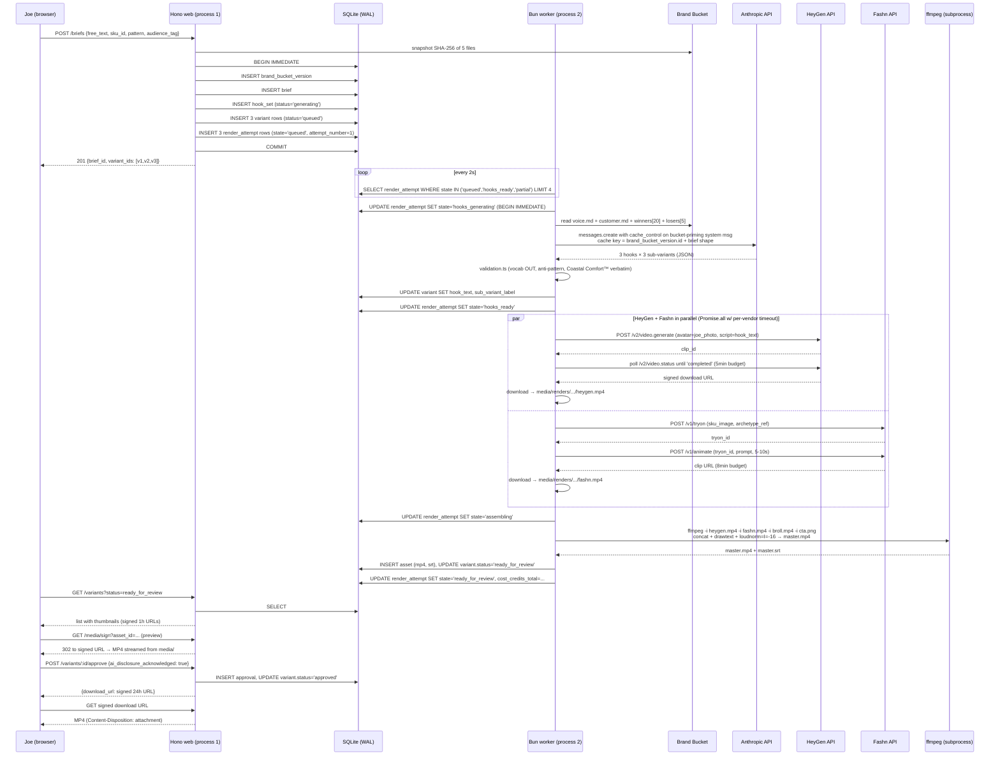

# Software Architecture Document: Saltwater AI Ads (Sprint 1)

**Version:** 0.2
**Last Updated:** 2026-04-30 PM
**Author:** Nick DeMarco (with AI assistance — Software Architecture agent draft, internal-eng-v0.4 review patches)
**Status:** Patched against PRD v0.4 + internal eng review v0.4 — TW Connector section reflects actual API surface; schema references redirect to v0.4 tables (`account_metric_snapshot` / `order_journey` / `ad_performance` instead of deprecated `performance_snapshot`).
**PRD Reference:** `docs/saltwater-ads/PRD.md` **v0.4**
**Eng Reviews:** `docs/saltwater-ads/reviews/eng-codex.md` (PRD v0.3 challenge), `docs/saltwater-ads/reviews/internal-eng-v0.4.md` (this doc + scaffold pre-Codex review)

---

## 1. Architecture Overview

Saltwater AI Ads Sprint 1 ships as a **single-tenant, two-process Bun application** behind a magic-link-gated web SPA. There is no Kubernetes, no serverless, no message broker — just one Hono server, one worker loop, one SQLite file with WAL, and one media volume. The split is deliberate: the web process must stay snappy for Joe's brief submissions and review queue, while the worker holds long-running vendor calls (HeyGen up to 3 min p95, Fashn up to 2 min, FFmpeg 30–60s) without blocking HTTP.

### 1.1 Topology

```
                     ┌──────────────────────────────────────┐
                     │   Joe's browser (Vite/React SPA)     │
                     │   served as static assets by Hono    │
                     └──────────────────┬───────────────────┘
                                        │ HTTPS, signed cookie session
                                        ▼
       ┌────────────────────────────────────────────────────────────┐
       │  Process 1: Bun web server (Hono)                          │
       │  src/server/index.ts                                        │
       │   - REST API (briefs, variants, approvals, settings)       │
       │   - Static SPA serving                                      │
       │   - Magic-link auth, signed-cookie sessions                 │
       │   - Signed-URL minting for media reads                      │
       └─────────────┬─────────────────────────┬────────────────────┘
                     │                         │
                     ▼                         ▼
       ┌─────────────────────────┐   ┌──────────────────────────┐
       │  data/saltwater.db      │   │  media/                  │
       │  SQLite, WAL mode       │   │  per-ad MP4/JPG/SRT      │
       │  (single writer)        │   │  gitignored, backed up   │
       └─────────────┬───────────┘   └──────────────────────────┘
                     │ shared file (WAL safe)
                     ▼
       ┌────────────────────────────────────────────────────────────┐
       │  Process 2: Bun worker (poll loop)                          │
       │  src/worker/poll-jobs.ts                                    │
       │   - Polls render_attempt for state ∈ pollable set           │
       │   - Calls Hook Generator (Claude API)                       │
       │   - Calls HeyGen + Fashn in parallel (Promise.all)          │
       │   - Drives state machine transitions                        │
       │   - Calls Assembly (FFmpeg) on completion                   │
       └────────────────────────────────────────────────────────────┘
                     │
                     ▼
   ┌────────────────────────────────────────────────────────────────┐
   │  External vendors (HTTPS, server-side keys only)                │
   │   - Anthropic Claude Sonnet 4.6  (lib/llm/anthropic.ts)         │
   │   - HeyGen Team API              (lib/services/render-orchestrator.ts) │
   │   - Fashn.ai Pro                 (lib/services/render-orchestrator.ts) │
   │   - Triple Whale Enterprise REST (lib/services/tw-connector.ts)        │
   │   - Resend (transactional email) (lib/services/auth-email.ts)          │
   └────────────────────────────────────────────────────────────────┘
```

### 1.2 Where each PRD §6.1 component lives in code

| PRD component | Code location | Process |
|---|---|---|
| Brand Bucket Manager (§6.1.1) | `lib/services/brand-bucket-manager.ts` | both (read), web (write) |
| Hook Generator agent (§6.1.2) | `lib/services/hook-generator.ts` + `lib/llm/anthropic.ts` | worker |
| Triple Whale Connector (§6.1.3) | `lib/services/tw-connector.ts` | both (web on-demand sync, worker for read priming) |
| Render Orchestrator (§6.1.4) | `lib/services/render-orchestrator.ts` | worker |
| Assembly (§6.1.5) | `lib/services/assembly.ts` (shells out to ffmpeg) | worker |
| Meta Pusher (§6.1.6) | _deferred Sprint 2_ | n/a |

The agent vs services distinction from PRD §6.1 is preserved at the module boundary: `hook-generator.ts` is the only service that calls `lib/llm/anthropic.ts`. Everything else is deterministic TypeScript.

---

## 2. Module Map

```
apps/saltwater-ads/
├── package.json                       # bun, hono, vite, react, zod, drizzle-orm (or raw bun:sqlite)
├── tsconfig.json
├── vite.config.ts                     # SPA build → dist/ served by Hono
├── bunfig.toml
├── README.md
│
├── src/
│   ├── server/                        # Hono web process
│   │   ├── index.ts                   # entrypoint: createApp(), Bun.serve()
│   │   ├── app.ts                     # Hono app factory, middleware chain
│   │   ├── middleware/
│   │   │   ├── auth.ts                # session-cookie verifier
│   │   │   ├── audit.ts               # writes audit_log on mutating routes
│   │   │   ├── error.ts               # JSON error envelope, log + redact
│   │   │   └── request-id.ts          # correlation ID per request
│   │   ├── routes/
│   │   │   ├── auth.ts                # POST /auth/magic, GET /auth/verify, POST /auth/logout
│   │   │   ├── briefs.ts              # POST /briefs, GET /briefs/:id
│   │   │   ├── variants.ts            # GET /variants, GET /variants/:id, POST /variants/:id/approve, POST /variants/:id/reject, POST /variants/:id/regen
│   │   │   ├── settings.ts            # GET /settings, POST /settings/secrets, POST /settings/tw-sync
│   │   │   ├── media.ts               # GET /media/sign?asset_id= → 302 to signed URL
│   │   │   └── health.ts              # GET /healthz, GET /readyz
│   │   └── signing.ts                 # HMAC signed-URL mint + verify (1h preview, 24h download)
│   │
│   ├── web/                           # Vite + React SPA
│   │   ├── index.html
│   │   ├── main.tsx
│   │   ├── App.tsx                    # router (generate / review / settings)
│   │   ├── api.ts                     # typed fetch client (zod-validated)
│   │   ├── pages/
│   │   │   ├── Generate.tsx           # S-1 (PRD §6.2)
│   │   │   ├── ReviewQueue.tsx        # S-2 master-detail
│   │   │   └── Settings.tsx           # S-3
│   │   ├── components/
│   │   │   ├── StatusPill.tsx         # READY/RENDERING/APPROVED/FAILED
│   │   │   ├── VariantCard.tsx
│   │   │   ├── BriefForm.tsx
│   │   │   └── BottomStrip.tsx        # status pill queue strip
│   │   └── styles/
│   │       └── tokens.css             # navy #1a3a5c, red #c8102e, sand neutrals
│   │
│   └── worker/                        # Bun worker process
│       ├── poll-jobs.ts               # entrypoint: while(true) { tick(); sleep(2s); }
│       ├── tick.ts                    # one polling iteration, claims jobs
│       ├── pipeline.ts                # runs one render_attempt through state machine
│       └── deadlines.ts               # 15-min ceiling enforcement, vendor budget timers
│
├── lib/
│   ├── llm/
│   │   ├── anthropic.ts               # Claude Sonnet 4.6 wrapper, prompt cache, retries
│   │   ├── prompts/
│   │   │   ├── hook-system.md         # bucket-priming system prompt template
│   │   │   └── hook-user.md           # brief-shaped user prompt template
│   │   └── types.ts                   # Hook, HookSet, GenerationResult
│   │
│   └── services/
│       ├── brand-bucket-manager.ts    # F-BBM-1..6 (read bucket files, write JSONL appends, version snapshot)
│       ├── hook-generator.ts          # F-HG-1..6 (the agent: brief → 3 hooks × 3 sub-variants)
│       ├── tw-connector.ts            # F-TW-1..10 — see PRD v0.4 §6.1.3: account-level summary + per-order journey post-processing. NO per-ad spend via key auth. Stores into account_metric_snapshot + order_journey + ad_performance (NOT the deprecated performance_snapshot).
│       ├── render-orchestrator.ts     # F-RO-1..7 (HeyGen + Fashn parallel, idempotent cache)
│       ├── assembly.ts                # F-AS-1..6 (FFmpeg shell-out, loudnorm, captions)
│       ├── auth-email.ts              # Resend client, magic-link mint
│       ├── secrets.ts                 # loads data/secrets.env, presence checks
│       └── validation.ts              # F-HG-6 vocab/anti-pattern/trademark gate
│
├── db/
│   ├── client.ts                      # bun:sqlite singleton, WAL pragma, foreign_keys=ON
│   ├── migrate.ts                     # `bun run db:migrate` runner; reads schema_version
│   ├── backup.ts                      # `bun run db:backup` → data/backups/saltwater-YYYY-MM-DD.db
│   └── migrations/
│       ├── 0001_init.sql              # PRD v0.4 §6.6 tables (brand_bucket_version, brief, hook_set, variant, render_attempt, asset, approval, publish_event, account_metric_snapshot, order_journey, ad_performance) + auth_token + audit_log + schema_version. NO performance_snapshot — deprecated for Sprint 1, returns Sprint 2+ once Meta Ads API provides per-ad spend.
│       ├── 0002_indexes.sql           # render_attempt(state), variant(status), perf(meta_ad_id, snapshot_date)
│       └── 0003_b_roll_index.sql      # b_roll_clip table (path, tags, duration)
│
├── assets/
│   ├── fonts/
│   │   └── saltwater-display.ttf      # bundled font (PRD §7.4)
│   └── overlays/
│       ├── logo-corner.png
│       └── cta-card.png
│
├── data/                              # gitignored
│   ├── saltwater.db
│   ├── saltwater.db-wal
│   ├── saltwater.db-shm
│   ├── secrets.env
│   └── backups/
│
├── media/                             # gitignored, served via signed URL only
│   └── renders/YYYY-MM-DD/<variant_id>/{master.mp4,master.srt,thumb.jpg,heygen.mp4,fashn.mp4}
│
├── test/
│   ├── fixtures/                      # golden-media inputs (PRD §7.4)
│   │   ├── heygen-sample.mp4
│   │   ├── fashn-sample.mp4
│   │   ├── broll-sample.mp4
│   │   └── expected-master.mp4
│   ├── unit/
│   │   ├── state-machine.test.ts
│   │   ├── validation.test.ts
│   │   └── signing.test.ts
│   └── integration/
│       ├── brief-to-review.test.ts    # mocks HeyGen/Fashn HTTP, real ffmpeg
│       └── tw-sync.test.ts            # mocked TW responses
│
└── scripts/
    ├── dev.sh                         # bun --hot src/server/index.ts & bun --hot src/worker/poll-jobs.ts
    └── seed.ts                        # populate sample brief + variant for local dev
```

Real file count: ~55 source files + 5 SQL migration files + ~10 test files. Tractable for one builder over weeks 2–4.

---

## 3. Data Flow — Happy Path



---

## 4. Job State Machine Implementation

The state machine in PRD §6.5 lives in **two files**:
- `src/worker/pipeline.ts` — owns transitions, runs one `render_attempt` to completion
- `src/worker/tick.ts` — claims jobs, enforces global deadlines

### 4.1 Atomic transitions

Every state change is a single SQLite write inside `BEGIN IMMEDIATE`:

```ts
// src/worker/pipeline.ts
function transition(
  attemptId: number,
  from: State,
  to: State,
  patch: Partial<RenderAttempt> = {}
): boolean {
  return db.transaction(() => {
    const row = db.query(
      `SELECT state FROM render_attempt WHERE id = ? FOR UPDATE`
    ).get(attemptId) as { state: State } | undefined;
    if (!row || row.state !== from) return false; // someone else moved it
    db.run(
      `UPDATE render_attempt SET state = ?, ${patchSql(patch)} WHERE id = ?`,
      [to, ...patchValues(patch), attemptId]
    );
    return true;
  }).immediate();
}
```

`BEGIN IMMEDIATE` acquires the SQLite RESERVED lock up front, so two worker instances cannot both read `state='queued'` and both transition. (Sprint 1 runs one worker; this guards against accidental double-start during dev.)

### 4.2 Worker polling pattern

```ts
// src/worker/tick.ts
const POLLABLE = ['queued', 'hooks_ready', 'partial'] as const;

async function tick() {
  const claimable = db.query(
    `SELECT id FROM render_attempt
     WHERE state IN (${POLLABLE.map(() => '?').join(',')})
       AND (started_at IS NULL OR started_at > datetime('now', '-15 minutes'))
     ORDER BY id ASC
     LIMIT 4`
  ).all(...POLLABLE) as { id: number }[];

  await Promise.allSettled(claimable.map(c => runOne(c.id)));
}

// poll-jobs.ts
while (true) {
  await tick();
  await Bun.sleep(2000);
}
```

LIMIT 4 = HeyGen/Fashn rate-limit headroom (PRD §7.2 assumes 3–5 concurrent vendor calls). Tunable via env var `WORKER_PARALLELISM`.

### 4.3 Per-vendor timeouts

`lib/services/render-orchestrator.ts` enforces budgets via `AbortController`:

| Vendor | Budget | Implementation |
|---|---|---|
| HeyGen | 5 min | `AbortSignal.timeout(5 * 60_000)` on poll loop |
| Fashn | 8 min | same |
| FFmpeg | 2 min | `Bun.spawn` with timer; SIGKILL on overrun |
| Job total | 15 min | `tick.ts` rejects any attempt where `started_at < now - 15m` and transitions to `failed_recoverable` |

### 4.4 Retry logic

Lives in `render-orchestrator.ts`. Per-vendor: 2 retries with exponential backoff (10s, 30s) before degrading. If HeyGen fails terminally, the job transitions to `partial` and Assembly skips the founder layer (CTA + Fashn + b-roll only). If Fashn fails terminally, Assembly skips the showcase layer. If both fail, transition to `failed_recoverable`.

### 4.5 Idempotency cache

`render_attempt` is queried by `(hook_text, avatar_id)` before each HeyGen call. If a prior attempt has `heygen_clip_id IS NOT NULL` for the same pair, the existing clip is reused — no double billing (PRD §6.5 idempotency rule, F-RO-2).

---

## 5. Auth + Session

### 5.1 Magic-link flow

1. Joe enters email at `/login` → `POST /auth/magic {email}`
2. Server validates email is in `ALLOWED_OPERATORS` (env: `joe@saltwaterclothingco.com,nickd@demarconet.com`)
3. Generate `token = crypto.randomBytes(32).toString('base64url')`, store hash:

```sql
INSERT INTO auth_token (token_hash, email, expires_at)
VALUES (?, ?, datetime('now', '+15 minutes'));
```

4. Send email via Resend: `https://saltwater-ads.<host>/auth/verify?token=<token>`
5. User clicks link → `GET /auth/verify?token=...`
6. Server looks up `SHA-256(token)` in `auth_token`, checks `expires_at > now`, **deletes the row** (single-use), and mints a session.

### 5.2 Session storage

Sessions live in a signed cookie, not in the DB, to keep the hot path off SQLite:

```ts
// src/server/middleware/auth.ts
import { setSignedCookie, getSignedCookie } from 'hono/cookie';

const SESSION_SECRET = process.env.SESSION_SECRET!; // 32+ random bytes
const SESSION_TTL_DAYS = 30;

await setSignedCookie(c, 'sw_session',
  JSON.stringify({ email, iat: Date.now() }),
  SESSION_SECRET,
  {
    httpOnly: true,
    secure: true,
    sameSite: 'Lax',
    maxAge: SESSION_TTL_DAYS * 86400,
    path: '/',
  }
);
```

Cookie is HMAC-signed (SHA-256) with `SESSION_SECRET`. Tampering → middleware rejects with 401. Logout = `setSignedCookie` with `maxAge: 0`.

### 5.3 Schema additions (in `0001_init.sql`)

```sql
CREATE TABLE auth_token (
  token_hash TEXT PRIMARY KEY,           -- SHA-256 of raw token
  email TEXT NOT NULL,
  created_at TIMESTAMP DEFAULT CURRENT_TIMESTAMP,
  expires_at TIMESTAMP NOT NULL
);
CREATE INDEX idx_auth_token_expires ON auth_token(expires_at);

CREATE TABLE audit_log (
  id INTEGER PRIMARY KEY,
  at TIMESTAMP DEFAULT CURRENT_TIMESTAMP,
  email TEXT,
  request_id TEXT,
  action TEXT NOT NULL,    -- 'login', 'generate', 'approve', 'reject', 'secret_update', 'tw_sync'
  target_type TEXT,        -- 'brief'|'variant'|'secret'
  target_id TEXT,
  meta_json TEXT
);
CREATE INDEX idx_audit_log_at ON audit_log(at DESC);
```

### 5.4 Trust model

- **Sprint 1:** Single-operator (Joe) + builder (Nick). Two emails whitelisted. No roles table.
- **Sprint 2:** Buddy gets signed-link review (24h TTL, no account). `lib/server/signing.ts` already mints those — Buddy flow just adds a non-authed `GET /review/buddy?token=...&variant_id=...` route that resolves to the same review UI in read-only-plus-comment mode.
- **Magic-link expiry:** 15 min (short window — Joe is at his desk when he requests it).
- **Session expiry:** 30 days rolling (re-issued on every authenticated request).

---

## 6. Secrets Management

Vendor keys never touch the browser. They live in `data/secrets.env` (gitignored, mode 0600), loaded at process boot via Bun's native `.env` handling plus an explicit fallback:

```ts
// lib/services/secrets.ts
import { existsSync, readFileSync } from 'node:fs';

const SECRETS_PATH = process.env.SECRETS_PATH ?? 'data/secrets.env';
if (existsSync(SECRETS_PATH)) {
  for (const line of readFileSync(SECRETS_PATH, 'utf8').split('\n')) {
    const m = line.match(/^([A-Z_]+)=(.*)$/);
    if (m && !process.env[m[1]]) process.env[m[1]] = m[2];
  }
}

export const secrets = {
  anthropic:    () => required('ANTHROPIC_API_KEY'),
  heygen:       () => required('HEYGEN_API_KEY'),
  fashn:        () => required('FASHN_API_KEY'),
  triplewhale:  () => required('TRIPLEWHALE_API_KEY'),
  resend:       () => required('RESEND_API_KEY'),
  sessionSig:   () => required('SESSION_SECRET'),
  signingKey:   () => required('SIGNING_KEY'),
};

export function presence(): Record<string, boolean> {
  return {
    anthropic:   !!process.env.ANTHROPIC_API_KEY,
    heygen:      !!process.env.HEYGEN_API_KEY,
    fashn:       !!process.env.FASHN_API_KEY,
    triplewhale: !!process.env.TRIPLEWHALE_API_KEY,
    resend:      !!process.env.RESEND_API_KEY,
  };
}
```

### 6.1 Settings screen contract

`GET /settings` returns ONLY `presence()` — booleans, never values. The Settings UI shows a green check or red X per vendor. To rotate a key, operator pastes new value into a one-shot `POST /settings/secrets` form; server validates and rewrites `data/secrets.env`, then audit-logs `secret_update` (with vendor name, no value).

### 6.2 Vendor key validation on save

Before persisting, hit each vendor's identity endpoint:

| Vendor | Validation call |
|---|---|
| Anthropic | `POST /v1/messages` with 1-token budget; expect 200 |
| HeyGen | `GET /v2/voice.list?limit=1` |
| Fashn | `GET /v1/account` |
| Triple Whale | `GET /v2/auth/check` |
| Resend | `GET /domains` |

Failure → 400, key not persisted, no audit log entry. Success → key written, `audit_log` row added.

### 6.3 Rotation cadence

Annual rotation is a calendar item on Nick's side. No automated rotation in Sprint 1 — operator load is too low to justify it.

---

## 7. Error Handling Matrix

Every failure has a defined system response, user-visible state, and pager rule. "Pager" in Sprint 1 = email to `nickd@demarconet.com` via Resend (Nick is the on-call per PRD §4.3 + §9 Sprint 1.5). Sprint 2 promotes to PagerDuty if ad volume justifies it.

| Failure class | System response | User sees | Pages Nick? |
|---|---|---|---|
| **HeyGen timeout** (>5 min, no response) | Abort, retry with 10s/30s backoff. After 2 retries → degrade: `state='partial'`, Assembly omits founder layer. | Variant card shows "Generated without founder layer" badge; still approvable. | No |
| **HeyGen 5xx** | Same as timeout. | same | No |
| **HeyGen 4xx auth** (401/403) | Halt all in-flight HeyGen calls. Mark all queued attempts `failed_recoverable` with `error_message='HEYGEN_AUTH'`. Audit-log. | Banner: "HeyGen API key invalid — Settings → Update key" | **Yes** (immediate) |
| **HeyGen 4xx other** (400, 429) | 429 → backoff 60s, retry up to 3×. 400 → terminal failure for this attempt, `failed_recoverable`. | Variant: "Render failed — click to retry" | No (unless 429 storm > 10/hr) |
| **Fashn timeout / 5xx** | Same retry pattern. After 2 retries → degrade (skip showcase layer). | Variant: "Generated without product showcase"; operator may regen. | No |
| **Fashn off-likeness flag** | Operator flag in Sprint 1 (US-7). Manual click → enqueue regen attempt (max 3 per variant). | Variant detail: "Regen with feedback" → notes box. | No |
| **Fashn 4xx auth** | same as HeyGen auth | same | **Yes** |
| **FFmpeg crash** | Capture stderr to `render_attempt.error_message`. Retry once with `-y -loglevel error`. Then `failed_recoverable`. | Variant: "Assembly failed — Nick has been notified" | **Yes** (any FFmpeg crash; usually means input is malformed) |
| **DB SQLITE_BUSY** | Retry the transaction up to 5× with 50ms backoff (Bun loops are fast). Beyond that → 503 to client. | Brief submit: "Server busy, try again in a moment" | No (unless rate > 1/min) |
| **LLM rate limit (429)** | Backoff 30s, retry up to 3×. If still 429, mark `hook_set.status='failed'`, transition to `failed_recoverable`. | Variant: "Hook generation throttled — retry in a few minutes" | No (unless > 5/hr) |
| **LLM 5xx** | Backoff 10s, retry 2×. Then `failed_recoverable`. | same | No |
| **LLM context-overflow** | Should never happen (bucket is small + cached). If it does, `failed_terminal`, audit-log full prompt size. | "Generation failed — Nick notified" | **Yes** |
| **Network partition** (Anthropic + HeyGen + Fashn all unreachable) | After 3 consecutive worker ticks with all-vendor failure → enter cooldown (worker sleeps 60s instead of 2s). | Banner: "Vendor APIs unreachable — retrying every minute" | **Yes** (after 3 min) |
| **TW API down** (during refresh) | Graceful degrade per F-TW-8: log, retain cached `account_metric_snapshot` + `order_journey` rows, hook generator omits TW priming. | Settings: "Last TW sync: 2h ago (current sync failed)" | No |
| **Disk full** (media volume) | Abort current attempt, `failed_recoverable`, audit-log free-bytes snapshot. | "Render failed — disk full"; operator opens runbook. | **Yes** (immediate) |
| **Unhandled exception** | Hono error middleware → 500 with `request_id`; pino logs full stack; `audit_log` records minimal info. | Toast: "Something went wrong (id: abc123)" | **Yes** (any 500) |

The failed-recoverable → failed-terminal auto-transition runs as a daily cleanup query at 02:00 (cron via Bun timer in worker process):

```sql
UPDATE render_attempt
SET state = 'failed_terminal'
WHERE state = 'failed_recoverable'
  AND finished_at < datetime('now', '-24 hours');
```

---

## 8. Brand Bucket Versioning + Prompt Caching

### 8.1 Snapshot at job creation

When `POST /briefs` fires, **before** the brief row is written, the server computes SHA-256 of all five bucket files and either finds an existing `brand_bucket_version` row matching all 5 hashes or inserts a new one:

```ts
// lib/services/brand-bucket-manager.ts
export async function snapshotBucket(): Promise<number> {
  const files = ['voice.md','customer.md','products.json',
                 'hooks-winners.jsonl','hooks-losers.jsonl'];
  const hashes = Object.fromEntries(
    await Promise.all(files.map(async f => {
      const buf = await Bun.file(`${BUCKET_ROOT}/${f}`).arrayBuffer();
      return [f, await sha256Hex(buf)];
    }))
  );
  const existing = db.query(`
    SELECT id FROM brand_bucket_version
    WHERE voice_sha256 = ? AND customer_sha256 = ? AND products_sha256 = ?
      AND hooks_winners_sha256 = ? AND hooks_losers_sha256 = ?
    LIMIT 1
  `).get(hashes['voice.md'], hashes['customer.md'], hashes['products.json'],
         hashes['hooks-winners.jsonl'], hashes['hooks-losers.jsonl']);
  if (existing) return (existing as any).id;
  return db.query(`
    INSERT INTO brand_bucket_version (captured_at, voice_sha256, customer_sha256,
      products_sha256, hooks_winners_sha256, hooks_losers_sha256)
    VALUES (CURRENT_TIMESTAMP, ?, ?, ?, ?, ?)
    RETURNING id
  `).get(hashes['voice.md'], hashes['customer.md'], hashes['products.json'],
         hashes['hooks-winners.jsonl'], hashes['hooks-losers.jsonl']).id;
}
```

The `hook_set.brand_bucket_version_id` is FK-bound to that row. The worker reads `voice.md` etc **at hook-generation time, not at brief time** — but only if the file's current SHA matches the snapshot. If a mid-flight edit changed the file, the worker reads from a content-addressed cache (`data/bucket-cache/<sha>.txt`) that's written eagerly during snapshot. Snapshot semantics preserved.

### 8.2 Anthropic prompt cache

The Hook Generator's API call uses Anthropic's `cache_control` directive on the system message:

```ts
// lib/services/hook-generator.ts
const response = await anthropic.messages.create({
  model: 'claude-sonnet-4-6',
  max_tokens: 2000,
  system: [
    {
      type: 'text',
      text: VOICE_MD + '\n\n' + CUSTOMER_MD + '\n\n' + WINNERS_TAIL + '\n\n' + LOSERS_TAIL,
      cache_control: { type: 'ephemeral' },  // Anthropic prompt cache
    },
  ],
  messages: [{ role: 'user', content: briefPrompt(brief) }],
  metadata: { user_id: `bbv-${bucketVersionId}` },
});
```

Cache hit conditions:
1. Same `bucketVersionId` (same 5 file hashes) → same system text byte-for-byte.
2. Same model, same `cache_control` placement.
3. Within Anthropic's cache TTL (5 min default, 1 hour with `ephemeral` and steady traffic).

For Saltwater's volume (≤20 briefs/week), cache hit rate will be high within a single editing session and zero across days — that's acceptable. The `prompt_hash` column on `hook_set` stores the exact prompt SHA so we can later analyze cache effectiveness.

### 8.3 Mid-flight bucket edits

The Settings screen lets the operator upload a new `voice.md` mid-day. The upload writes the new file to `context-buckets/saltwater-brand/files/voice.md` and writes the **previous** version's content to `data/bucket-cache/<old-sha>.md`. Any in-flight `hook_set` whose `brand_bucket_version_id` references the old hash will read from the cache, not the live file. Snapshot semantics: a mid-flight edit never affects a running job.

---

## 9. Migration + DB Lifecycle

### 9.1 Migration runner

```ts
// db/migrate.ts
const applied = db.query(`SELECT version FROM schema_version`).all() as {version:string}[];
const applied_set = new Set(applied.map(r => r.version));
const files = (await readdir('db/migrations')).filter(f => f.endsWith('.sql')).sort();

for (const f of files) {
  const version = f.split('_')[0]; // "0001"
  if (applied_set.has(version)) continue;
  console.log(`applying ${f}...`);
  const sql = await Bun.file(`db/migrations/${f}`).text();
  db.transaction(() => {
    db.exec(sql);
    db.run(`INSERT INTO schema_version (version, applied_at) VALUES (?, CURRENT_TIMESTAMP)`, [version]);
  }).immediate();
}
```

Run via `bun run db:migrate` (npm script in `package.json`). Idempotent — re-running is a no-op.

### 9.2 0001_init.sql highlights

- All v0.4 PRD §6.6 tables: `brand_bucket_version` (with 6 sha256 columns including `winning_patterns_sha256`), `brief`, `hook_set`, `variant`, `render_attempt`, `asset`, `approval`, `publish_event`, `account_metric_snapshot`, `order_journey`, `ad_performance`. The pre-v0.4 `performance_snapshot` table is intentionally NOT created — see PRD §6.1.3 v0.4 for the rationale (per-ad spend not exposed via TW API key auth).
- `auth_token`, `audit_log`, `schema_version` (added by this SAD).
- Pragmas at top:

```sql
PRAGMA journal_mode = WAL;
PRAGMA synchronous = NORMAL;
PRAGMA foreign_keys = ON;
PRAGMA busy_timeout = 5000;

CREATE TABLE schema_version (
  version TEXT PRIMARY KEY,
  applied_at TIMESTAMP NOT NULL
);
-- ... (all PRD §6.6 tables)
```

### 9.3 WAL + single-writer pattern

WAL mode allows concurrent readers + one writer. The web process and the worker process both have read connections; **writes go through `BEGIN IMMEDIATE`** to acquire RESERVED lock atomically. With a 5s `busy_timeout`, lock contention auto-retries inside SQLite. Application-level retry (5× × 50ms) catches the rare timeout.

Bun's `bun:sqlite` is synchronous but fast (~100µs per simple write). For Saltwater's volume, contention is theoretical — but the pattern is correct and free.

### 9.4 Backups

```ts
// db/backup.ts
import { $ } from 'bun';
const date = new Date().toISOString().slice(0,10);
await $`sqlite3 data/saltwater.db ".backup data/backups/saltwater-${date}.db"`;
// Keep last 30; delete older.
```

`bun run db:backup` invoked by a systemd timer (or cron) at 02:30 nightly. The `.backup` command is online-safe — no locking required. Retention: 30 days local, weekly upload to S3 (Sprint 2). Restore = `cp data/backups/saltwater-YYYY-MM-DD.db data/saltwater.db` while web + worker are stopped.

---

## 10. Testing Strategy

### 10.1 Unit tests (`bun test`)

| Module | Coverage target | Notable cases |
|---|---|---|
| `state-machine.test.ts` | every transition pair | `queued→hooks_generating`, illegal jumps rejected, `partial→assembling` with skip flags |
| `validation.test.ts` | F-HG-6 | OUT-vocab triggers regen, "Coastal Comfort" without ™ rejected, anti-pattern "elevate your wardrobe" blocked, Veronica-as-wife rule date-gated |
| `signing.test.ts` | HMAC URLs | wrong key rejected, expired token rejected, replay within TTL allowed |
| `brand-bucket-manager.test.ts` | snapshot semantics | identical bucket → same `brand_bucket_version.id`, mid-flight edit → cached read |
| `tw-connector.test.ts` (unit) | watermark math | new rows past watermark upsert, watermark advances only on success |

### 10.2 Integration tests (`bun test test/integration`)

`brief-to-review.test.ts` exercises the full pipeline with HeyGen + Fashn HTTP **mocked via `msw`**, real `bun:sqlite`, real `ffmpeg`:

```ts
test('brief → ready_for_review', async () => {
  const server = setupServer(
    rest.post('https://api.heygen.com/v2/video.generate', mockHeyGen),
    rest.post('https://api.fashn.ai/v1/tryon', mockFashn),
    // ...
  );
  server.listen();
  const briefId = await api.createBrief({ free_text: 'Coastal Comfort summer launch', sku_id: 'CC-001', pattern: 'founder' });
  await waitForVariantStatus(briefId, 'ready_for_review', 60_000);
  const variants = await api.listVariants({ brief_id: briefId });
  expect(variants).toHaveLength(3);
  expect(variants.every(v => v.master_mp4_path)).toBe(true);
});
```

Real ffmpeg runs against the golden fixtures — output is hashed and compared to `test/fixtures/expected-master.mp4` via perceptual hash (frame sample at 1s, 5s, 10s; tolerance 5%). This catches FFmpeg parameter regressions without flaking on encoder non-determinism.

### 10.3 Golden-media fixtures (PRD §7.4)

Committed to git (≤ 5 MB each):
- `heygen-sample.mp4` — 7s 1080×1920 30fps talking-head with audio
- `fashn-sample.mp4` — 6s 1024×1024 silent product showcase (forces resize+crop test)
- `broll-sample.mp4` — 4s 1920×1080 16:9 footage (forces aspect-ratio handling)
- `cta-card.png` — 1080×1920 last-frame overlay
- `expected-master.mp4` — known-good stitched output for regression check

Regen script: `bun run test:fixtures:regen` re-runs the assembly and overwrites — used after intentional FFmpeg parameter changes.

### 10.4 No-real-vendor rule

CI (GitHub Actions on `apps/saltwater-ads/**`) **never** calls Anthropic, HeyGen, Fashn, or Triple Whale. All vendor traffic is mocked. Smoke tests against real vendors run manually via `bun run smoke:vendors` on Nick's machine before each release. This keeps CI deterministic and free.

---

## 11. Logging + Observability

### 11.1 Structured logs to stdout

Both processes use `pino` with JSON output to stdout. systemd captures stdout to journal; we tail with `journalctl -u saltwater-ads-web -f`.

```ts
// lib/log.ts
import pino from 'pino';
export const log = pino({
  level: process.env.LOG_LEVEL ?? 'info',
  base: { proc: process.env.PROC_NAME ?? 'web' },  // 'web' | 'worker'
  formatters: { level: (label) => ({ level: label }) },
  timestamp: pino.stdTimeFunctions.isoTime,
});
```

Every log line carries:
- `request_id` (web process: from `request-id.ts` middleware, generated per HTTP request)
- `attempt_id` (worker process: the current `render_attempt.id`)
- `variant_id`, `brief_id` where relevant
- `vendor` (`heygen`|`fashn`|`anthropic`|`triplewhale`) on vendor calls
- `cost_credits` on vendor responses

Example log line:

```json
{"level":"info","time":"2026-04-30T15:23:11.421Z","proc":"worker","attempt_id":42,"variant_id":42,"vendor":"heygen","event":"clip_completed","duration_ms":94320,"cost_credits":12.5}
```

### 11.2 Correlation through the request

Web process generates `request_id` (ulid or `crypto.randomUUID()`) on inbound request, stores in `c.set('request_id', ...)`, and writes to every log line. When the request enqueues a render attempt, `request_id` is written to `audit_log.request_id` — so a worker line carrying `attempt_id=42` can be joined back to the originating HTTP request via SQL.

### 11.3 `audit_log` for sensitive events

Schema in §5.3. Written from web middleware on:
- login (`action='login'`)
- magic-link request (`action='login_request'`)
- brief submit (`action='generate'`, `target_id=brief_id`)
- approve / reject / regen (`action='approve|reject|regen'`)
- secret update (`action='secret_update'`, `meta_json={vendor:'heygen'}`)
- TW manual sync (`action='tw_sync'`)

Audit_log is append-only; no UPDATE or DELETE allowed. Retention: indefinite for Sprint 1 (volume is trivial).

### 11.4 Per-vendor cost tracking

Each vendor SDK wrapper extracts cost from response and writes to `render_attempt.cost_credits_total` (sum of all vendors used for that attempt):

```ts
// lib/services/render-orchestrator.ts
const heygenCost = parseFloat(heygenRes.headers.get('x-credits-used') ?? '0');
const fashnCost = parseFloat(fashnRes.body.usage?.credits ?? '0');
const anthropicCost = anthropicResponse.usage?.input_tokens * 0.003e-3
                    + anthropicResponse.usage?.output_tokens * 0.015e-3;
db.run(`UPDATE render_attempt SET cost_credits_total = ? WHERE id = ?`,
       [heygenCost + fashnCost + anthropicCost, attemptId]);
```

A weekly cost report (`bun run report:cost`) sums `cost_credits_total` over the last 7 days, grouped by vendor — emailed to Nick. This is how we'll catch a runaway cache miss or a Fashn regen storm before the credit card surprise.

### 11.5 Health endpoints

- `GET /healthz` — liveness, returns 200 if Hono is up
- `GET /readyz` — readiness, returns 200 only if DB query succeeds + secrets present + media volume writable

systemd or uptime monitor (Sprint 2: UptimeRobot) hits `/readyz` every 60s.

---

## 12. Deployment Topology (Sprint 1.5)

PRD §12 Q6 still has the hosting domain decision open (saltwater-ads.demarconet.com vs vistter.com subdomain vs joe-hosted). Sprint 1.5 placeholder assumes **single VPS** (Fly.io machine or Hetzner CX22 $5/mo class) with the following layout:

```
VPS (1 vCPU, 2 GB RAM, 40 GB SSD)
├── /opt/saltwater-ads/                  # deployed app
│   ├── current/  → symlink to releases/<sha>/
│   ├── releases/<sha>/                  # bun build output
│   └── shared/
│       ├── data/    → persistent volume mount
│       └── media/   → persistent volume mount (separate, larger)
├── /etc/systemd/system/
│   ├── saltwater-ads-web.service
│   ├── saltwater-ads-worker.service
│   └── saltwater-ads-backup.timer
└── /etc/caddy/Caddyfile                 # TLS terminator + reverse proxy
```

### 12.1 systemd units

```ini
# /etc/systemd/system/saltwater-ads-web.service
[Unit]
Description=Saltwater AI Ads — web
After=network.target
[Service]
Type=simple
User=saltwater
WorkingDirectory=/opt/saltwater-ads/current
EnvironmentFile=/opt/saltwater-ads/shared/data/secrets.env
Environment=PROC_NAME=web PORT=3000
ExecStart=/usr/local/bin/bun src/server/index.ts
Restart=always
RestartSec=5
[Install]
WantedBy=multi-user.target
```

Worker unit is identical except `PROC_NAME=worker` and `ExecStart=... src/worker/poll-jobs.ts`. Caddy fronts both with auto-HTTPS:

```
saltwater-ads.demarconet.com {
  reverse_proxy 127.0.0.1:3000
  encode gzip
}
```

### 12.2 Deployment

`bun run build` produces `dist/` (SPA) and bundled server. CI uploads tarball; deploy script extracts to `releases/<sha>/`, runs `bun run db:migrate`, swaps the `current` symlink, restarts both systemd units.

Rollback = swap symlink back, restart. DB migrations are forward-only — rollback past a destructive migration requires the last backup.

### 12.3 Backup + recovery

- Nightly `db:backup` to `data/backups/`
- Weekly `restic` snapshot of `data/` and `media/` to S3 (Sprint 2 — Sprint 1 leaves backup local-only with a documented manual `scp` runbook).
- **RPO:** 24h (last backup) — acceptable; system holds no irreplaceable state (renders can be regenerated from the brief + bucket).
- **RTO:** 30 min (provision new VPS, restore data + media, swap DNS).

### 12.4 Monitoring stub (Sprint 1.5)

- UptimeRobot ping `/readyz` every 5 min → email Nick on 2 consecutive failures
- pino logs → systemd journal → `journalctl --user -u saltwater-ads-* -f` for live inspection
- No metrics dashboard in Sprint 1; add Grafana + a Prometheus exporter only if operator load justifies it (Sprint 3+)

### 12.5 Local dev

`scripts/dev.sh` runs both processes with `--hot`:

```bash
#!/usr/bin/env bash
trap 'kill 0' EXIT
PROC_NAME=web    bun --hot src/server/index.ts &
PROC_NAME=worker bun --hot src/worker/poll-jobs.ts &
wait
```

SQLite file is local, media writes to `media/` under repo root (gitignored), secrets in `data/secrets.env`. Tailscale exposes the dev box if Joe wants a peek.

---

## 13. Deferred Work + Open Architectural Questions

### 13.1 Explicitly deferred (Sprint 2+)

| Item | PRD ref | Why deferred |
|---|---|---|
| **Higgsfield Creator integration** | §6.1.4 F-RO-5 | Optional layer, used 2–4×/month. Not on the critical path for first 5 ads. |
| **Meta Pusher (auto-draft to Ads Manager)** | §6.1.6 | Joe uploading manually for first 5 ads is fine; reduces vendor surface to learn during Sprint 1. |
| **Decay detector** | §6.1.3 F-TW-7 | Deferred to Sprint 2+ — original F-TW-5 assumed real-time per-ad hook-rate from TW; that's not in the API surface. Needs Meta Ads API directly OR journey-revenue trend logic. |
| **Hourly TW sync** | §6.1.3 F-TW-6 | On-demand sync (account summary + journey) ships in v1. Nightly cron is a 10-line addition once stable. |
| **Per-ad ROAS / CPA / CPM / hook-rate** | §6.1.3 F-TW-9 | Per-ad spend not exposed via API key. Requires Meta Ads Manager API integration (Sprint 2+). Until then, per-ad winners are ranked by revenue + order_count, not ROAS. |
| **Attribution-model selection in UI** | §6.1.3 F-TW-4 | Settings exposes default attribution model (`fullFirstClick` recommended for Saltwater after 2026-04-30 baseline showed 24% Meta share via first-touch vs 5% via last-click). Operator can switch; the UI labels every metric with the active model. |
| **Buddy preview-link review** | §4.2 | Joe forwarding MP4s via text is good enough for first 5 ads. Preview-link flow adds non-authed routes + signed URL surface — not free to ship. |
| **Automated Fashn similarity check** | §6.1.4 F-RO-7 | Manual "off-likeness" flag works in Sprint 1. Image-similarity model + threshold tuning is its own project. |
| **Performance Digest screen (S-5)** | §6.2 | Use Triple Whale's existing dashboards. |
| **Brand Bucket UI editor** | §6.2 | File upload in Settings is enough; full UI is non-trivial markdown editing. |
| **Hit-rate dashboard** | §10.3 | Statistically meaningless before month 3 (PRD §10.1). |
| **TikTok format (1:1 / 16:9 secondaries)** | §7.4 | Saltwater is Meta-only today. Add when channel expands. |
| **PagerDuty / on-call rotation** | §11 | Sprint 1 = Nick's email. Promote when ad volume warrants 24/7. |
| **S3 backup automation** | §12.3 | Manual `scp` runbook ships in Sprint 1.5; automate in Sprint 2. |

### 13.2 Open architectural questions

These are real calls that need decisions before code lands:

1. **WebSocket vs polling for live status pills.** Sprint 1 ships polling (`GET /variants` every 5s while a brief is in flight). Cleaner UX with WebSockets, but Hono + Bun WS adds a process-coordination problem (worker writes to DB; how does web push?). **Recommendation:** ship polling, revisit only if Joe complains about staleness.

2. **Single-process vs two-process for web + worker.** Two-process is documented above and is safer (worker crash doesn't take down the web). Single-process (`Bun.spawn` worker as child of web) is simpler ops and fine for this scale. **Recommendation:** start two-process with shared SQLite; collapse if ops burden is real.

3. **Drizzle ORM vs raw `bun:sqlite`.** Drizzle gives type-safe queries and migration tooling but adds a dependency. Raw `bun:sqlite` with hand-written queries is faster and zero-magic, at the cost of repetitive boilerplate. **Recommendation:** raw `bun:sqlite` + small query helpers (`db/queries/*.ts`). Drizzle is a refactor target if the schema balloons.

4. **Where does the worker's b-roll selector live?** F-RO-4 selects from `b-roll-index.json` on brand tags. Index lives in repo or in DB? Sprint 1 puts it in DB (`b_roll_clip` table, migration `0003`) so Joe can curate via Settings without a redeploy.

5. **Hosting domain.** PRD §12 Q6 still open: `saltwater-ads.demarconet.com` (Nick-owned), subdomain of vistter.com (cleaner billing pass-through), or Saltwater-owned domain (clearest ownership but one more handoff). **Decision needed before Sprint 1.5 deploy.**

6. **HeyGen rate-limit reality check.** PRD §7.2 assumes 3–5 concurrent vendor calls. HeyGen Team plan's actual concurrency is undocumented; first integration spike (week 2 day 1) confirms the real number. If <3, `WORKER_PARALLELISM` drops to 2 and 3-variant SLA stretches to ~12 min worst case.

7. **FFmpeg static binary vs system.** Bun ships no ffmpeg. VPS gets `apt install ffmpeg` (5.x or 6.x). Pin the version in the systemd unit's `Environment=` and document in README. Static-binary alternative (`@ffmpeg-installer/ffmpeg`) avoids the dep but bloats the deploy. **Recommendation:** system ffmpeg, version-pinned in deploy docs.

### 13.3 Out of scope for this SAD

- Sprint 2+ Meta Pusher API contract (separate doc when scoped)
- Sprint 3 TW feedback-loop nightly classifier (separate doc)
- Multi-tenant migration plan (PRD says YAGNI; if it changes, write a new SAD)

---

**End of SAD v0.1.** Next steps: Nick reviews; spike HeyGen + Fashn integrations week 2 day 1 to confirm rate limits and timeout numbers; lock hosting domain question (§13.2 #5); begin scaffold.
