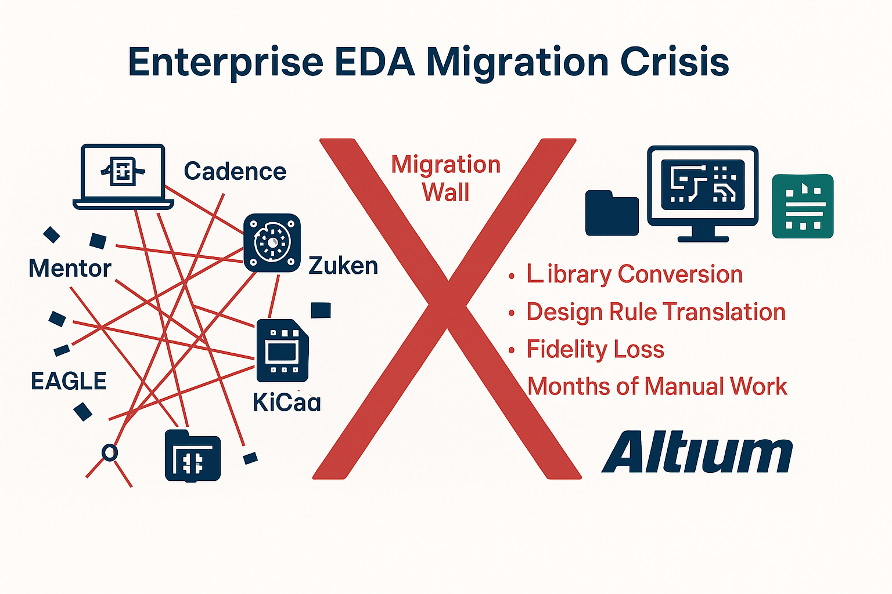
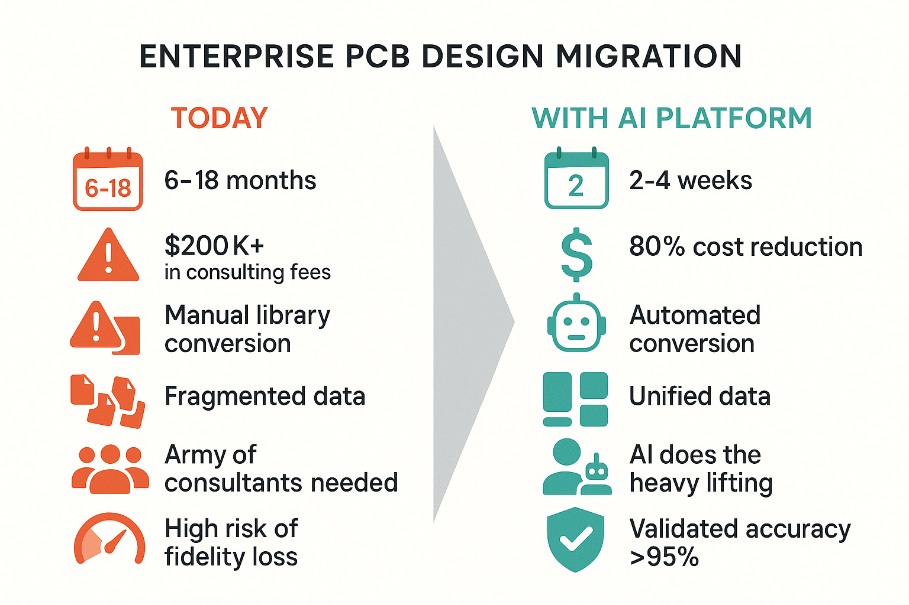
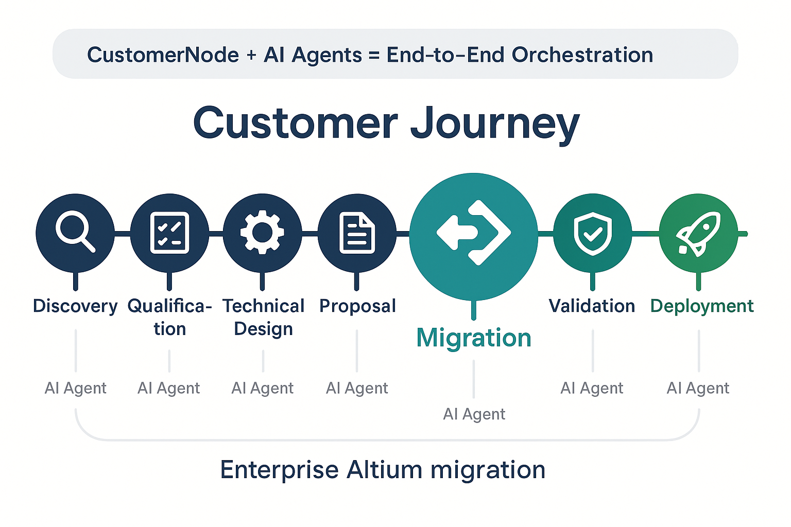
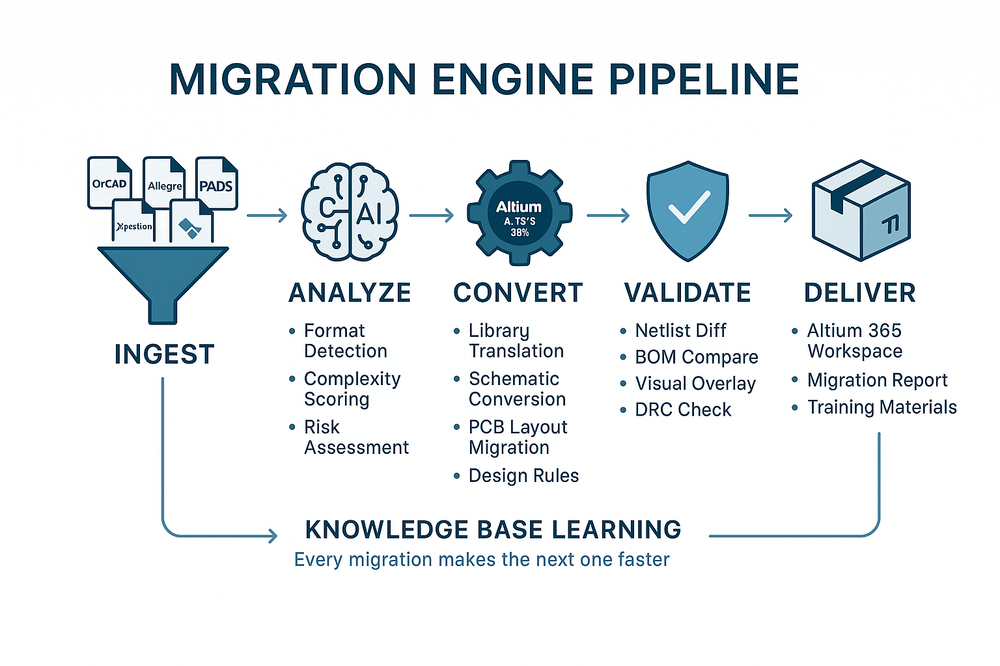
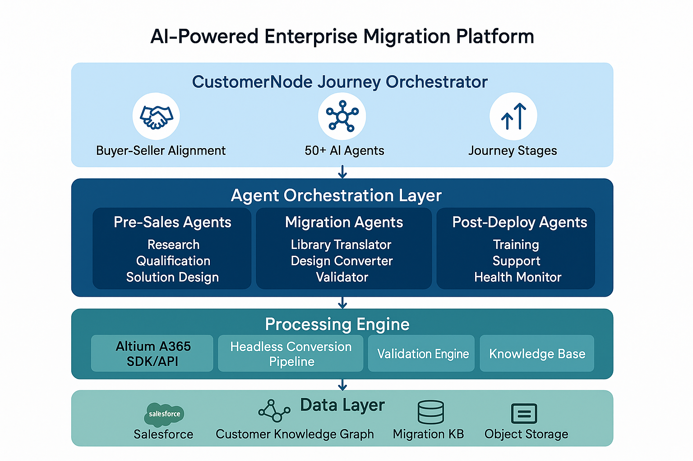
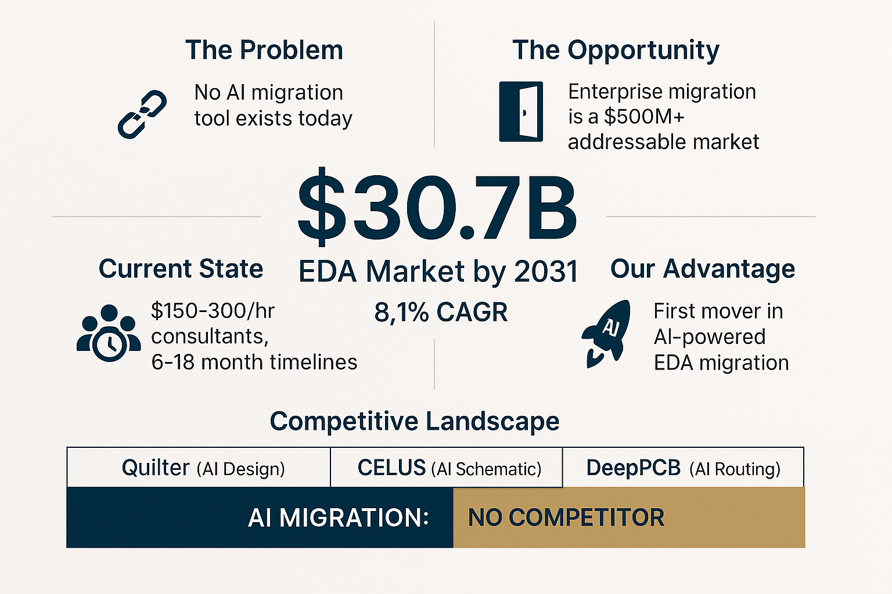
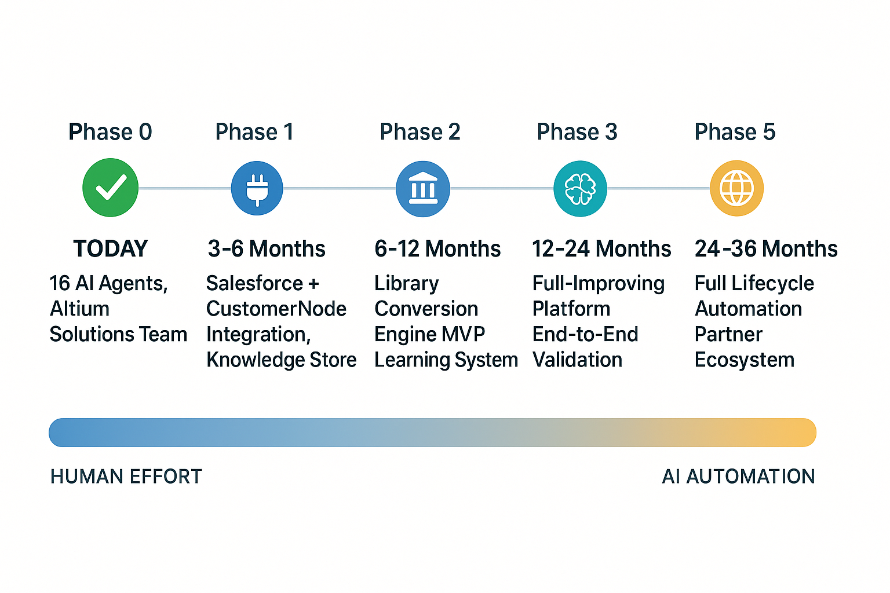

# The AI Migration Engine

**Eliminating the Last Barrier to Enterprise PCB Platform Dominance Through AI-Powered Frictionless Migration**

*White Paper — February 2026*
*Confidential — For Internal Discussion*

---

## Executive Summary

Altium has the superior platform. Altium has the cloud. Altium has the Renesas backing. But one thing stands between Altium and enterprise PCB dominance: **migration friction**. Every enterprise that wants to adopt Altium faces months of painful, expensive manual conversion from legacy tools — and that friction is the single greatest gift we give to Cadence, Siemens, and Zuken every day.

We propose building the **AI Migration Engine** — a platform that reduces enterprise migration from a 6-18 month ordeal to a 2-4 week automated process. But the migration itself is not the goal. **The goal is PCB platform dominance.** When switching to Altium costs nothing, takes weeks instead of months, and carries near-zero risk — there is no reason for any enterprise to stay on legacy tools. The AI Migration Engine doesn't just move designs. It removes the last barrier standing between Altium and the entire enterprise PCB market.

> **The strategic thesis:** *Migration friction is the moat that protects incumbent EDA vendors. AI destroys that moat. With zero switching cost, Altium wins on product merit alone — and the $30.7B enterprise EDA market opens up.*

| $30.7B | #1 | 0 | 2-4 wks |
|--------|-----|---|---------|
| EDA Market by 2031 | Barrier to Altium Adoption: Migration | AI Migration Tools Exist Today | Target: Full Enterprise Migration |

---

## The Strategic Case: Migration Friction Is the Enemy of Market Dominance

This is not a proposal for a migration tool. This is a proposal for a **market dominance strategy** that happens to use migration as its mechanism.

### Why Enterprises Stay on Legacy Tools

Ask any enterprise why they haven't switched to Altium. The answer is rarely "because Cadence is better." The answers are:

- **"We have 20 years of libraries we can't afford to recreate."**
- **"The migration would shut down engineering for 6 months."**
- **"We tried once. The converted designs were unusable."**
- **"The consulting quote was $200K+ and 18 months."**
- **"The risk isn't worth it — what if the conversion fails?"**

Every one of those answers is about *migration friction*, not product quality. Altium wins on features, cloud, collaboration, price, and ecosystem. But none of that matters if switching is too painful to contemplate.

### Migration Friction Is Your Competitor's Best Defense

Cadence charges premium prices for Allegro. Siemens charges premium prices for Xpedition. They can do this because their customers are locked in — not by contracts, but by the cost of leaving. Every library, every design rule, every workflow built over decades becomes a wall that keeps customers paying.

**The AI Migration Engine demolishes that wall.**

> **The dominance equation:**
>
> Altium (superior platform) + Zero switching cost = Every enterprise evaluates Altium on merit
>
> Altium on merit + Renesas 365 + Cloud + Price advantage = Altium wins
>
> Altium wins at scale = **PCB platform dominance**

### The True Cost of Migration Today

Forget the $200K estimate. The real numbers are far worse. Industry data from enterprise design translation projects shows that **each individual PCB design takes 7 to 136 working hours to migrate**, depending on complexity. At professional services rates of $100-150/hour:

| Design Complexity | Hours per Design | Cost per Design |
|-------------------|-----------------|-----------------|
| Simple (2-4 layer, low density) | 7-20 hours | $1,000-$3,000 |
| Medium (6-8 layer, moderate density) | 40-60 hours | $6,000-$9,000 |
| Complex (10+ layer, high density, impedance-controlled) | 80-136 hours | $12,000-$20,000+ |

Now multiply by enterprise scale. A company with 200 active designs and decades of legacy libraries:

| Enterprise Size | Active Designs | Design Migration Cost | + Library & Infrastructure | Total Migration Cost |
|----------------|---------------|----------------------|---------------------------|---------------------|
| Small (50 seats) | ~50 | $300K-$1M | $100-300K | **$400K-$1.3M** |
| Mid (200 seats) | ~200 | $1.2M-$4M | $300K-$1M | **$1.5M-$5M** |
| Large (500+ seats) | ~500+ | $3M-$10M+ | $500K-$2M | **$3.5M-$12M+** |

> **This is why enterprises don't switch.** A VP of Engineering at a 200-seat Cadence shop isn't looking at a $200K migration project. They're looking at a **$2-5 million migration project** that will disrupt their engineering organization for 12-18 months. No wonder they keep paying Cadence renewals.

### The Revenue Multiplier: What Frictionless Migration Unlocks

When the AI Migration Engine reduces that $2-5M cost to near zero and compresses 12-18 months into 2-4 weeks, suddenly every enterprise evaluates Altium on merit. Here's what a single converted enterprise account is worth:

| Revenue Stream | Per Enterprise | Note |
|---------------|---------------|------|
| AI Migration (our cost in compute/tokens) | $20-100K | 95-98% cheaper than manual consulting |
| **Year 1 seat licenses** | **$250K-2M+** | **200-500 seats at $1,500-4,500/yr** |
| **Annual recurring revenue** | **$250K-2M+/yr** | **Subscription model, compounds annually** |
| Altium 365/Agile platform fees | $100K-500K/yr | Enterprise cloud platform |
| PLM/MCAD integrations | $50-200K | Professional services add-ons |

**The AI migration cost is less than 1% of the lifetime customer value.** You're spending tokens to unlock enterprise accounts worth $1-2M+/year in recurring revenue — accounts that are currently locked behind a $2-5M migration wall that makes switching unthinkable.

> **The math is simple:** Spend $50K in compute to demolish a $3M migration wall that unlocks $1M+/year in recurring revenue. That's a 20:1 return in year one alone. Every year after that is pure recurring revenue.

---

## The Migration Wall: What We're Up Against

With the Renesas acquisition ($9.1B), the Discover/Develop/Agile platform launch, and Renesas 365 arriving in 2026, Altium is ready for the enterprise. But the enterprise can't get past the migration wall — and that wall is what keeps every Cadence and Siemens seat collecting renewal fees. Here's what the wall looks like:

*Figure 1: The migration wall between legacy EDA tools and Altium adoption*

### The Pain Is Real and Quantifiable

Enterprise customers considering Altium face a migration wall that kills deals and delays adoption:

| Pain Point | Impact | Current Solution |
|-----------|--------|-----------------|
| **Library conversion** | 1-2 days per 5-day project; months for enterprise-scale libraries | Manual, one component at a time |
| **Design fidelity loss** | Copper pours, pad stacks, design rules corrupted in translation | Manual post-import cleanup by engineers |
| **Design rule translation** | Each EDA tool has a fundamentally different rule model | Manual recreation in Altium's Rules Editor |
| **Multi-site rollout** | Dual-tool maintenance, staggered adoption, interop issues | 6-18 months of phased deployment |
| **Training & adoption** | 3-6 month productivity dip; engineer resistance | Classroom training, hope for adoption |
| **Cost per design** | 7-136 hours per design at $100-150/hr = $1K-$20K+ each | Manual consulting, per-design quoting |
| **Total enterprise cost** | 200 designs = $1.5M-$5M+; large enterprises $3-12M+ | Fragmented partner ecosystem, no dedicated offering |

> **Critical gap:** Altium has no dedicated enterprise migration services offering. Migration support is fragmented across partners with varying levels of capability. Meanwhile, AI startups like Quilter ($25M Series B), CELUS ($25M), DeepPCB, and AutoCuro are all building AI for PCB *design* — but **none are building AI for migration**.
>
> This is the single largest unaddressed gap in the EDA market.

---

## The Weapon: A Self-Deploying AI Migration Engine

The AI Migration Engine is a strategic weapon for market capture. It makes the answer to "should we switch to Altium?" an obvious, risk-free "yes" by eliminating the cost, time, and uncertainty of migration. AI agents, compute, and tokens do the heavy lifting — humans supervise and validate. The system gets smarter with every migration, compounding into a capability no competitor can replicate.

*Figure 2: The transformation from manual consulting engagements to AI-powered migration*

### The Core Idea

Combine three powerful technologies into a unified platform:

**CustomerNode**
Customer journey orchestration platform with 50+ AI agents. Manages the buyer-seller relationship from first touch through ongoing success. Solves the "Bosch problem" — unifying fragmented enterprise identities across Salesforce.
*Role: Journey orchestration, entity resolution, buyer-seller alignment*

**Altium 365 SDK/API**
Direct programmatic access to Altium's platform — import wizards, library management, workspace provisioning, design validation, and more.
*Role: Conversion engine, validation pipeline, environment provisioning*

**AI Agent Team**
22+ specialized agents spanning pre-sales, migration, and post-deployment. Each agent is an expert in its domain — from qualification analysis to library translation to health monitoring.
*Role: Domain expertise, orchestration, exception handling, continuous learning*

**Migration Knowledge Base**
A compound learning system that grows with every migration. Component mappings, conversion patterns, effort estimates — all anonymized and shared across engagements.
*Role: Institutional memory, prediction, acceleration*

> "The traditional model asks: how many consultants do we need? The new model asks: how much compute do we need? The answer is always cheaper, faster, and more scalable."

---

## How It Works: The Customer Journey

The platform spans the entire customer lifecycle — not just the technical migration, but everything from identifying the enterprise target to monitoring long-term adoption health.

*Figure 3: The complete customer journey, orchestrated by CustomerNode with AI agents at every stage*

### Stage-by-Stage Breakdown

| Stage | AI Agent(s) | What Happens | Output |
|-------|------------|-------------|--------|
| **Discovery** | Account Researcher | Identifies enterprise targets, maps their EDA stack, finds migration triggers (M&A, tool EOL, cost pressure) | Account Brief |
| **Qualification** | Qualification Analyst | MEDDPICC scoring, technical fit assessment, ICP matching with KB-backed pattern recognition | Qualification Scorecard |
| **Solution Design** | Solution Architect + Value Engineer | Technical solution design with migration scope estimate; ROI model and business case | Solution Design + Business Case |
| **Proposal** | Proposal Writer + Competitive Intel | Auto-populated migration scope from discovery; competitive differentiation | Proposal / RFP Response |
| **Close** | Deal Strategist | Negotiation playbook, close plan, stakeholder alignment via CustomerNode shared journey | Close Plan + CRM Notes |
| **Migration** | Library Translator + Design Converter | Automated ingestion, conversion via A365 SDK, AI-powered exception handling | Converted Altium Environment |
| **Validation** | Validation Orchestrator | Netlist diff, BOM compare, visual overlay, DRC — automated multi-layer verification | Validation Report |
| **Deployment** | Deployment Manager + Domain Specialists | Workspace provisioning, SSO setup, PLM/MCAD/ERP integration, user rollout | Live Environment |
| **Ongoing Success** | Training Agent + Health Monitor | Personalized learning paths, adoption tracking, proactive issue detection, expansion opportunities | Health Reports + Expansion Recommendations |

> **Key insight:** CustomerNode's shared buyer-seller journey model means the customer can see their migration progress in real time — not through status update emails, but through a live, AI-guided dashboard they navigate alongside us.

---

## The Migration Engine: Technical Deep Dive

The heart of the platform is the automated migration pipeline — a system that ingests legacy EDA data, converts it through the Altium 365 SDK, validates the output, and learns from every conversion.

*Figure 4: The five-stage migration pipeline with continuous learning feedback loop*

### Stage 1: Ingest

Enterprise customers upload their legacy design files through a secure portal. The system automatically detects file formats, tool versions, and project structures across 14+ supported EDA platforms including Cadence Allegro/OrCAD, Siemens Xpedition/PADS, Zuken CADSTAR/CR-5000, EAGLE, and KiCad.

### Stage 2: Analyze

AI agents perform a comprehensive pre-migration assessment:

- **Complexity scoring** — Estimate conversion difficulty per design
- **Knowledge Base lookup** — Find component mappings from previous migrations
- **Risk identification** — Flag known problem areas (copper pours, complex pad stacks, custom footprints)
- **Effort prediction** — Generate time and cost estimates based on historical data

### Stage 3: Convert

The conversion engine leverages the **Altium 365 SDK** directly — not screen scraping, not approximation, but native API-driven conversion that produces guaranteed-valid Altium output. AI agents orchestrate the process and handle exceptions:

- **Library translation** — Symbols, footprints, 3D models, parametric data
- **Schematic conversion** — Hierarchical designs, multi-sheet, variants
- **PCB layout migration** — Copper pours, routing, planes, board shape
- **Design rule translation** — Semantic mapping between different rule models (not just syntactic copy)

> **The compound learning advantage:** Every migration enriches the Knowledge Base. Component mappings, conversion patterns, and effort data are anonymized and shared. The 50th Cadence migration is dramatically faster and more accurate than the 5th. This compounds into an unassailable competitive moat.

### Stage 4: Validate

Multi-layer automated validation ensures conversion accuracy:

- **Netlist comparison** — Verify every electrical connection matches the original
- **BOM validation** — Ensure all components, values, and parameters transferred
- **Visual overlay** — Automated comparison of PCB layouts for geometric accuracy
- **Design Rule Check** — Full DRC on converted designs
- **Confidence scoring** — Flag low-confidence conversions for human review

### Stage 5: Deliver

Converted designs are delivered as a fully configured Altium 365 workspace:

- Organized project structure matching the customer's original hierarchy
- Centralized, version-controlled library in the workspace vault
- Detailed migration report explaining every conversion decision
- Training materials personalized to the customer's specific design patterns

---

## Platform Architecture

The system is built on four planes: orchestration, data, processing, and presentation — with CustomerNode and the Altium 365 SDK as the two primary integration points.

*Figure 5: Four-plane platform architecture*

### Orchestration Plane

The brain of the system. CustomerNode manages the customer journey and buyer-seller alignment. The Agent Orchestrator dispatches AI agents from three pools based on journey stage:

- **Pre-Sales Pool** — Account Researcher, Qualification Analyst, Solution Architect, Value Engineer, Deal Strategist, Proposal Writer, Competitive Intel
- **Migration Pool** — Library Translator, Design Converter, Validation Orchestrator
- **Post-Deployment Pool** — Deployment Manager, Training Agent, Health Monitor, Support Agent, Expansion Scout

### Data Plane

The memory of the system. A unified customer knowledge graph resolves entity fragmentation (one "Bosch," not hundreds of Salesforce fragments). The Migration Knowledge Base stores anonymized component mappings, conversion patterns, and historical effort data.

### Processing Plane

The muscle. Conversion and validation workers powered by the Altium 365 SDK process design files at scale. With direct API access, the platform bypasses GUI limitations and operates at machine speed.

### Presentation Plane

The face. A customer-facing migration portal (integrated with CustomerNode's shared journey view) provides real-time progress visibility. An internal dashboard gives the team operational insight.

---

## CustomerNode: The Journey Orchestrator

CustomerNode solves two critical problems that no CRM addresses: the misalignment between buyer and seller processes, and the fragmentation of enterprise customer identity.

### Solving the "Bosch Problem"

Altium historically sold individual seats transactionally. The result: a company like Bosch appears hundreds of times across Salesforce — different names, departments, subsidiaries, divisions. No single source of truth for the enterprise.

CustomerNode's entity resolution creates a **unified customer identity** that consolidates all touchpoints, history, and context into a single navigable graph. When a Migration Agent needs to know "what EDA tools does Bosch use across all divisions?", the answer exists in one place.

### Shared Buyer-Seller Journey

Traditional enterprise sales: the seller has a pipeline in Salesforce, the buyer has an evaluation spreadsheet, and neither can see the other's process. CustomerNode creates a single shared journey where both parties navigate together — with 50+ contextual AI agents providing guidance, generating documents, and keeping momentum.

For enterprise Altium migrations, this means:

- The customer sees their migration progress in real time
- AI agents on both sides stay synchronized
- Stakeholder alignment is maintained across 60-150 touchpoints
- Documents (SOWs, migration plans, validation reports) are auto-generated and shared

### First-Party AI: Complementary Agent Ecosystems

CustomerNode's 50+ agents handle journey orchestration. Our domain agents handle Altium-specific execution. The two ecosystems are complementary:

| CustomerNode Agents | Altium Domain Agents |
|--------------------|---------------------|
| "What should happen at this journey stage?" | "How do we do the Altium-specific work?" |
| Discovery guides, SOW generators, predictive insights | Library translators, design converters, validation engines |
| Buyer-seller alignment, stakeholder management | Migration execution, technical integration |

---

## Market Opportunity: The Entire Enterprise EDA Market

The addressable market isn't "migration services." It's **every enterprise seat currently running a competitor's tool.** The EDA market reaches $30.7 billion by 2031. Enterprise direct sales represent ~55%. Every dollar of Cadence and Siemens renewal revenue is a dollar that frictionless migration puts in play for Altium.

*Figure 6: The AI migration gap in the EDA competitive landscape*

### Competitive Landscape

| Company | Focus | Funding | Migration? |
|---------|-------|---------|-----------|
| **Quilter** | AI autonomous PCB layout | $25M Series B | No |
| **CELUS** | AI schematic generation | $25M | No |
| **DeepPCB** | AI cloud routing | Undisclosed | No |
| **AutoCuro** | AI-assisted routing co-pilot | Undisclosed | No |
| **AI Migration Engine** | **AI-powered EDA migration + lifecycle** | **—** | **YES — First Mover** |

> **No direct competitor exists.** Altium's Import Wizard is rule-based with known fidelity gaps. Partner consulting runs $150-300/hour and doesn't scale. Every AI PCB startup has chosen to focus on new design — nobody is solving migration. This is a wide-open market.

### Target Customers

The highest-value migration paths by source platform:

| Priority | Source Platform | Rationale |
|----------|----------------|-----------|
| 1 | Cadence OrCAD | Largest migration volume; well-documented but still painful |
| 2 | Cadence Allegro | High enterprise value; complex designs |
| 3 | Siemens Xpedition | Highest complexity = highest willingness to pay |
| 4 | Siemens PADS | Large installed base; cost-driven migrations |
| 5 | Zuken CR-8000 | No native Altium importer exists — total gap |

### Economics: The Migration Wall vs. The AI Engine

**Today (Manual Migration)**
- 12-18 months per enterprise
- $100-150/hr consulting x 7-136 hours per design
- **$1.5M-$5M+ for a 200-seat enterprise**
- Fragmented partner delivery
- No institutional learning
- Enterprises stay on legacy rather than face this

**With AI Migration Engine**
- 2-4 weeks per enterprise
- Compute + tokens: 95-98% cheaper
- **$20-100K per enterprise migration**
- Consistent, scalable delivery
- Compounds with every migration
- Enterprises say "yes" because there's no reason not to

---

## Implementation Roadmap

The platform builds incrementally from today's existing 16-agent Altium Solutions team to a fully autonomous lifecycle management system over 24-36 months.

*Figure 7: Five-phase implementation roadmap with decreasing human effort and increasing AI automation*

| Phase | Timeline | Milestone | Key Deliverables |
|-------|----------|-----------|-----------------|
| **0** | Today | Foundation | 16 AI agents operational; Altium Solutions team active; CustomerNode integration stub ready |
| **1** | 3-6 months | Integration | Salesforce + CustomerNode connected; persistent Knowledge Store; enterprise entity resolution |
| **2** | 6-12 months | Library MVP | Automated library conversion engine; learning system; first enterprise pilot (OrCAD → Altium) |
| **3** | 12-18 months | Full Migration | Complete design migration pipeline; end-to-end validation; multi-platform support |
| **4** | 18-24 months | Intelligence | Self-improving platform; predictive assessment; effort forecasting from historical data |
| **5** | 24-36 months | Autonomous | Full lifecycle automation; partner ecosystem; "give us your designs" at scale |

### MVP: Library Conversion Proof of Concept

> **Recommended first milestone:** Take a real enterprise customer's OrCAD component library (500+ components) and deliver a fully validated Altium library in 24 hours. This is the smallest demonstration that proves the vision — library conversion is the #1 pain point, the most contained scope, and the most impressive demo.

---

## Why This Team, Why Now

### Structural Advantages

| Advantage | Detail |
|-----------|--------|
| **Full A365 SDK/API access** | Direct access to Altium's conversion, validation, and provisioning APIs. Engineering builds what we need — no reverse engineering, no workarounds. |
| **CustomerNode on the team** | Michael Cantow (CustomerNode founder) is a team member. Full platform access, roadmap influence, and ability to build custom Altium journey templates. |
| **Existing agent infrastructure** | 16 specialized AI agents already operational in the Agent Architect framework. The foundation is built — we're extending, not starting from scratch. |
| **Renesas 365 timing** | Renesas 365 launches early 2026, creating a natural market moment for enterprise migration at scale. |
| **No competition** | Zero AI-powered EDA migration tools exist. First-mover advantage in a market with massive enterprise demand. |
| **Compound learning moat** | Every migration enriches the Knowledge Base. By migration #50, the system has institutional knowledge no competitor can replicate without doing the migrations themselves. |

### Complementary Expertise

**Nick DeMarco**
Back-end systems architecture, enterprise deployment, AI agent framework design. Built the 16-agent Altium Solutions team and Agent Architect infrastructure. Expertise in making complex systems work in practice.

**Michael Cantow**
MIT MEng (EECS). CustomerNode founder. Front-end journey orchestration, First-Party AI architecture, buyer-seller alignment. Developed 50+ contextual AI agents for complex B2B deal execution.

---

## The Ask

This is not a request to fund a migration tool. This is a request to fund a **market dominance accelerator** — a system that turns every enterprise running Cadence, Siemens, or Zuken into a reachable Altium customer.

### Immediate Needs (Phase 1-2)

1. **A365 SDK access and Engineering partnership** — Dedicated engineering support to expose import/conversion, library management, and validation APIs for programmatic use
2. **Pilot enterprise customer** — One real enterprise migration (OrCAD or Allegro source) to prove the library conversion MVP
3. **Compute budget** — Cloud infrastructure for conversion workers and AI agent runtime
4. **Salesforce data access** — Enterprise account data to seed CustomerNode's entity resolution and knowledge graph

### What Success Looks Like

**Migration Metrics**
- **<24 hours** — Library conversion (500 components)
- **95%+** — First-pass conversion accuracy
- **2-4 weeks** — Full enterprise migration
- **80%** — Cost reduction vs. consulting

**Dominance Metrics**
- **Enterprise deals unlocked** — Previously stalled by migration fear
- **Competitive displacements** — Cadence/Siemens seats converted to Altium
- **Time to revenue** — Weeks from first contact to paying customer
- **Recurring ARR per migration** — $250K-2M+/year in seat + platform revenue

### The Bottom Line

> Every enterprise running Cadence Allegro, Siemens Xpedition, or Zuken CR-8000 is a potential multi-million-dollar Altium customer. Today, migration friction makes them unreachable. The AI Migration Engine makes them inevitable.
>
> **The question is not whether to invest in frictionless migration. The question is whether we capture this market — or hand the opportunity to someone who will.**

> "We don't win by having the best PCB platform. We already have that. We win by making it effortless for every enterprise on earth to prove it for themselves."

---

*The AI Migration Engine — Confidential White Paper — February 2026*
*For discussion purposes only. All market data sourced from public industry reports.*
