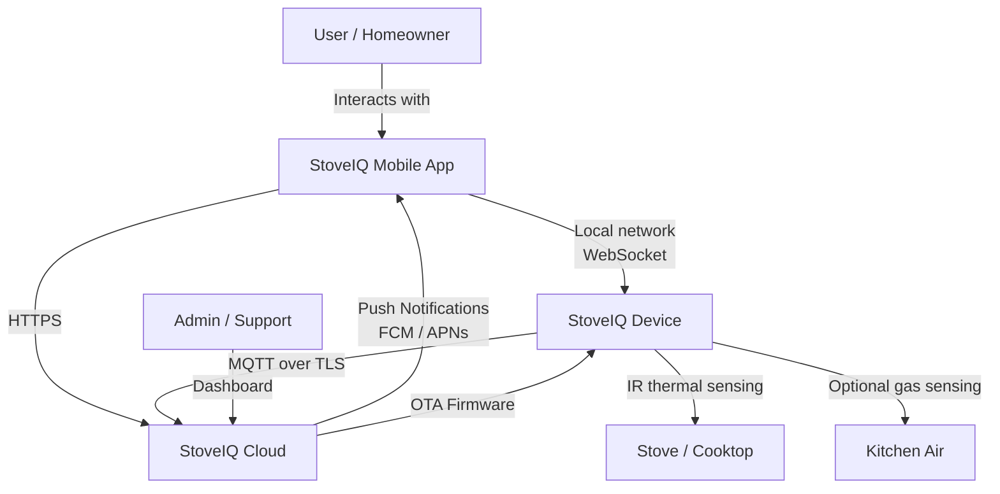
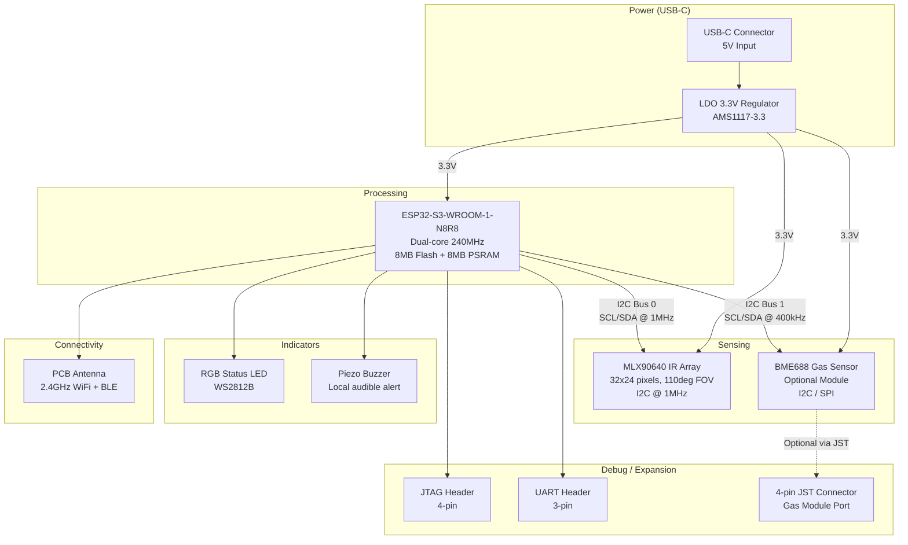
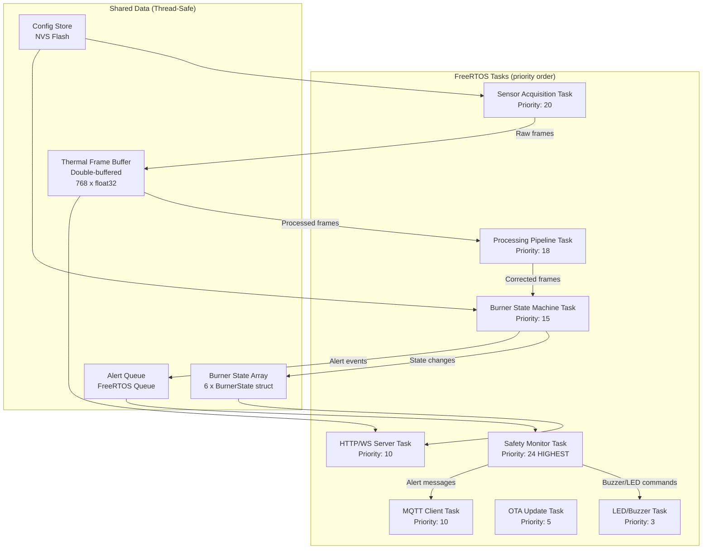
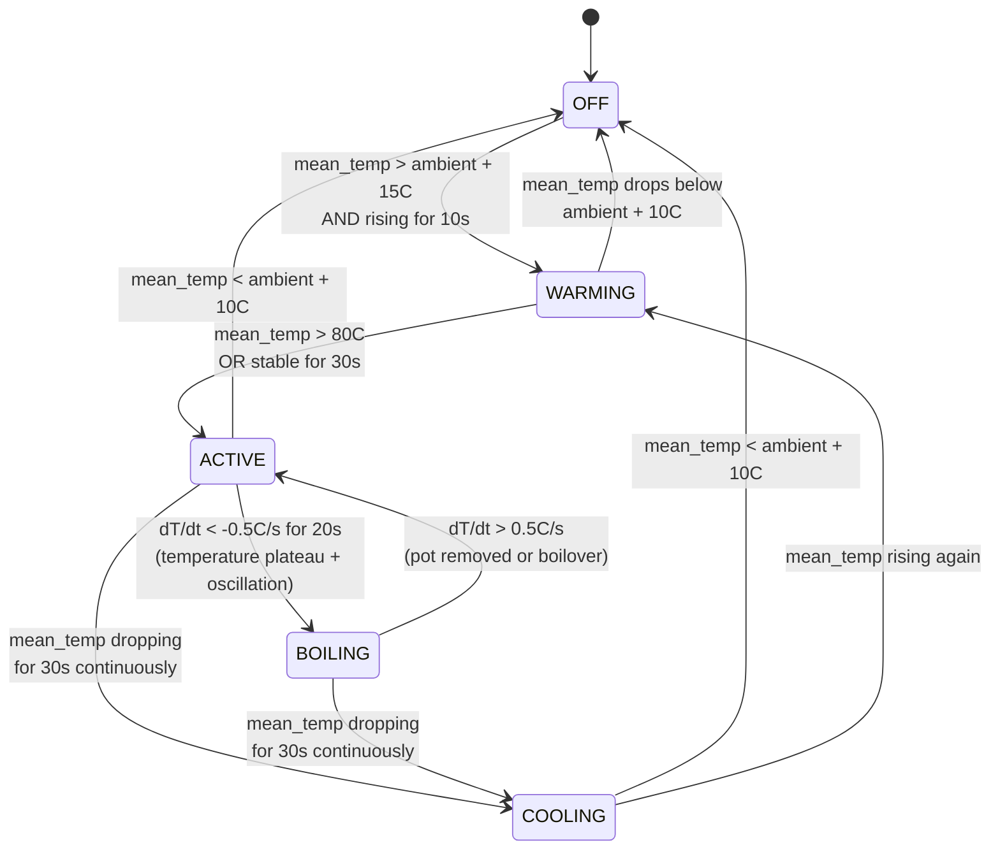
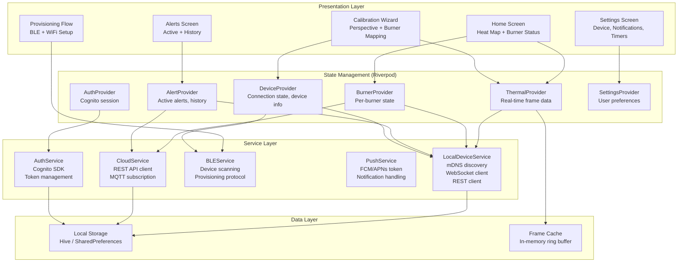
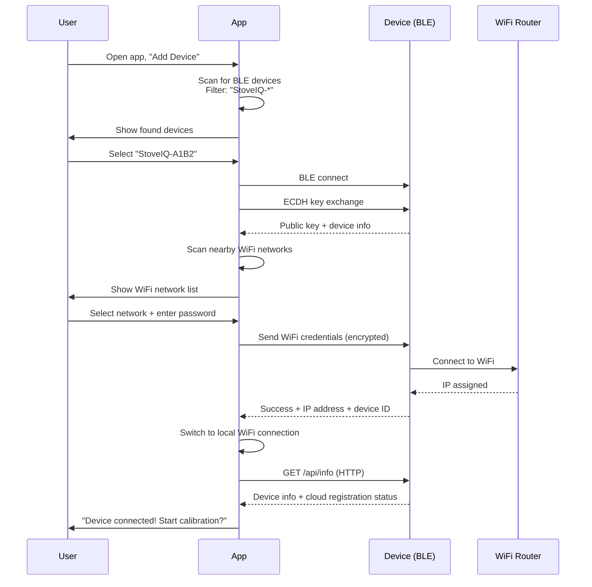
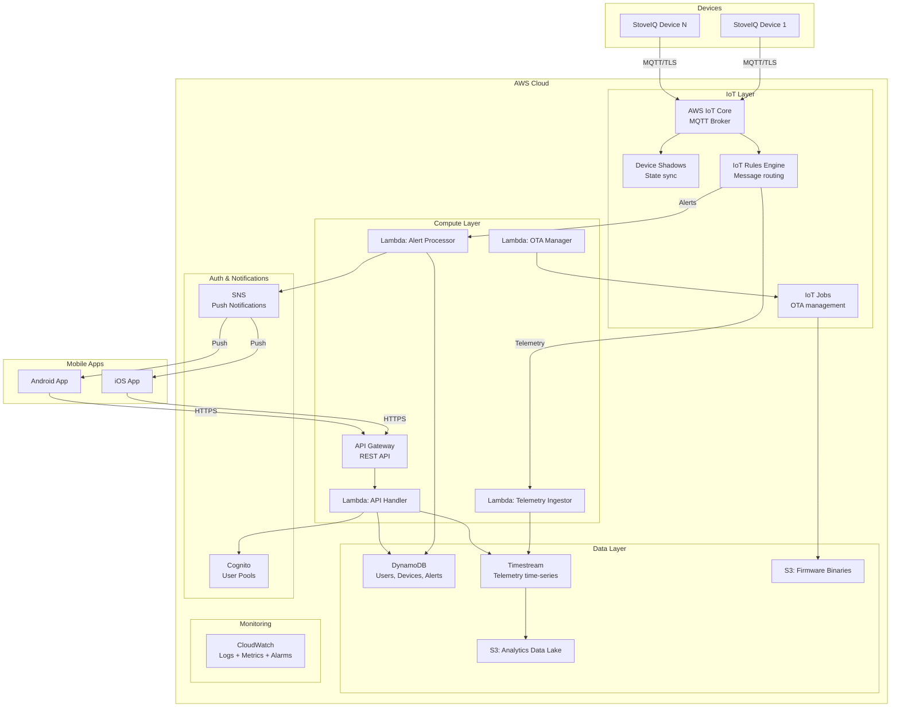
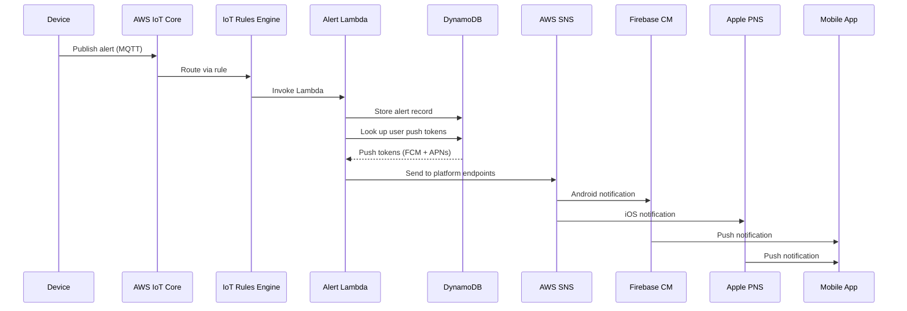
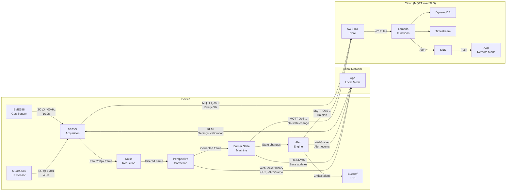
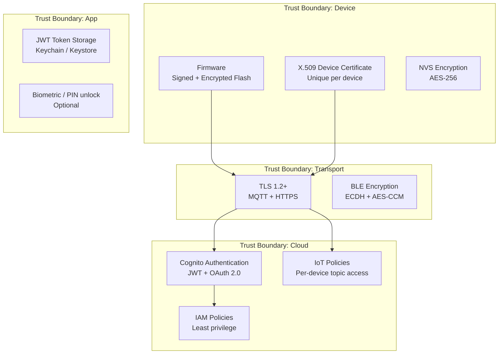

# Software Architecture: StoveIQ

**Version:** 0.1
**Last Updated:** 2026-03-26
**Author:** Nick DeMarco with AI Assistance
**Status:** Draft

---

## 1. Executive Summary

### 1.1 System Overview

StoveIQ is a retrofit smart stove monitor that uses an infrared thermal array sensor to provide real-time stovetop heat mapping, per-burner temperature monitoring, safety alerts, and cooking intelligence. The device mounts under the cabinet or on the wall behind a stove, viewing the cooktop at an angle. Software-based perspective correction transforms the angled thermal image into a top-down view, and a user-guided calibration process maps individual burner positions.

The system comprises four subsystems: a hardware device built around an ESP32-S3 MCU and MLX90640 IR thermal array; firmware running FreeRTOS that handles sensor acquisition, local processing, and safety alerting; a cross-platform mobile app (Flutter) for real-time heat map display, calibration, and notifications; and a cloud backend providing user management, device registry, push notifications, OTA firmware updates, and anonymized analytics.

Safety is the product's primary value proposition. The firmware implements a local-first safety architecture: all critical alerts (unattended burner, excessive temperature, burner left on) are generated on-device without requiring internet connectivity. The cloud and mobile app extend this with remote notifications, historical data, and cooking intelligence features.

### 1.2 Key Architectural Decisions

| Decision | Choice | Rationale |
|----------|--------|-----------|
| IR Sensor | MLX90640 (32x24, 110-degree FOV) | Best price/resolution for consumer thermal imaging; 768-pixel array sufficient for 4-6 burner discrimination |
| MCU | ESP32-S3-WROOM-1 (8MB Flash, 8MB PSRAM) | Dual-core 240MHz, WiFi+BLE5, vector instructions for DSP/ML, mature IoT ecosystem |
| Firmware RTOS | ESP-IDF with FreeRTOS | Official Espressif SDK; task-based architecture, built-in OTA, WiFi/BLE stacks |
| Mobile Framework | Flutter | Superior real-time rendering (Impeller engine), consistent heat map visualization across platforms, strong BLE support |
| Cloud Provider | AWS (IoT Core + serverless) | Managed MQTT broker, device shadows, OTA job management; serverless keeps costs low at small scale |
| Communication Protocol | MQTT v3.1.1 (via AWS IoT Core) | Lightweight pub/sub ideal for IoT; device shadows for state sync; QoS 1 for alerts |
| Local Communication | mDNS + HTTP/WebSocket | Direct app-to-device on same LAN; zero-config discovery; low-latency thermal streaming |
| Gas Sensor (optional) | BME688 | I2C/SPI, tiny footprint (3x3mm), built-in AI gas classification, temp/humidity/pressure bonus data |
| Power | USB-C (5V, always-on) | Simplest user experience; no battery management complexity; adequate for 0.8W average draw |

### 1.3 Technology Stack Summary

| Layer | Technology |
|-------|------------|
| IR Sensor | Melexis MLX90640ESF-BAB (110-degree FOV) |
| MCU | ESP32-S3-WROOM-1-N8R8 |
| Firmware | C (ESP-IDF v5.x, FreeRTOS) |
| Mobile App | Flutter 3.24+ (Dart), Impeller renderer |
| Cloud Compute | AWS Lambda (Node.js/Python) |
| MQTT Broker | AWS IoT Core |
| API Gateway | AWS API Gateway (REST) |
| Database | DynamoDB (device/user data), S3 (firmware binaries) |
| Push Notifications | AWS SNS -> FCM (Android) / APNs (iOS) |
| Auth | AWS Cognito (user pools) |
| OTA | AWS IoT Jobs + S3 |
| Analytics | AWS Timestream (time-series telemetry), Athena (ad-hoc queries) |

---

## 2. System Context

### 2.1 Context Diagram



### 2.2 External Systems

| System | Purpose | Integration Type |
|--------|---------|-----------------|
| AWS IoT Core | MQTT broker, device shadows, jobs | MQTT over TLS 1.2 |
| AWS Cognito | User authentication and identity | OAuth 2.0 / OIDC |
| Firebase Cloud Messaging | Android push notifications | FCM HTTP v1 API |
| Apple Push Notification Service | iOS push notifications | APNs HTTP/2 |
| AWS S3 | Firmware binary storage, assets | AWS SDK |
| AWS Timestream | Time-series telemetry storage | AWS SDK |

### 2.3 Users and Actors

| Actor | Description | Interactions |
|-------|-------------|--------------|
| Homeowner (primary) | Person who cooks and monitors the stove | App: view heat map, receive alerts, calibrate device |
| Household member | Other people in the home | App: view-only heat map, receive alerts |
| Installer | Person who mounts the device | App: calibration wizard, WiFi provisioning |
| Support agent | Customer support staff | Admin dashboard: device diagnostics, logs |
| OTA system | Automated firmware deployment | Cloud: push updates to device fleet |

---

## 3. Hardware Architecture

### 3.1 PCB Block Diagram



### 3.2 Component Selection

| Component | Part Number | Purpose | Unit Cost (1K qty) | Notes |
|-----------|-------------|---------|-------------------|-------|
| MCU | ESP32-S3-WROOM-1-N8R8 | Main processor, WiFi, BLE | $3.20 | 8MB Flash + 8MB PSRAM; vector instructions for DSP |
| IR Sensor | MLX90640ESF-BAB-000-TU | 32x24 thermal array, 110-degree FOV | $18.50 | I2C, -40 to 300C range, 0.1K NETD |
| Voltage Regulator | AMS1117-3.3 | 5V to 3.3V LDO | $0.08 | 1A output, dropout 1.1V |
| USB-C Connector | GCT USB4110-GF-A | Power input | $0.35 | 5V only, no data lines needed for production |
| Gas Sensor (optional) | BME688 | VOC/CO/gas detection + temp/humidity | $5.80 | I2C, 3x3mm, on-chip AI |
| Status LED | WS2812B-Mini | RGB status indicator | $0.06 | Addressable, single data pin |
| Piezo Buzzer | PKLCS1212E4001 | Audible safety alert | $0.45 | 85dB at 10cm, 4kHz resonant |
| Decoupling caps | Various | Power filtering | $0.15 | 100nF + 10uF per rail |
| JST Connector | B4B-PH-K-S | Gas module expansion port | $0.12 | 4-pin: VCC, GND, SDA, SCL |
| PCB | 2-layer FR4 | Main board | $1.50 | 45x35mm, lead-free HASL |
| Enclosure | Custom injection-molded ABS | Housing | $2.50 | Heat-resistant ABS, white/gray |
| Thermal pad | Bergquist SIL-PAD | IR sensor thermal isolation | $0.30 | Isolates sensor from PCB heat |
| **Total BOM (without gas module)** | | | **~$27.00** | |
| **Total BOM (with gas module)** | | | **~$33.00** | |

### 3.3 Thermal Management

The device operates near a heat source (stove), which creates two challenges: protecting electronics from ambient heat and ensuring IR sensor accuracy.

**Design strategies:**

1. **IR Sensor Thermal Isolation** -- Mount the MLX90640 on a thermal standoff (2mm air gap + thermal pad) to isolate it from PCB-conducted heat. The sensor has an internal temperature compensation circuit but performs best when its package temperature is stable.

2. **Enclosure Design** -- Use heat-resistant ABS (rated to 105C continuous). Include ventilation slots on the top and sides to allow convective cooling. The back panel (closest to wall/cabinet) should be solid to reflect radiant heat.

3. **Component Placement** -- Position the ESP32 module on the opposite end of the PCB from the IR sensor to minimize self-heating effects on thermal readings. Place the voltage regulator on the back side of the PCB with a copper pour for heat spreading.

4. **Thermal Specifications** -- Operating ambient range: 0C to 60C. The device should be mounted at least 18 inches (45cm) above the cooktop surface. At this distance, ambient temperature at the device is typically 35-50C during cooking.

5. **IR Sensor Window** -- Use a germanium or silicon window (IR-transparent) in the enclosure. The window protects against grease/steam while maintaining thermal transmission. Anti-fog coating recommended.

### 3.4 Sensor Positioning and Optics

The 110-degree FOV variant of the MLX90640 is selected to maximize cooktop coverage from an angled mounting position.

**Mounting geometry:**

```
Cabinet / Wall
    |
    |  [StoveIQ Device]
    |       \  angle: 30-60 degrees from horizontal
    |        \
    |         \
    |          \  ---- FOV cone ----
    |           \                    \
    ============ COOKTOP ============
    [B1]  [B2]    [B3]  [B4]
```

- **Optimal mount height:** 18-24 inches (45-60cm) above cooktop
- **Optimal angle:** 35-50 degrees from horizontal
- **Coverage at 20 inches, 45 degrees:** Approximately 40x30 inches of cooktop visible -- sufficient for standard 30-inch and 36-inch cooktops
- **Pixel density:** At 30-inch coverage, each thermal pixel covers approximately 0.9 x 1.25 inches -- adequate for burner discrimination (typical burner diameter is 6-10 inches)

**Lens considerations:**
- The MLX90640 BAB variant has an integrated silicon lens with 110-degree FOV
- No external optics required
- The device enclosure should provide a recessed window to prevent direct grease contact with the sensor lens

### 3.5 Antenna Design

- **WiFi + BLE:** The ESP32-S3-WROOM-1 module includes an integrated PCB antenna
- **Placement constraint:** The antenna must be positioned away from the metal enclosure back and away from the stove's metal body. Place it at the top edge of the PCB, oriented toward the room
- **Ground plane clearance:** Maintain 10mm keep-out zone around the antenna area on the PCB
- **Expected range:** 10-15 meters through open air; sufficient for kitchen-to-router connectivity

### 3.6 Power Budget

| Component | Active Current (3.3V) | Duty Cycle | Average Current |
|-----------|-----------------------|------------|-----------------|
| ESP32-S3 (WiFi active, dual-core) | 120 mA | 100% (always-on) | 120 mA |
| MLX90640 (continuous read @ 4Hz) | 18 mA | 100% | 18 mA |
| BME688 (periodic, 1 read/30s) | 12 mA active | 3% | 0.4 mA |
| WS2812B LED | 20 mA (white) | 10% average | 2 mA |
| Piezo buzzer | 30 mA | <1% (alert only) | 0.3 mA |
| LDO quiescent + misc | 5 mA | 100% | 5 mA |
| **Total** | | | **~146 mA** |

- **Average power consumption:** 146 mA x 3.3V = 0.48W (plus LDO losses: ~0.25W) = **~0.73W total from USB**
- **USB-C input:** 5V @ 0.15A typical, 0.5A max (during WiFi TX bursts)
- **Any standard USB-C phone charger (5W+) is sufficient**
- **Annual energy cost:** ~6.4 kWh = approximately $1/year at average US electricity rates

### 3.7 Optional Gas Sensor Module

The BME688 gas sensor is offered as an optional plug-in module that connects via the 4-pin JST connector on the main PCB.

**Module design:**
- Small daughterboard (15x10mm) with BME688, decoupling capacitors, and JST connector
- Positioned to sample ambient kitchen air (not directly over burner exhaust)
- I2C address: 0x76 (default) or 0x77 (selectable via jumper)
- Capabilities: VOC detection, smoke/burn detection, temperature, humidity, barometric pressure
- The BME688's built-in AI gas classification can distinguish cooking smells from hazardous gases after training

**Gas detection use cases:**
- Smoke/burn detection (food burning)
- Gas leak detection (natural gas/propane -- supplementary, not a replacement for a dedicated gas detector)
- Ambient kitchen temperature and humidity for cooking context

---

## 4. Firmware Architecture

### 4.1 Architecture Overview

The firmware runs on ESP-IDF v5.x with FreeRTOS. It follows a task-based architecture with clearly separated concerns. Safety-critical logic runs in the highest-priority tasks and operates independently of WiFi or cloud connectivity.



### 4.2 Task Descriptions

#### Sensor Acquisition Task (Core 1)

- **Priority:** 20
- **Core affinity:** Pinned to Core 1 (dedicated sensor core)
- **Responsibilities:**
  - Configure MLX90640 via I2C (set refresh rate, resolution)
  - Read 768-pixel thermal frames at 4Hz (configurable 2-8Hz)
  - Apply factory calibration parameters (stored in MLX90640 EEPROM)
  - Convert raw ADC values to temperature (degrees C) using Melexis driver library
  - Write completed frames to double-buffer (swap on frame-complete)
  - Read BME688 sensor data every 30 seconds (if module present)
- **I2C Configuration:** Bus 0, 1MHz fast-mode, pull-ups on PCB
- **Frame timing:** 250ms per frame at 4Hz; I2C transfer takes ~80ms for subpage read

#### Processing Pipeline Task (Core 0)

- **Priority:** 18
- **Core affinity:** Pinned to Core 0 (application core)
- **Responsibilities:**
  - Read latest frame from double-buffer
  - Apply temporal noise reduction (exponential moving average, alpha=0.3)
  - Apply spatial noise reduction (3x3 median filter for dead/stuck pixels)
  - Apply perspective correction (homography transform)
  - Output corrected 32x24 thermal frame to processed frame buffer
- **Perspective Correction:** See Section 4.3

#### Burner State Machine Task (Core 0)

- **Priority:** 15
- **Responsibilities:**
  - Read processed thermal frame
  - For each calibrated burner region, compute: mean temperature, max temperature, rate of change (dT/dt)
  - Update per-burner state machine (see Section 4.4)
  - Emit state-change events to alert queue
  - Track burner-on duration timers

#### Safety Monitor Task (Core 0)

- **Priority:** 24 (highest -- preempts all other tasks)
- **Responsibilities:**
  - Consume alert events from alert queue
  - Evaluate safety rules (see Section 4.6)
  - Trigger local buzzer/LED for critical alerts
  - Queue MQTT alert messages for cloud delivery
  - Maintain alert state (active, acknowledged, cleared)
  - **Does NOT depend on WiFi, cloud, or app** -- all safety logic is local

#### MQTT Client Task (Core 0)

- **Priority:** 10
- **Responsibilities:**
  - Maintain TLS connection to AWS IoT Core
  - Publish: alerts, burner state changes, telemetry (every 60s), device heartbeat (every 300s)
  - Subscribe: commands (settings updates, calibration data push), OTA job notifications
  - Handle reconnection with exponential backoff
  - Buffer up to 50 messages during disconnection (persist critical alerts to NVS flash)

#### HTTP/WebSocket Server Task (Core 0)

- **Priority:** 10
- **Responsibilities:**
  - Run lightweight HTTP server on port 80 (mDNS: `stoveiq-XXXX.local`)
  - Serve WebSocket endpoint (`/ws`) for real-time thermal frame streaming to local app
  - Serve REST endpoints for device info, settings, calibration
  - Handle WiFi provisioning API during setup mode

#### OTA Update Task

- **Priority:** 5
- **Responsibilities:**
  - Listen for OTA job notifications via MQTT
  - Download firmware binary from S3 pre-signed URL
  - Verify firmware signature (RSA-2048 + SHA-256)
  - Write to inactive OTA partition (A/B scheme)
  - Reboot to new firmware; roll back if boot fails 3 times

### 4.3 Perspective Correction Algorithm

The device is mounted at an angle, so the thermal image appears trapezoidal rather than rectangular. A homography transform corrects this.

**Calibration process (one-time, user-guided):**

1. User places the device in its mounting position
2. App connects via BLE/WiFi and receives raw thermal stream
3. User turns on all burners to maximum
4. App displays raw thermal image showing bright burner spots
5. User taps four corner points of the cooktop in the thermal image
6. App computes a 3x3 homography matrix H that maps the trapezoidal cooktop region to a normalized rectangle
7. H is sent to the device and stored in NVS flash

**Firmware implementation:**

```
// Homography transform: maps source (u,v) to destination (x,y)
// H is a 3x3 matrix stored as 9 floats in NVS
//
// [x']   [h00 h01 h02] [u]
// [y'] = [h10 h11 h12] [v]
// [w']   [h20 h21 h22] [1]
//
// x = x'/w',  y = y'/w'
//
// Applied per-pixel on 32x24 frame using bilinear interpolation
// Processing time: ~2ms on ESP32-S3 @ 240MHz (768 pixels)
```

The ESP32-S3's vector instructions accelerate the matrix multiplication. At 32x24 resolution, the transform is computationally trivial.

### 4.4 Burner State Machine

Each calibrated burner has an independent state machine:



**State parameters (configurable, stored in NVS):**

| Parameter | Default | Description |
|-----------|---------|-------------|
| `ambient_offset_on` | 15C | Temperature above ambient to detect burner activation |
| `ambient_offset_off` | 10C | Temperature above ambient to detect burner deactivation |
| `active_threshold` | 80C | Temperature to transition from WARMING to ACTIVE |
| `warming_timeout` | 30s | Max time in WARMING before auto-transition to ACTIVE |
| `boil_detect_rate` | -0.5C/s | Rate-of-change threshold for boil detection |
| `boil_detect_window` | 20s | Duration of sustained rate for boil confirmation |
| `cooling_duration` | 30s | Duration of continuous decrease to confirm cooling |

**Burner data structure:**

```c
typedef struct {
    uint8_t  id;                    // Burner index (0-5)
    float    center_x, center_y;    // Calibrated position in corrected frame
    float    radius;                // Calibrated radius in pixels
    burner_state_t state;           // Current state
    float    mean_temp;             // Current mean temperature
    float    max_temp;              // Current max temperature
    float    rate_of_change;        // dT/dt (C/s), averaged over 5s window
    uint32_t state_enter_time;      // Timestamp of last state transition
    uint32_t burner_on_time;        // Total seconds burner has been on (this session)
    float    ambient_temp;          // Baseline ambient (from non-burner pixels)
} burner_t;
```

### 4.5 Boil Detection Algorithm

Boil detection uses thermal rate-of-change analysis. When water in a pot reaches boiling:

1. **Pre-boil:** Temperature rises steadily (positive dT/dt)
2. **At boil:** Temperature plateaus near 100C (dT/dt approaches 0)
3. **Sustained boil:** Temperature oscillates slightly around boiling point (small dT/dt oscillations)
4. **Key indicator:** The thermal signature changes from a smooth gradient to a noisy/oscillating pattern as bubbles break the surface and steam disrupts the thermal profile

**Detection logic:**

```
boil_score = 0

if (burner.state == ACTIVE && burner.mean_temp > 85C):
    // Check for temperature plateau
    if (abs(burner.rate_of_change) < 0.3 C/s for > 15s):
        boil_score += 40

    // Check for thermal oscillation (variance of recent dT/dt samples)
    variance = compute_variance(rate_history, last_20_samples)
    if (variance > 0.1 && variance < 2.0):
        boil_score += 30

    // Check for temperature near expected boiling point
    if (burner.mean_temp > 90C):
        boil_score += 30

if (boil_score >= 70):
    transition_to(BOILING)
```

**Limitations:**
- Cannot distinguish boiling from simmering at identical temperatures
- Covered pots reduce thermal signature accuracy
- Different pot materials (cast iron vs. aluminum) have different emissivity -- addressed via calibration coefficients
- Future ML model (TFLite Micro) can improve detection using spatial pattern analysis

### 4.6 Alert Engine (Local-First Safety)

All safety alerts are evaluated locally on the device. No internet connection is required.

**Alert rules:**

| Alert | Condition | Severity | Local Action | Cloud Action |
|-------|-----------|----------|--------------|--------------|
| Unattended burner | Any burner ACTIVE or BOILING for > 30 min (configurable) | WARNING | LED amber flash | Push notification |
| Unattended burner (critical) | Any burner ACTIVE for > 60 min | CRITICAL | Buzzer + LED red | Push notification + SMS (future) |
| High temperature | Any pixel > 250C | CRITICAL | Buzzer + LED red | Push notification |
| All burners off reminder | All burners were ACTIVE, now user walks away (no app interaction for 15 min) | INFO | LED pulse | Push notification |
| Boil detected | Burner transitions to BOILING state | INFO | LED blue pulse | Push notification (if enabled) |
| Burner left on | Burner still ACTIVE at scheduled time (e.g., bedtime) | WARNING | LED amber | Push notification |
| Device offline | No heartbeat for 10 min | N/A | N/A | Cloud detects, alerts via push |
| Gas detected (optional) | BME688 detects elevated VOC/CO levels | WARNING/CRITICAL | Buzzer + LED | Push notification |

**Alert acknowledgment:**
- User can acknowledge alerts via app (local or remote)
- Acknowledged alerts suppress buzzer but maintain LED indication
- Alerts auto-clear when condition resolves (e.g., burner turned off)

### 4.7 Communication Protocol

#### MQTT Topics (AWS IoT Core)

```
# Device publishes:
stoveiq/{device_id}/telemetry          # Every 60s: burner states, temps, ambient
stoveiq/{device_id}/alert              # On alert: type, severity, burner, timestamp
stoveiq/{device_id}/heartbeat          # Every 300s: uptime, WiFi RSSI, firmware version
stoveiq/{device_id}/thermal/frame      # On-demand: compressed thermal frame (for remote view)

# Device subscribes:
stoveiq/{device_id}/command            # Settings updates, calibration data
stoveiq/{device_id}/ota                # OTA job notifications
stoveiq/{device_id}/alert/ack          # Alert acknowledgments from app
```

**Message format (JSON, gzipped for thermal frames):**

```json
{
  "device_id": "SIQ-A1B2C3D4",
  "timestamp": 1711468800,
  "firmware_version": "1.2.3",
  "burners": [
    {
      "id": 0,
      "state": "ACTIVE",
      "mean_temp": 185.3,
      "max_temp": 212.1,
      "on_duration": 1245,
      "rate_of_change": 0.02
    }
  ],
  "ambient_temp": 28.5,
  "gas": {
    "voc_index": 142,
    "temperature": 29.1,
    "humidity": 45.2
  }
}
```

#### Local Network API

The device runs a lightweight HTTP server discoverable via mDNS (`stoveiq-XXXX.local`).

| Endpoint | Method | Description |
|----------|--------|-------------|
| `/api/info` | GET | Device ID, firmware version, WiFi RSSI, uptime |
| `/api/status` | GET | Current burner states, temperatures, alerts |
| `/api/settings` | GET/PUT | Read/update device settings |
| `/api/calibration` | GET/PUT | Read/update calibration data (homography matrix, burner positions) |
| `/ws` | WebSocket | Real-time thermal frame stream (4Hz, binary) |

**WebSocket frame format (binary, 3080 bytes per frame):**

```
Header (8 bytes):
  [0-1]  Magic: 0x5349 ("SI")
  [2]    Frame type: 0x01 (thermal)
  [3]    Sequence number (uint8, wraps)
  [4-7]  Timestamp (uint32, ms since boot)

Payload (3072 bytes):
  768 x float32 (little-endian) = temperature values in Celsius
  Row-major order: pixel[0,0] to pixel[31,23]
```

### 4.8 OTA Update Mechanism

**Partition layout:**

```
# ESP32-S3 Partition Table (8MB Flash)
# Name,    Type, SubType,  Offset,    Size
nvs,       data, nvs,      0x9000,    0x6000    # 24KB  - settings, calibration
otadata,   data, ota,      0xF000,    0x2000    # 8KB   - OTA boot selection
ota_0,     app,  ota_0,    0x20000,   0x300000  # 3MB   - Firmware slot A
ota_1,     app,  ota_1,    0x320000,  0x300000  # 3MB   - Firmware slot B
coredump,  data, coredump, 0x620000,  0x10000   # 64KB  - Crash dumps
storage,   data, spiffs,   0x630000,  0x1D0000  # 1.8MB - Local data storage
```

**Update flow:**

1. AWS IoT Jobs creates an OTA job targeting device(s)
2. Device receives job notification via MQTT subscription
3. Device downloads firmware binary from S3 (pre-signed URL, TLS)
4. Firmware binary is verified: RSA-2048 signature check against embedded public key
5. Binary is written to inactive OTA partition (A/B swap)
6. Device reboots to new partition
7. New firmware runs self-test (sensor read, WiFi connect, MQTT publish)
8. If self-test passes: mark partition as valid, report success to IoT Jobs
9. If self-test fails (or 3 consecutive boot failures): bootloader rolls back to previous partition

**Security:**
- Firmware binaries signed with RSA-2048 private key (kept offline, never on device)
- Public key embedded in firmware at build time
- Secure Boot v2 enabled: bootloader verifies app signature on every boot
- Flash encryption enabled: prevents firmware extraction via physical access
- Anti-rollback: firmware version counter in eFuse prevents downgrade attacks

### 4.9 WiFi Provisioning

**First-time setup flow:**

1. Device powers on with no WiFi credentials -- enters provisioning mode
2. Device starts BLE GATT server advertising as "StoveIQ-XXXX"
3. User opens StoveIQ app, which scans for BLE devices
4. App connects to device via BLE
5. App sends WiFi SSID and password to device over BLE (encrypted with ECDH key exchange)
6. Device attempts WiFi connection
7. Device reports success/failure to app via BLE
8. On success: device connects to AWS IoT Core, app transitions to calibration wizard
9. BLE advertising stops; device enters normal operation mode

**Implementation:** Uses ESP-IDF's `wifi_provisioning` component with BLE transport.

### 4.10 Memory Budget (ESP32-S3, 8MB PSRAM)

| Allocation | Size | Location |
|------------|------|----------|
| FreeRTOS kernel + task stacks | ~80 KB | Internal SRAM (512KB) |
| WiFi/BLE stack buffers | ~100 KB | Internal SRAM |
| MQTT client buffers | ~32 KB | PSRAM |
| Thermal frame double-buffer | 6 KB (2 x 768 x float32) | Internal SRAM (fast access) |
| Processed frame buffer | 3 KB | Internal SRAM |
| Burner state array | ~1 KB | Internal SRAM |
| Perspective correction LUT | 6 KB | PSRAM |
| HTTP server + WebSocket buffers | ~32 KB | PSRAM |
| Alert queue + history | ~8 KB | Internal SRAM |
| NVS cache | ~16 KB | Internal SRAM |
| TFLite Micro model (future) | ~500 KB | PSRAM |
| **Total Internal SRAM used** | ~250 KB / 512 KB | |
| **Total PSRAM used** | ~580 KB / 8 MB | |

---

## 5. Mobile App Architecture

### 5.1 Framework Choice: Flutter

**Recommendation: Flutter 3.24+ with Impeller rendering engine.**

**Rationale:**

| Factor | Flutter | React Native |
|--------|---------|--------------|
| Heat map rendering | Impeller engine renders custom Canvas at 60fps natively; ideal for 768-pixel interpolated thermal display | Requires bridge to native Canvas or WebGL; performance overhead for real-time rendering |
| BLE support | `flutter_blue_plus` -- mature, well-maintained, supports BLE 5 | `react-native-ble-plx` -- mature but bridging adds latency |
| Cross-platform consistency | Pixel-identical rendering on iOS and Android | Platform-specific rendering differences |
| Performance | Compiled to native ARM; no JS bridge overhead | New Architecture (Bridgeless) improves but still has overhead |
| Custom UI (calibration) | CustomPainter API is powerful and performant for drag-to-calibrate UI | Requires native modules or SVG workarounds |
| Developer productivity | Hot reload, strong typing (Dart), good tooling | Hot reload, larger community, more third-party packages |

Flutter's Impeller rendering engine (default since 3.24) pre-compiles all shaders at build time, eliminating jank during real-time heat map animation. This is the decisive factor for StoveIQ.

### 5.2 App Architecture



### 5.3 State Management: Riverpod

Riverpod is chosen over BLoC or Provider for its:
- Compile-time safety (no runtime errors from missing providers)
- Easy dependency injection and testing
- Support for async providers (ideal for WebSocket streams)
- Autodispose for resource management (WebSocket connections, BLE)

**Key providers:**

```dart
// Real-time thermal frame stream from device WebSocket
final thermalStreamProvider = StreamProvider.autoDispose<ThermalFrame>((ref) {
  final device = ref.watch(connectedDeviceProvider);
  return device.thermalFrameStream; // WebSocket binary stream, decoded
});

// Per-burner state, derived from thermal data + device status
final burnerStateProvider = Provider.autoDispose<List<BurnerState>>((ref) {
  final status = ref.watch(deviceStatusProvider);
  return status.burners;
});

// Alert stream merging local (WebSocket) and remote (MQTT/push) sources
final alertStreamProvider = StreamProvider.autoDispose<Alert>((ref) {
  final local = ref.watch(localAlertStreamProvider);
  final remote = ref.watch(cloudAlertStreamProvider);
  return MergeStream([local.value ?? const Stream.empty(),
                      remote.value ?? const Stream.empty()]);
});
```

### 5.4 Real-Time Heat Map Rendering

The 32x24 thermal frame must be rendered as a smooth, visually appealing heat map on screen.

**Rendering pipeline:**

1. **Receive frame** -- 768 float32 values via WebSocket (binary, ~3KB per frame at 4Hz)
2. **Normalize** -- Map temperature range to 0.0-1.0 (dynamic range: ambient to max_temp)
3. **Color map** -- Apply perceptually uniform colormap (Inferno or custom gradient: blue->green->yellow->red->white)
4. **Upscale** -- Bilinear interpolation from 32x24 to display resolution (e.g., 320x240 or 640x480)
5. **Render** -- Draw as `CustomPainter` on Flutter Canvas using `drawImage` with the interpolated bitmap
6. **Overlay** -- Draw burner circles, temperature labels, and state indicators on top

**Performance target:** 60fps rendering with <16ms frame time.

**Implementation approach:**

```dart
class HeatMapPainter extends CustomPainter {
  final ThermalFrame frame;
  final List<BurnerState> burners;
  final ColorMap colorMap;

  @override
  void paint(Canvas canvas, Size size) {
    // 1. Create upscaled RGBA image from thermal data
    final image = _interpolateFrame(frame, size);

    // 2. Draw thermal image
    canvas.drawImage(image, Offset.zero, Paint());

    // 3. Draw burner overlays
    for (final burner in burners) {
      _drawBurnerOverlay(canvas, burner, size);
    }
  }
}
```

**Optimization:**
- Perform interpolation in an isolate (Dart's equivalent of a background thread) to avoid blocking the UI thread
- Use `Uint8List` for pixel buffer manipulation (avoid object allocation per pixel)
- Cache the colormap lookup table (256 RGBA entries)
- Only re-render when a new frame arrives (4Hz), not on every Flutter frame (60Hz)

### 5.5 Calibration UI

The calibration flow is a multi-step wizard:

**Step 1: Perspective Correction**
- Display raw thermal stream from device
- User turns on all burners
- User taps 4 corners of the cooktop in the thermal image
- App computes homography matrix using `solvePnP`-style algorithm
- Preview shows corrected (rectangular) thermal image
- User confirms or adjusts

**Step 2: Burner Mapping**
- Display perspective-corrected thermal stream
- Burner heat spots are visible as bright regions
- Auto-detect burner centers using blob detection (connected components above threshold)
- Display draggable circles over detected burners
- User adjusts circle position and size to match each burner
- User labels each burner (Front Left, Back Right, etc.)
- Save calibration data to device (NVS)

**Step 3: Validation**
- User turns burners on/off one at a time
- App confirms correct detection for each burner
- "Calibration Complete" confirmation

### 5.6 WiFi Provisioning Flow (BLE)



### 5.7 Push Notifications

**Implementation:**

- Use `firebase_messaging` (Flutter plugin) for both FCM (Android) and APNs (iOS)
- On app launch: register for push, send device token to cloud backend
- Cloud stores mapping: `user_id -> [push_tokens]`
- When device publishes alert to MQTT, Lambda function triggers SNS -> FCM/APNs

**Notification types:**

| Type | Priority | Content |
|------|----------|---------|
| Safety alert (critical) | HIGH | "Burner left on for 60 minutes! Front Left burner at 195C" |
| Safety alert (warning) | HIGH | "Unattended cooking: Back Right burner active for 30 minutes" |
| Boil detected | DEFAULT | "Water is boiling on Front Right burner" |
| All burners off | LOW | "All burners are now off. Stove is cooling." |
| Device offline | DEFAULT | "StoveIQ lost connection 10 minutes ago" |
| OTA update available | LOW | "Firmware update available. Install now?" |

### 5.8 Offline Capability

When the internet is down but the phone and device are on the same local network:

- **mDNS discovery** still works -- app finds device via `stoveiq-XXXX.local`
- **WebSocket thermal streaming** works -- direct device-to-app communication
- **REST API** works -- settings, calibration, device status
- **Alerts** are delivered locally via WebSocket (no push notification, but in-app alerts work)
- **Cloud features disabled:** historical data, remote access, household sharing

The app detects connectivity state and switches between local and cloud data sources transparently.

### 5.9 App Navigation

```
StoveIQ App
|
+-- Onboarding (first launch)
|   +-- Create Account / Sign In
|   +-- Add Device (BLE provisioning)
|   +-- Calibration Wizard
|
+-- Home (default tab)
|   +-- Live Heat Map
|   +-- Burner Status Cards
|   +-- Active Alert Banner
|
+-- Alerts (tab)
|   +-- Active Alerts
|   +-- Alert History
|
+-- Cooking (tab, future)
|   +-- Timer per burner
|   +-- Recipe temperature guide
|   +-- Cooking history
|
+-- Settings (tab)
    +-- Device Management
    |   +-- Device info, WiFi, signal strength
    |   +-- Re-calibrate
    |   +-- Firmware update
    +-- Notification Preferences
    +-- Household Members
    +-- Account
```

---

## 6. Cloud Backend Architecture

### 6.1 Architecture Overview



### 6.2 API Design (REST)

**Base URL:** `https://api.stoveiq.com/v1`

**Authentication:** Bearer token (JWT from Cognito). All endpoints require authentication except `/auth/*`.

#### Auth Endpoints

| Method | Path | Description |
|--------|------|-------------|
| POST | `/auth/register` | Create account (email + password) |
| POST | `/auth/login` | Sign in, receive JWT |
| POST | `/auth/refresh` | Refresh expired JWT |
| POST | `/auth/forgot-password` | Initiate password reset |
| POST | `/auth/verify-email` | Verify email with code |

#### Device Endpoints

| Method | Path | Description |
|--------|------|-------------|
| POST | `/devices` | Register a new device (device_id, cert fingerprint) |
| GET | `/devices` | List user's devices |
| GET | `/devices/{id}` | Get device details + current state (from shadow) |
| PUT | `/devices/{id}/settings` | Update device settings (pushed via MQTT) |
| DELETE | `/devices/{id}` | Remove device from account |
| POST | `/devices/{id}/share` | Share device with household member |
| GET | `/devices/{id}/telemetry` | Query historical telemetry (time range, resolution) |

#### Alert Endpoints

| Method | Path | Description |
|--------|------|-------------|
| GET | `/alerts` | List alerts (filtered by device, severity, time range) |
| GET | `/alerts/{id}` | Get alert details |
| POST | `/alerts/{id}/acknowledge` | Acknowledge an alert (forwarded to device via MQTT) |

#### OTA Endpoints (admin)

| Method | Path | Description |
|--------|------|-------------|
| POST | `/admin/ota/upload` | Upload signed firmware binary to S3 |
| POST | `/admin/ota/deploy` | Create IoT Job for firmware rollout |
| GET | `/admin/ota/status` | Get rollout status (success/failure/pending counts) |

#### User Endpoints

| Method | Path | Description |
|--------|------|-------------|
| GET | `/users/me` | Get current user profile |
| PUT | `/users/me` | Update profile |
| GET | `/users/me/push-tokens` | List registered push tokens |
| POST | `/users/me/push-tokens` | Register a push token (FCM/APNs) |
| DELETE | `/users/me/push-tokens/{token}` | Remove a push token |

### 6.3 Error Response Format

```json
{
  "error": {
    "code": "DEVICE_NOT_FOUND",
    "message": "No device found with ID SIQ-A1B2C3D4",
    "request_id": "req_abc123"
  }
}
```

Standard HTTP status codes: 200, 201, 400, 401, 403, 404, 429, 500.

### 6.4 Real-Time Data: MQTT via AWS IoT Core

AWS IoT Core serves as the managed MQTT broker. Each device connects with a unique X.509 client certificate (generated during manufacturing and registered with IoT Core).

**IoT Rules Engine routing:**

| Rule | Source Topic | Action |
|------|-------------|--------|
| Alert processing | `stoveiq/+/alert` | Invoke `alert-processor` Lambda |
| Telemetry ingestion | `stoveiq/+/telemetry` | Invoke `telemetry-ingestor` Lambda |
| Heartbeat tracking | `stoveiq/+/heartbeat` | Update device shadow + CloudWatch metric |
| Thermal frame (on-demand) | `stoveiq/+/thermal/frame` | Forward to subscribed app via IoT Core MQTT |

**App real-time subscription:**
- For remote heat map viewing, the mobile app subscribes to `stoveiq/{device_id}/thermal/frame` via AWS IoT Core (using Cognito identity for auth)
- This is used only when the app is NOT on the same local network as the device
- Local WebSocket is preferred for latency and cost reasons

### 6.5 User Management and Device Pairing

**Account creation:** Email + password via Cognito User Pool. Email verification required.

**Device pairing flow:**

1. During BLE provisioning, app sends `user_id` to device
2. Device connects to IoT Core with its X.509 certificate
3. Device publishes to `stoveiq/{device_id}/register` with `user_id`
4. Lambda function creates device-user association in DynamoDB
5. Lambda attaches IoT policy allowing the user's Cognito identity to subscribe to device topics

**Household sharing:**
- Device owner invites household member by email
- Invitee creates account (or uses existing)
- Shared access grants: view heat map, receive alerts, acknowledge alerts
- Shared access denies: change settings, re-calibrate, remove device

### 6.6 Push Notification Service



### 6.7 OTA Update Distribution

**Firmware lifecycle:**

1. **Build:** CI pipeline compiles firmware, runs tests, signs binary with RSA-2048 key
2. **Upload:** Signed binary uploaded to S3 with version metadata
3. **Stage:** Create IoT Job targeting a test group (5-10 devices)
4. **Canary:** Monitor test group for 24 hours (crash rate, rollback rate)
5. **Rollout:** Expand to 10%, then 50%, then 100% of fleet
6. **Monitor:** Track success/failure via IoT Jobs + CloudWatch

**Rollout strategy:**
- Staged rollout with automatic abort if failure rate exceeds 5%
- Devices report OTA status (success/failure/rollback) via MQTT
- Admin dashboard shows rollout progress

### 6.8 Data Storage

#### DynamoDB Tables

| Table | Partition Key | Sort Key | Description |
|-------|---------------|----------|-------------|
| `Users` | `user_id` (UUID) | -- | User profile, settings, notification preferences |
| `Devices` | `device_id` (string) | -- | Device info, firmware version, registration date, WiFi RSSI |
| `UserDevices` | `user_id` | `device_id` | User-device associations, role (owner/shared) |
| `Alerts` | `device_id` | `timestamp` | Alert records with type, severity, duration, acknowledged |
| `PushTokens` | `user_id` | `token` | FCM/APNs push tokens, platform, last_used |

#### Timestream (Time-Series Telemetry)

| Measure | Dimensions | Retention |
|---------|------------|-----------|
| `burner_temp` | device_id, burner_id | 30 days (memory), 1 year (magnetic) |
| `burner_state` | device_id, burner_id | 30 days (memory), 1 year (magnetic) |
| `ambient_temp` | device_id | 30 days (memory), 1 year (magnetic) |
| `gas_voc` | device_id | 30 days (memory), 1 year (magnetic) |
| `wifi_rssi` | device_id | 7 days (memory), 90 days (magnetic) |

**Data volume estimate (per device):**
- Telemetry: 1 message/60s x 24h x 30 days = 43,200 messages/month
- Alert: ~5-10 alerts/day average = 150-300/month
- Heartbeat: 1/300s = 8,640/month
- **Total: ~52,000 messages/device/month**

#### S3 Buckets

| Bucket | Purpose | Lifecycle |
|--------|---------|-----------|
| `stoveiq-firmware` | Signed firmware binaries | Retain all versions |
| `stoveiq-analytics` | Aggregated, anonymized analytics data | Transition to Glacier after 90 days |

### 6.9 Cost Estimate (10,000 devices)

| Service | Monthly Cost | Notes |
|---------|-------------|-------|
| AWS IoT Core (messaging) | ~$130 | 520M messages x $1/M (first 250M), $0.80/M after |
| AWS IoT Core (connections) | ~$8 | 10K devices x $0.08/device/month |
| DynamoDB | ~$25 | On-demand mode, ~50K writes/day, ~200K reads/day |
| Timestream | ~$80 | Write: 520M data points x $0.50/M; Query: minimal |
| Lambda | ~$15 | 520M invocations (128MB, 100ms avg) |
| API Gateway | ~$20 | ~5M API calls/month from apps |
| Cognito | ~$50 | 10K MAU x $0.0055 (first 50K) |
| SNS (push) | ~$5 | ~1M push notifications/month |
| S3 | ~$5 | Firmware storage + analytics |
| CloudWatch | ~$30 | Logs, metrics, alarms |
| **Total** | **~$370/month** | Well under $500 target |

**Cost scaling notes:**
- At 100K devices: ~$2,500/month (consider migrating to EMQX on EC2 for MQTT at this scale)
- At 1M devices: ~$15,000/month with EMQX; AWS IoT Core would be $25,000+
- DynamoDB costs scale linearly but remain modest
- Timestream becomes the largest cost at scale; consider downsampling older data

---

## 7. Data Flow Architecture

### 7.1 Complete Data Flow



### 7.2 Data Flow Summary Table

| Flow | Source | Destination | Protocol | Rate | Payload Size | QoS |
|------|--------|-------------|----------|------|-------------|-----|
| Thermal frame (sensor) | MLX90640 | ESP32-S3 | I2C @ 1MHz | 4 Hz | 1536 bytes (raw) | N/A |
| Gas data (sensor) | BME688 | ESP32-S3 | I2C @ 400kHz | 1/30s | 16 bytes | N/A |
| Thermal frame (local) | ESP32-S3 | Mobile app | WebSocket (binary) | 4 Hz | 3080 bytes | TCP |
| Device status (local) | ESP32-S3 | Mobile app | WebSocket (JSON) | On change | ~200 bytes | TCP |
| Telemetry (cloud) | ESP32-S3 | AWS IoT Core | MQTT | 1/60s | ~500 bytes | QoS 0 |
| Alert (cloud) | ESP32-S3 | AWS IoT Core | MQTT | On event | ~300 bytes | QoS 1 |
| Heartbeat (cloud) | ESP32-S3 | AWS IoT Core | MQTT | 1/300s | ~150 bytes | QoS 0 |
| Push notification | AWS SNS | Mobile app | FCM/APNs | On alert | ~200 bytes | Platform |
| Settings command | Mobile app | ESP32-S3 | REST or MQTT | On demand | ~500 bytes | QoS 1 |
| Calibration data | Mobile app | ESP32-S3 | REST | One-time | ~1 KB | TCP |
| OTA firmware | AWS S3 | ESP32-S3 | HTTPS | On demand | ~1.5 MB | TLS |
| Remote thermal (cloud) | ESP32-S3 | Mobile app | MQTT (via IoT Core) | On demand, 1 Hz | ~3 KB | QoS 0 |

### 7.3 Bandwidth Estimate (per device)

| Direction | Data | Monthly Volume |
|-----------|------|---------------|
| Device -> Cloud (MQTT) | Telemetry + alerts + heartbeats | ~75 MB |
| Cloud -> Device (MQTT) | Commands + OTA notifications | ~1 MB |
| Device -> App (local WebSocket) | Thermal frames (while app open) | ~4 MB/hour |
| Device -> Cloud (remote thermal) | On-demand remote viewing | ~10 MB/hour (when active) |

---

## 8. Security Architecture

### 8.1 Security Model

StoveIQ follows a defense-in-depth approach with security at every layer: device identity, transport encryption, application authentication, and data protection.



### 8.2 Device Identity and Authentication

- **Each device has a unique X.509 certificate** generated during manufacturing
- Certificate and private key are stored in ESP32-S3's encrypted NVS partition
- Device authenticates to AWS IoT Core using mutual TLS (mTLS) -- both client and server certificates are verified
- Device ID format: `SIQ-{8-char-hex}` (derived from ESP32-S3 MAC address)

**Certificate provisioning (manufacturing):**

1. Manufacturing test fixture generates unique EC P-256 key pair on device
2. CSR (Certificate Signing Request) is created and sent to StoveIQ CA
3. StoveIQ CA (AWS IoT Core CA or ACM PCA) signs the certificate
4. Certificate is written to device NVS (encrypted)
5. Certificate fingerprint is registered in AWS IoT Core device registry

### 8.3 Transport Security

| Channel | Encryption | Details |
|---------|-----------|---------|
| Device <-> IoT Core | TLS 1.2 (mTLS) | X.509 client cert + AWS root CA |
| App <-> API Gateway | TLS 1.3 | Cognito JWT in Authorization header |
| App <-> Device (local) | None (LAN only) | mDNS discovery; traffic stays on local network |
| App <-> Device (BLE provisioning) | ECDH + AES-128-CCM | Key exchange on pairing; WiFi credentials encrypted |
| OTA firmware download | TLS 1.2 | Pre-signed S3 URL; firmware signature verified separately |

**Note on local HTTP:** The device's local HTTP/WebSocket server does not use TLS (no certificate management burden for LAN). This is acceptable because (a) traffic is local-only, (b) thermal data is not sensitive PII, and (c) TLS on ESP32 adds significant memory overhead. If required, a self-signed certificate with pinning can be added in a future version.

### 8.4 Firmware Security

| Feature | Implementation |
|---------|---------------|
| Secure Boot v2 | Bootloader verifies app signature using RSA-3072 key burned into eFuse |
| Flash Encryption | AES-256-XTS; firmware and NVS encrypted at rest; key in eFuse (read-protected) |
| OTA Signing | RSA-2048 + SHA-256 signature on firmware binary; public key embedded in bootloader |
| Anti-rollback | Firmware version counter in eFuse; prevents installing older (potentially vulnerable) firmware |
| Debug disable | JTAG disabled via eFuse in production builds; UART logging disabled |

### 8.5 User Data Privacy

**Data classification:**

| Data | Classification | Storage | Encryption |
|------|---------------|---------|------------|
| Email, name | PII | DynamoDB | At rest (AWS managed) |
| Password | Sensitive | Cognito (bcrypt hashed) | At rest + in transit |
| Device certificate | Secret | Device NVS | AES-256 (NVS encryption) |
| WiFi credentials | Sensitive | Device NVS | AES-256 (NVS encryption) |
| Thermal telemetry | Non-PII | Timestream | At rest (AWS managed) |
| Alert history | Non-PII | DynamoDB | At rest (AWS managed) |
| Push tokens | PII | DynamoDB | At rest (AWS managed) |

**GDPR considerations:**
- User can export all their data via API (`GET /users/me/export`)
- User can delete account and all associated data (`DELETE /users/me` with cascade delete)
- Telemetry data is associated with device_id, not directly with user identity
- Analytics data is aggregated and anonymized before storage in S3 data lake
- Privacy policy must disclose: data collected, retention periods, third-party sharing (none planned)

### 8.6 Network Security

- **Device firewall:** ESP32-S3 only accepts incoming connections on port 80 (local HTTP server) when on the home WiFi network. No UPnP or port forwarding required.
- **Cloud access:** All cloud communication is outbound from device (MQTT client connects to IoT Core endpoint). No inbound ports opened on the home network.
- **Rate limiting:** API Gateway configured with 100 requests/minute per authenticated user. Device MQTT publish rate limited by IoT Core policies.

---

## 9. Manufacturing and BOM Considerations

### 9.1 BOM Cost Analysis

**Target retail price:** $99-129
**Target BOM cost:** <$35 (at 1K unit volume)
**Target margin structure:**

| Component | Cost |
|-----------|------|
| BOM (components + PCB) | $27 |
| Enclosure (injection-molded ABS) | $2.50 |
| Assembly (SMT + through-hole + test) | $3.50 |
| Packaging + accessories (USB-C cable, mount bracket, manual) | $2.50 |
| **Total COGS** | **~$35.50** |
| Shipping + logistics | $3.00 |
| **Landed cost** | **~$38.50** |
| Target retail (direct-to-consumer) | $119 |
| **Gross margin** | **~68%** |

### 9.2 Key Component Sourcing Risks

| Component | Risk | Mitigation |
|-----------|------|------------|
| MLX90640 | Sole source (Melexis), long lead times (12-16 weeks) | Pre-order 6-month inventory; qualify HTPA 32x32 (Heimann) as second source |
| ESP32-S3-WROOM-1 | Popular but high-volume production by Espressif | Multiple authorized distributors; consider ESP32-S3-MINI-1 as pin-compatible alternative |
| BME688 | Sole source (Bosch Sensortec) | Optional module -- product works without it; keep as separate SKU |
| USB-C connector | Commodity, many sources | Qualify 2-3 vendors |
| Germanium IR window | Specialty optic, limited suppliers | Qualify silicon alternative (lower transmission but 1/3 cost); bulk order from Thorlabs or Edmund Optics |

### 9.3 Design for Manufacturing (DFM)

1. **Two-layer PCB** -- Minimizes cost; no blind vias; all components on one side (except LDO on back for thermal management)
2. **Standard SMT components** -- 0603 passives minimum (avoid 0402 to reduce assembly cost); ESP32 module is pre-certified (no RF testing needed)
3. **MLX90640 is through-hole (TO-39 package)** -- Requires manual or selective soldering step; consider wave soldering compatibility
4. **Snap-fit enclosure** -- No screws; two-piece ABS enclosure with snap tabs; reduces assembly time
5. **Pogo-pin test points** -- 6 pogo-pin test pad array on PCB for automated testing: 3.3V, GND, TX, RX, GPIO0 (boot), EN (reset)
6. **QR code on PCB** -- Laser-etched QR code containing device_id and MAC address for traceability

### 9.4 Test Fixtures and QA

**Production test sequence (per unit):**

| Step | Test | Pass Criteria | Time |
|------|------|--------------|------|
| 1 | Power-on test | 3.3V rail within 3.25-3.35V; current draw 50-200mA | 2s |
| 2 | ESP32 boot test | UART output shows boot log within 3s | 3s |
| 3 | WiFi test | Scan finds test AP; RSSI > -60 dBm | 5s |
| 4 | BLE test | BLE advertisement detected by test receiver | 3s |
| 5 | IR sensor test | Read MLX90640 ID register via I2C; read frame; all pixels in 15-35C range | 5s |
| 6 | IR accuracy test | Point at calibrated black body source; mean error < 2C | 10s |
| 7 | Gas module test (if installed) | Read BME688 chip ID; temperature within 2C of reference | 5s |
| 8 | LED test | Drive RGB LED; photodiode confirms each color | 2s |
| 9 | Buzzer test | Drive buzzer at 4kHz; microphone confirms sound | 2s |
| 10 | Flash firmware | Write production firmware + device certificate via UART | 30s |
| 11 | Cloud registration | Device connects to IoT Core; heartbeat received | 10s |
| **Total test time** | | | **~77s** |

**Test fixture:**
- Custom PCB bed-of-nails with pogo pins
- Raspberry Pi or PC running automated test script
- Calibrated IR black body source (35C reference)
- WiFi AP and BLE receiver
- Photodiode + microphone for LED/buzzer verification

---

## 10. Cross-Cutting Concerns

### 10.1 Logging

**Firmware logging:**
- ESP-IDF `esp_log` module with configurable log level per component
- Production default: WARN level (minimize UART output for security)
- Crash dumps saved to `coredump` partition; uploaded to cloud on next boot
- Log format: `[timestamp][level][tag] message`

**Cloud logging:**
- All Lambda functions log to CloudWatch Logs (structured JSON)
- IoT Core message broker logs enabled for troubleshooting
- API Gateway access logs enabled
- Log retention: 30 days (CloudWatch), 90 days (S3 archive)

**App logging:**
- Crashlytics (Firebase) for crash reporting
- Custom analytics events for user flows (calibration success/failure, alert response time)
- No PII in logs

### 10.2 Monitoring and Alerting

**Device fleet monitoring (CloudWatch):**

| Metric | Source | Alarm Threshold |
|--------|--------|-----------------|
| Device online count | IoT Core lifecycle events | < 95% of registered devices |
| Message publish rate | IoT Core metrics | Anomaly detection |
| OTA failure rate | IoT Jobs | > 5% failure rate |
| Alert frequency (fleet) | Lambda custom metric | > 2x normal rate (possible firmware bug) |

**Cloud service monitoring:**

| Metric | Alarm Threshold |
|--------|-----------------|
| Lambda error rate | > 1% |
| API Gateway 5xx rate | > 0.5% |
| DynamoDB throttle events | > 0 |
| Lambda duration P99 | > 5 seconds |

### 10.3 Configuration Management

**Device configuration hierarchy:**

1. **Factory defaults** -- Compiled into firmware
2. **NVS stored settings** -- Persist across reboots (alert thresholds, burner names)
3. **Cloud-pushed settings** -- Pushed via MQTT command topic (override NVS)
4. **Calibration data** -- Stored in NVS (homography matrix, burner positions)

**Cloud configuration:**
- Lambda environment variables for non-secret config
- AWS Secrets Manager for API keys, push notification credentials
- IoT Core policies managed via CloudFormation/Terraform

### 10.4 Observability

**Distributed tracing:**
- Each device message includes `device_id` and monotonic `sequence_number`
- Lambda functions propagate `request_id` through all service calls
- CloudWatch Logs Insights for cross-service query
- No X-Ray needed at current scale (add at 100K+ devices)

**Device diagnostics (via device shadow):**

```json
{
  "reported": {
    "firmware_version": "1.2.3",
    "uptime_seconds": 86400,
    "wifi_rssi": -52,
    "free_heap": 142000,
    "sensor_fps": 3.98,
    "mqtt_reconnects": 0,
    "last_crash_reason": null,
    "ir_sensor_temp": 32.1
  }
}
```

---

## 11. Development Guidelines

### 11.1 Repository Structure

```
stoveiq/
|
+-- firmware/
|   +-- main/                    # Application source
|   |   +-- sensor/              # MLX90640 + BME688 drivers
|   |   +-- processing/          # Noise reduction, perspective correction
|   |   +-- burner/              # State machine, boil detection
|   |   +-- safety/              # Alert engine, buzzer/LED control
|   |   +-- network/             # WiFi, MQTT, HTTP server, WebSocket
|   |   +-- ota/                 # OTA update logic
|   |   +-- provisioning/        # BLE WiFi provisioning
|   |   +-- app_main.c           # Entry point, task creation
|   +-- components/              # ESP-IDF components (reusable libraries)
|   +-- test/                    # Unit tests (Unity framework)
|   +-- partitions.csv           # Partition table
|   +-- sdkconfig.defaults       # ESP-IDF configuration
|   +-- CMakeLists.txt
|
+-- mobile/
|   +-- lib/
|   |   +-- main.dart
|   |   +-- app/                 # App configuration, routing, theme
|   |   +-- features/
|   |   |   +-- home/            # Heat map, burner status
|   |   |   +-- alerts/          # Alert list, detail, acknowledge
|   |   |   +-- settings/        # Device, notification, account settings
|   |   |   +-- calibration/     # Perspective + burner calibration wizard
|   |   |   +-- provisioning/    # BLE device setup + WiFi config
|   |   |   +-- auth/            # Sign in, register, forgot password
|   |   +-- core/
|   |   |   +-- providers/       # Riverpod providers
|   |   |   +-- services/        # BLE, local device, cloud, push
|   |   |   +-- models/          # Data models (ThermalFrame, BurnerState, Alert)
|   |   |   +-- utils/           # Color maps, interpolation, math
|   |   +-- widgets/             # Reusable widgets (heat map painter, burner card)
|   +-- test/                    # Widget and unit tests
|   +-- integration_test/        # Integration tests
|   +-- pubspec.yaml
|
+-- cloud/
|   +-- lib/
|   |   +-- functions/
|   |   |   +-- alert-processor/ # Lambda: process device alerts, trigger push
|   |   |   +-- telemetry/       # Lambda: ingest telemetry to Timestream
|   |   |   +-- api/             # Lambda: REST API handler
|   |   |   +-- ota-manager/     # Lambda: manage firmware rollouts
|   |   +-- shared/              # Shared utilities, models
|   +-- infra/                   # CDK or Terraform IaC
|   +-- test/                    # Unit + integration tests
|
+-- hardware/
|   +-- schematic/               # KiCad schematic
|   +-- pcb/                     # KiCad PCB layout
|   +-- bom/                     # Bill of materials
|   +-- enclosure/               # 3D models (STEP/STL)
|   +-- test-fixture/            # Production test fixture design
|
+-- docs/
|   +-- architecture/            # This document
|   +-- api/                     # API documentation (OpenAPI spec)
|   +-- user-guide/              # End-user documentation
|
+-- tools/
    +-- cert-provisioning/       # Manufacturing certificate generation scripts
    +-- firmware-signing/        # Firmware signing scripts
    +-- fleet-tools/             # Device fleet management utilities
```

### 11.2 Coding Standards

**Firmware (C, ESP-IDF):**
- Follow ESP-IDF coding style (4-space indent, snake_case)
- All public functions documented with Doxygen-style comments
- Unit tests via Unity framework (ESP-IDF built-in)
- Static analysis via `cppcheck`; CI enforced
- Test coverage target: 70% for processing and state machine code

**Mobile (Dart, Flutter):**
- Follow official Dart style guide (`dart format` enforced)
- Riverpod for all state management (no raw `setState`)
- Widget tests for all screens; unit tests for services and providers
- Integration tests for critical flows (provisioning, calibration)
- Test coverage target: 80%

**Cloud (TypeScript/Python, Lambda):**
- TypeScript preferred for Lambda functions (type safety)
- Infrastructure as Code (CDK or Terraform) -- no manual AWS console changes
- Unit tests with mocks for all Lambda handlers
- Integration tests against deployed staging environment

### 11.3 Git Workflow

- **Trunk-based development** for firmware and cloud (short-lived feature branches)
- **Branch naming:** `feat/`, `fix/`, `chore/` prefixes
- **PR requirements:** 1 review, CI green, no linting errors
- **Firmware versioning:** Semantic versioning (MAJOR.MINOR.PATCH); MAJOR for breaking changes, MINOR for features, PATCH for bug fixes
- **Release branches:** `release/fw-X.Y` for firmware; `release/app-X.Y` for mobile app

### 11.4 CI/CD Pipeline

**Firmware CI:**
1. Compile for ESP32-S3 target
2. Run unit tests (host-based simulation)
3. Static analysis (cppcheck)
4. Size check (binary must fit in 3MB OTA partition)
5. Sign firmware binary (release builds only)

**Mobile CI:**
1. `flutter analyze` (lint)
2. `flutter test` (unit + widget tests)
3. Build APK (Android) and IPA (iOS)
4. Integration tests on emulator/simulator

**Cloud CI:**
1. Lint + type check
2. Unit tests
3. Deploy to staging (CDK)
4. Integration tests against staging
5. Deploy to production (manual approval gate)

---

## 12. Architectural Decision Records (ADRs)

### ADR-001: ESP32-S3 as MCU Platform

**Status:** Accepted
**Date:** 2026-03-26

**Context:**
The device needs WiFi and BLE connectivity, sufficient processing power for real-time thermal data processing (noise reduction, perspective correction, state machine), and potential for on-device ML inference. Power consumption must support always-on USB operation.

**Decision:**
Use the ESP32-S3-WROOM-1-N8R8 module (dual-core Xtensa LX7, 240MHz, 8MB Flash, 8MB PSRAM, WiFi + BLE 5).

**Consequences:**
- Positive: Mature ecosystem (ESP-IDF, FreeRTOS), large community, integrated WiFi+BLE, vector instructions for DSP/ML, low cost ($3.20 at volume)
- Positive: 8MB PSRAM provides ample memory for future ML models (TFLite Micro)
- Positive: Built-in Secure Boot v2 and Flash Encryption
- Negative: 240MHz is slower than ARM Cortex-M7 alternatives (STM32H7) but sufficient for 32x24 processing
- Negative: WiFi power consumption (~120mA active) is higher than dedicated WiFi modules but acceptable for USB-powered device

**Alternatives Considered:**

| Option | Pros | Cons |
|--------|------|------|
| ESP32-C3 (RISC-V, single core) | Lower cost ($2.00), lower power | Single core limits real-time processing + WiFi; no vector instructions |
| STM32H7 + ESP32-C3 (separate WiFi) | More processing power, better real-time | Two chips, higher BOM, more complex firmware, higher cost |
| nRF5340 + WiFi module | Best BLE, good for battery | No integrated WiFi; requires separate WiFi module; higher total cost |
| Raspberry Pi Pico W (RP2040) | Low cost, good community | No BLE, limited memory, no hardware encryption |

---

### ADR-002: MLX90640 (110-degree FOV) as IR Sensor

**Status:** Accepted
**Date:** 2026-03-26

**Context:**
The product needs an IR thermal array sensor that can image an entire cooktop from an angled mounting position 18-24 inches away. The sensor must provide sufficient resolution to discriminate individual burners and detect temperature changes.

**Decision:**
Use the Melexis MLX90640ESF-BAB-000-TU (32x24 pixels, 110-degree FOV).

**Consequences:**
- Positive: 110-degree FOV covers a 30-36 inch cooktop from 18-24 inch mounting distance
- Positive: 768 pixels provides ~4-6 pixels per burner after perspective correction
- Positive: -40C to 300C range covers all cooking temperatures
- Positive: I2C interface, 4Hz refresh rate adequate for cooking monitoring
- Positive: Integrated calibration data in sensor EEPROM
- Negative: $18.50 component cost is the largest single BOM item
- Negative: Sole source from Melexis (mitigated by qualifying Heimann HTPA as alternative)
- Negative: TO-39 through-hole package complicates SMT-only assembly

**Alternatives Considered:**

| Option | Pros | Cons |
|--------|------|------|
| MLX90640 (55-degree FOV variant) | Higher spatial resolution per pixel | FOV too narrow for angled mounting; cannot cover full cooktop |
| Heimann HTPA 32x32d | Higher resolution (32x32), similar price | Less mature driver ecosystem; different I2C protocol; larger package |
| MLX90641 (16x12 pixels) | Lower cost (~$12) | Insufficient resolution; only ~1-2 pixels per burner |
| AMG8833 (8x8 pixels, Panasonic) | Very low cost (~$5) | Far too low resolution for burner discrimination |
| FLIR Lepton 3.5 (160x120) | Excellent resolution | $200+ cost; SPI interface; overkill for this application |

---

### ADR-003: Flutter for Mobile App

**Status:** Accepted
**Date:** 2026-03-26

**Context:**
The mobile app needs to render a real-time interpolated thermal heat map at 4Hz, provide a custom calibration UI with draggable elements, handle BLE device provisioning, and run on both iOS and Android from a single codebase.

**Decision:**
Use Flutter 3.24+ with the Impeller rendering engine and Riverpod for state management.

**Consequences:**
- Positive: Impeller pre-compiles shaders, eliminating first-frame jank in heat map rendering
- Positive: CustomPainter API provides performant, low-level canvas access for heat map and calibration UI
- Positive: Single codebase for iOS and Android with pixel-identical rendering
- Positive: Strong Dart type system reduces runtime errors
- Positive: Riverpod provides compile-time safe dependency injection
- Negative: Smaller talent pool than React Native
- Negative: Larger app binary size (~15MB vs ~8MB for React Native)
- Negative: BLE libraries slightly less mature than React Native equivalents

**Alternatives Considered:**

| Option | Pros | Cons |
|--------|------|------|
| React Native | Larger community, more packages, familiar (JS/TS) | Bridge overhead for real-time rendering; Canvas requires native modules |
| Native (Swift + Kotlin) | Best performance, best platform integration | Two codebases, 2x development cost, no code sharing |
| Kotlin Multiplatform | Shared business logic, native UI | Immature for consumer apps; limited UI sharing |

---

### ADR-004: AWS Serverless Backend

**Status:** Accepted
**Date:** 2026-03-26

**Context:**
The backend needs to support MQTT connections from devices, REST API for mobile apps, push notifications, user authentication, OTA firmware management, and time-series telemetry storage. The system must be cost-effective for a startup with 0-10K initial devices and scale to 100K+ devices.

**Decision:**
Use AWS with IoT Core (MQTT), Lambda (compute), DynamoDB (data), Timestream (telemetry), Cognito (auth), SNS (push), and S3 (firmware storage). All serverless, no EC2 instances.

**Consequences:**
- Positive: Zero-ops infrastructure; no servers to manage
- Positive: Pay-per-use pricing ideal for startup (costs near zero with 0 devices)
- Positive: IoT Core provides managed MQTT with device shadows, rules engine, and OTA jobs
- Positive: Scales automatically from 1 to 100K devices
- Positive: Cognito handles auth complexity (email verification, password reset, JWT)
- Negative: Vendor lock-in to AWS
- Negative: IoT Core pricing becomes expensive above 100K devices ($0.08/device/month + messaging)
- Negative: Lambda cold starts can add 200-500ms latency to infrequent API calls
- Negative: IoT Core lacks MQTT QoS 2 (acceptable; QoS 1 sufficient for alerts)

**Alternatives Considered:**

| Option | Pros | Cons |
|--------|------|------|
| Self-hosted EMQX + PostgreSQL on EC2 | Lower per-message cost at scale; full MQTT spec | Requires ops team; higher base cost ($200+/month minimum); not cost-effective <10K devices |
| Google Cloud IoT Core | Similar managed offering | Shut down in 2023; no longer available |
| Azure IoT Hub | Good managed MQTT; strong enterprise features | Higher cost at low scale; less mature serverless ecosystem |
| HiveMQ Cloud + Supabase | Managed MQTT + managed Postgres; startup-friendly | Two vendors to manage; less integrated than AWS IoT ecosystem |

**Migration path:** At 100K+ devices, evaluate migrating MQTT to self-hosted EMQX on ECS/EKS to reduce messaging costs by 60-80%. The device firmware is MQTT-standard and can point to any broker.

---

### ADR-005: Local-First Safety Architecture

**Status:** Accepted
**Date:** 2026-03-26

**Context:**
StoveIQ's primary value proposition is safety. If the internet goes down or the cloud service is unavailable, the device must still detect dangerous conditions (unattended burner, excessive temperature) and alert the user locally.

**Decision:**
All safety-critical alert logic runs on the ESP32-S3 device firmware. The cloud and mobile app are used for remote notification delivery but are not required for safety. The device has a local piezo buzzer and RGB LED for on-device alerting.

**Consequences:**
- Positive: Safety alerts work during internet outages, cloud downtime, or app crashes
- Positive: Minimal latency for critical alerts (no round-trip to cloud)
- Positive: Reduces liability risk (product works without cloud dependency)
- Positive: Enables "works out of the box" experience even without account creation
- Negative: Buzzer/LED alerts are less noticeable than phone notifications for users in another room
- Negative: Duplicate alert logic (device + cloud) increases testing surface
- Negative: Device firmware is more complex (must handle full alert lifecycle locally)

---

### ADR-006: BLE for WiFi Provisioning

**Status:** Accepted
**Date:** 2026-03-26

**Context:**
The device needs to connect to the user's WiFi network during initial setup. Common IoT provisioning approaches include: SoftAP (device creates its own WiFi AP), BLE-based provisioning, WPS, and manual configuration.

**Decision:**
Use BLE-based WiFi provisioning via ESP-IDF's `wifi_provisioning` component with custom GATT characteristics.

**Consequences:**
- Positive: User never leaves their home WiFi network (unlike SoftAP which requires switching networks)
- Positive: BLE is more reliable than SoftAP in environments with many WiFi networks
- Positive: Encrypted credential transfer via ECDH key exchange
- Positive: ESP-IDF provides built-in provisioning component (less custom code)
- Positive: Better UX than SoftAP (which confuses users with network switching)
- Negative: Requires BLE permissions on mobile (both iOS and Android)
- Negative: BLE range can be limited in some environments
- Negative: iOS BLE has stricter background restrictions

---

## 13. Open Questions and Future Considerations

### Open Questions

- [ ] **Smoke alarm integration:** Should StoveIQ integrate with existing smart smoke alarms (Nest Protect, First Alert) via their APIs? This could reduce false alarm fatigue by correlating thermal data with smoke detection.
- [ ] **Voice assistant integration:** Should we support Alexa/Google Home for "Is my stove on?" queries? This adds significant cloud integration complexity but is a strong consumer feature.
- [ ] **UL/CE certification:** What testing and certification is required for a device mounted near a cooking surface? Need to engage a certification lab early in development.
- [ ] **IR window material:** Germanium ($8-15/window) vs silicon ($3-5/window) vs plastic IR filter ($1-2). Need to test transmission characteristics with the MLX90640's spectral range (8-14 micrometer).
- [ ] **Multiple device support:** Should one account support multiple StoveIQ devices (e.g., kitchen + outdoor grill)? Architecture supports it, but UX needs design.
- [ ] **Insurance partnerships:** Can StoveIQ data reduce homeowner's insurance premiums? Requires data sharing API and insurer partnerships.

### Future Considerations

1. **On-device ML (TFLite Micro):** Train a CNN on thermal frame sequences to improve boil detection, identify cooking activities (frying vs. boiling vs. simmering), and detect anomalies. The ESP32-S3's vector instructions and 8MB PSRAM can support inference for small models (<500KB).

2. **Recipe integration:** Partner with recipe APIs to suggest temperature settings and provide cooking guidance based on detected burner temperatures.

3. **Matter/Thread support:** Future ESP32 chips (ESP32-H2) support Thread networking. A future hardware revision could add Matter support for smart home integration without cloud dependency.

4. **Camera add-on module:** A low-resolution visible-light camera module could enable visual monitoring (check if pot is boiling over, food is burning) via the same JST expansion port.

5. **Induction cooktop support:** Induction cooktops heat the pot, not the surface. The IR sensor would see the pot temperature rather than the burner surface. May require different thresholds and detection algorithms.

6. **Commercial/restaurant version:** Higher-resolution sensor (HTPA 80x64 or FLIR Lepton), multiple sensors for larger cooking surfaces, integration with commercial kitchen management systems.

7. **Energy monitoring:** Correlate thermal data with energy consumption data (via smart plug or utility API) to provide cooking energy cost estimates.

---

## 14. Revision History

| Version | Date | Author | Changes |
|---------|------|--------|---------|
| 0.1 | 2026-03-26 | Nick DeMarco (with AI) | Initial architecture document |

---

## References

- [MLX90640 Datasheet (Melexis)](https://www.melexis.com/-/media/files/documents/datasheets/mlx90640-datasheet-melexis.pdf)
- [ESP32-S3 Datasheet (Espressif)](https://www.espressif.com/sites/default/files/documentation/esp32-s3_datasheet_en.pdf)
- [ESP-IDF OTA Documentation](https://docs.espressif.com/projects/esp-idf/en/stable/esp32s3/api-reference/system/ota.html)
- [ESP32-S3 Power Consumption](https://docs.espressif.com/projects/esp-idf/en/stable/esp32s3/api-guides/current-consumption-measurement-modules.html)
- [BME688 Datasheet (Bosch Sensortec)](https://www.bosch-sensortec.com/media/boschsensortec/downloads/datasheets/bst-bme688-ds000.pdf)
- [AWS IoT Core vs EMQX Comparison](https://www.emqx.com/en/blog/aws-iot-core-vs-emqx-in-depth-comparison-of-mqtt-features)
- [Flutter vs React Native 2025 Comparison](https://www.thedroidsonroids.com/blog/flutter-vs-react-native-comparison)
