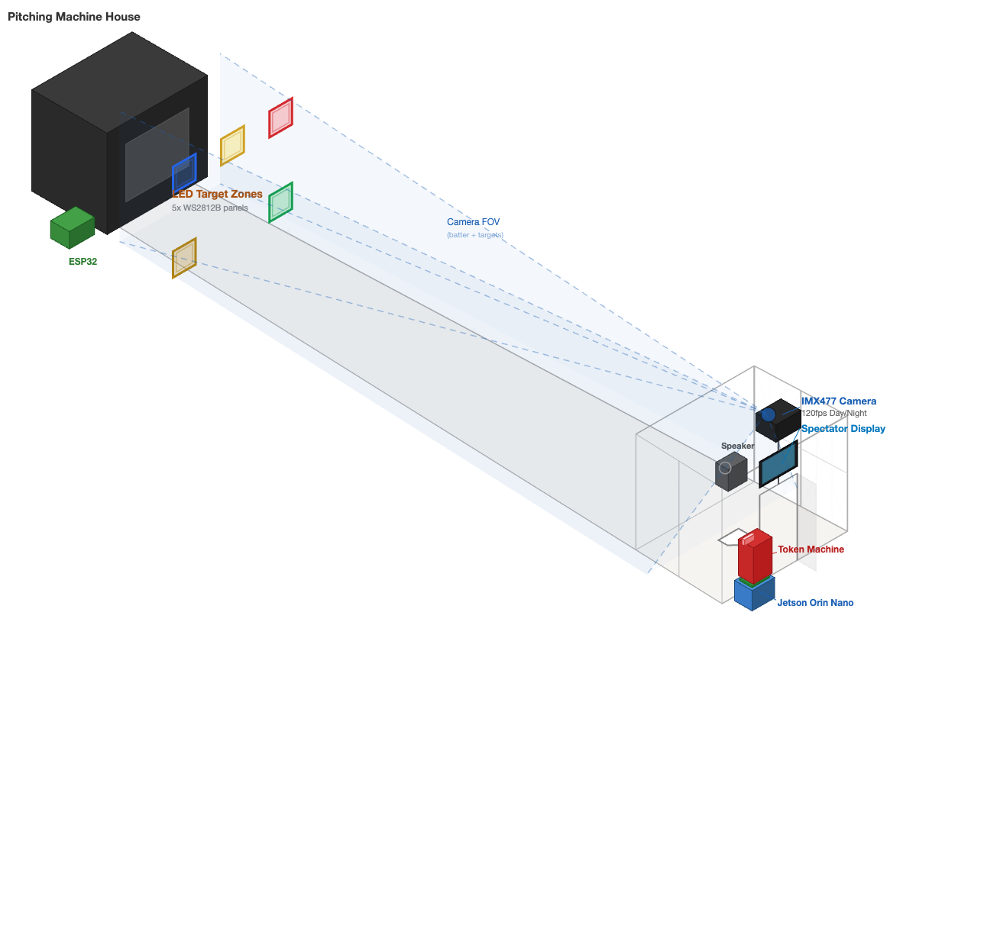
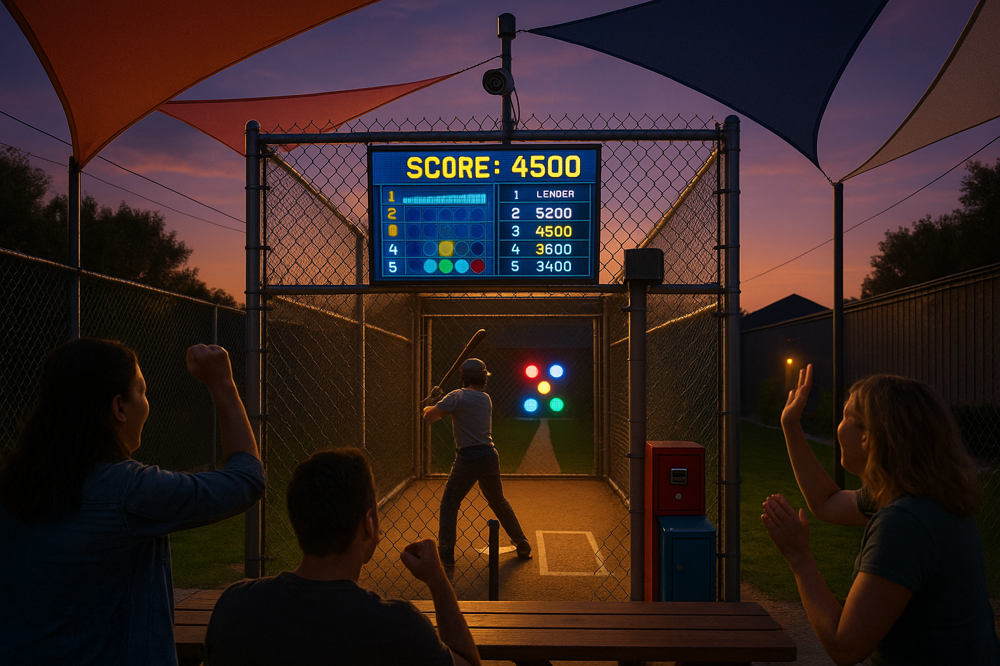
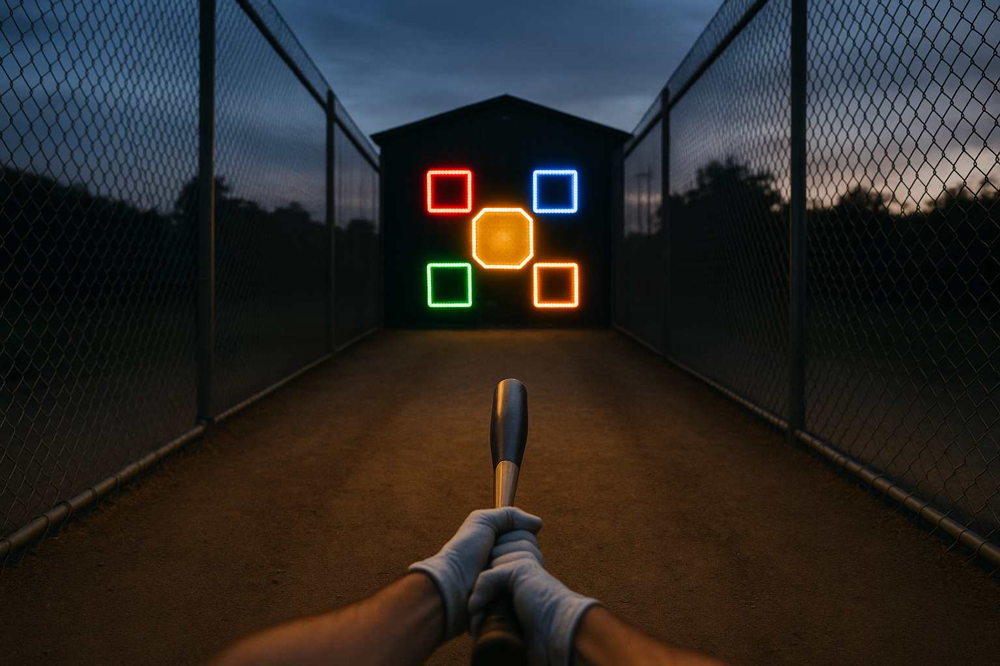

# CAGE MATCH: Gamified Batting Cage Experience
## Business Plan for Batter Up, Bethpage, Long Island

**Prepared:** April 7, 2026  
**Version:** 1.0  
**Status:** Draft for Internal Review

---

## Table of Contents

1. [Executive Summary](#1-executive-summary)
2. [The Opportunity](#2-the-opportunity)
3. [Game Concept](#3-game-concept---cage-match)
4. [Hardware Architecture](#4-hardware-architecture)
5. [MVP vs. Full Build](#5-mvp-vs-full-build)
6. [Bill of Materials](#6-bill-of-materials)
7. [Financial Projections](#7-financial-projections)
8. [Implementation Timeline](#8-implementation-timeline)
9. [Competitive Moat](#9-competitive-moat)
10. [Risks & Mitigations](#10-risks--mitigations)
11. [Phase 2 Expansion](#11-phase-2-expansion)
12. [Visual Mockups](#12-visual-mockups)

---

## 1. Executive Summary

**Cage Match** transforms one of Batter Up's existing batting cages into an interactive, gamified experience — a cross between a pinball machine and TopGolf, but for baseball.

Using computer vision, LED targets, and a real-time scoring display, batters compete against themselves and each other in a game that turns 10 pitches into an arcade experience. Spectators watch the action unfold on a display outside the cage. A persistent leaderboard drives repeat visits and social sharing.

**The key insight:** Long Island has zero gamified batting cage experiences. Every cage on the island operates with 1980s technology — token in, hit, leave. No scores, no competition, no reason to come back tomorrow. Cage Match changes that.

**Investment:** ~$1,500 for the MVP (tablet display), ~$3,000 for the full build (outdoor TV)  
**Proprietary hardware:** Custom-built using NVIDIA Jetson + computer vision  
**No licensing fees:** Unlike HitTrax ($10K-$20K) or ProBatter ($30K), this system is owned outright  
**Zero disruption to existing operations:** The game overlays on top of the current token system

---

## 2. The Opportunity

### The Market Gap

| What Exists on Long Island | What Does NOT Exist |
|---|---|
| 15+ batting cage facilities | Zero gamified batting experiences |
| 1 HitTrax facility (Bohemia, training-focused) | No recreational/social hitting venue |
| Traditional token-operated cages unchanged since the 1980s | No leaderboards, no group competition |
| Baseball culture deeply embedded in LI families | No "TopGolf of baseball" anywhere in the NY metro |

### The Proof Points

- **Batbox** (Dallas, TX) opened Oct 2025 as the "TopGolf of baseball" — charges $18-24/person/hour, raised $7.3M, plans 25+ US locations by 2030. No East Coast locations yet.
- **TopGolf** proved that gamifying a commoditized range experience creates a 5-10x revenue premium. There is no TopGolf on Long Island.
- **HitTrax** cages command a 50-75% pricing premium over standard cages nationally.
- **Bowlero** transformed bowling from $5/game to $45-65/hour per lane using the same playbook: gamification + time-based pricing + social experience.

### The Historical Inspiration

Baseball and gaming have been intertwined since the 1920s. The first coin-operated baseball pinball machines appeared in 1929, and by the 1940s, companies like Williams, Gottlieb, and Chicago Coin had created an entire genre of pitch-and-bat arcade games that were wildly popular. These games succeeded because they combined real skill with arcade scoring, visual feedback, and social competition — the exact same elements that make TopGolf work today.

Cage Match brings this full circle: a real batting cage with arcade game mechanics.

### Why Batter Up Is Perfectly Positioned

- **Existing customer base and brand recognition** — Batter Up has operated in Bethpage since the 1980s
- **Physical infrastructure already in place** — 9 hardball + 4 softball cages, power, lighting
- **Spectator area with seating** — picnic tables, shade sails, and a social gathering space right behind the cages
- **Mini golf draws families** — built-in foot traffic of the exact target demographic
- **Family-owned** — can move fast, test, iterate without corporate approval chains

---

## 3. Game Concept — CAGE MATCH

### Overview

Cage Match is a points-based target game played during a standard 10-pitch batting cage session. The batter aims for illuminated LED target zones inside the cage. A computer vision system tracks where the ball goes after each swing. Scores appear on a display visible to spectators, and a persistent leaderboard drives repeat visits.

### How It Works

1. **Batter walks up to the Cage Match cage** — it looks different from the other cages. LED targets glow inside. A display outside shows the leaderboard and "DROP A TOKEN TO PLAY."
2. **Batter drops a token** — the token signal triggers the game system. The display shows "GAME ON" and the pitching machine activates (same as today).
3. **Targets light up** — 5 LED target panels mounted on the far end of the cage illuminate. Each target is a different color and point value.
4. **Batter swings** — the high-speed camera tracks the ball after contact. If the ball enters a target zone, the corresponding target flashes, a sound effect plays (pinball ding, crowd cheer), and points appear on the display.
5. **Multiplier builds** — hit 2 targets in a row and the multiplier goes to 2x. Three in a row = 3x. A miss resets the multiplier. This creates the "streak" mechanic that makes people say "one more try."
6. **After 10 pitches** — final score displays with a celebration animation. If the score makes the leaderboard, it goes up on the board with the batter's first name (entered on a simple touchscreen before the game, or just "PLAYER").
7. **Leaderboard persists** — daily and all-time high scores visible to everyone walking by.

### Scoring System

| Target Zone | Location | Points | Color |
|---|---|---|---|
| Bullseye | Center | 1,000 | Gold (flashing) |
| Upper Left | High & pulled | 500 | Red |
| Upper Right | High & opposite field | 300 | Blue |
| Lower Left | Line drive pull side | 200 | Green |
| Lower Right | Line drive opposite | 100 | Yellow |

**Bonus mechanics:**
- **Streak Multiplier:** 2x after 2 consecutive hits, 3x after 3, max 5x
- **Bonus Target:** Randomly, one target flashes gold for one pitch — worth 2,000 points
- **Perfect Game:** Hit all 10 pitches into target zones = 5,000 point bonus
- **Maximum theoretical score:** ~35,000 points (all bonus targets + max multiplier + perfect game)

### Game Modes (MVP = Mode 1 only)

**Mode 1 — Target Blitz (MVP)**
- 10 pitches, score as many points as possible
- Leaderboard competition
- 1 token, same as a regular cage session

**Mode 2 — Derby (Phase 2)**
- 2-4 players take turns, 10 pitches each
- Head-to-head competition on the display
- Last place gets a 5-pitch redemption round at 3x multiplier
- Birthday party / group mode

**Mode 3 — Innings (Phase 2)**
- 9 innings, 3 strikes = 1 out, 3 outs = inning over
- Hit zones map to singles, doubles, triples, home runs
- Virtual base runners displayed on screen
- Premium offering (requires more tokens / time)

### The Social Loop

```
See leaderboard → Want to try → Play → Get score →
  ↗ "I can beat that" → Play again (more tokens)
  ↗ Tell friend → Friend comes → New player
  ↗ Post on social → Organic marketing
```

The leaderboard is the engine. It converts every play into either a repeat play or a referral.

---

## 4. Hardware Architecture

### System Diagram



### Components

| Component | Hardware | Role |
|---|---|---|
| **Brain** | NVIDIA Jetson Orin Nano Super ($249) | Runs computer vision, game logic, serves web app display |
| **Eyes** | Arducam IMX477 @ 1080p/120fps ($65) | Tracks ball trajectory after bat contact |
| **Targets** | ESP32 + WS2812B LED strips behind polycarbonate ($150) | 5 illuminated target zones inside the cage |
| **Display** | Weatherproof tablet or outdoor TV | Shows game state, scores, leaderboard |
| **Trigger** | Optocoupler on token machine signal ($8) | Detects token insertion, starts game session |
| **Audio** | Weatherproof speakers ($85) | Pinball sounds, crowd reactions, score announcements |
| **Network** | 4G router or existing WiFi ($89) | Internet for leaderboard sync, remote monitoring |

### How Ball Tracking Works

1. Camera runs at 120 frames per second, mounted behind and above the batter
2. When a pitch is thrown, the system watches for bat-ball contact (sudden change in ball trajectory)
3. After contact, OpenCV background subtraction + centroid tracking follows the ball across frames
4. The ball's trajectory is mapped to the 5 target zones (defined as pixel regions in the camera's field of view)
5. If the ball enters a zone, that zone scores — MQTT message sent to ESP32, LED target flashes
6. A baseball at 80mph moves about 1.1 feet per frame at 120fps — the system captures the ball in 3+ frames across the cage length, which is sufficient for zone detection

### Camera Placement

The camera mounts behind and above the batter position — the safest location since all balls travel AWAY from the camera. A 2.8mm wide-angle lens on the IMX477 sensor covers ~120 degrees horizontal field of view, enough to see the entire cage width from 30+ feet back. The cage's chain-link fence does not interfere with computer vision — the CV model learns to ignore the mesh pattern (a well-known technique in security camera AI).

---

## 5. MVP vs. Full Build

### MVP (Pilot) — ~$1,500

The MVP proves the concept with minimal investment and zero disruption to current operations.

| What's Included | What's Not |
|---|---|
| Jetson Orin Nano + camera + CV system | Outdoor TV (use tablet instead) |
| 5 LED target panels inside the cage | Food & beverage integration |
| Web app on a mounted tablet outside the cage | Player profiles / app |
| Token machine integration (auto-start) | Multiple game modes (Target Blitz only) |
| Daily leaderboard | Online/cloud leaderboard |
| Pinball sound effects | QR code score sharing |
| Same token price as regular cages | Premium pricing (free overlay for now) |

**MVP Cost Breakdown:**

| Category | Cost |
|---|---|
| Compute (Jetson + SSD + PSU + enclosure) | $389 |
| Camera (IMX477 + lens + housing + mount) | $156 |
| LED Targets (ESP32 + LEDs + polycarbonate + frames) | $414 |
| Audio (speakers + USB adapter) | $100 |
| Token Interface | $40 |
| Power & Infrastructure | $286 |
| Mounting Hardware | $69 |
| **Tablet display (iPad or rugged Android in weatherproof case)** | **~$100-200** |
| **MVP TOTAL** | **~$1,550-1,650** |

> Note: The SunBrite outdoor TV ($1,116 with mount) is deferred to Phase 1.5 after the MVP proves engagement.

### Full Build (Phase 1.5) — ~$3,000

Everything in the MVP, plus:
- SunBrite Veranda 3 55" outdoor TV replacing the tablet
- Dedicated outdoor surge protector for TV
- Enhanced audio system
- Networking (4G router for internet connectivity)

---

## 6. Bill of Materials

A detailed, line-item BOM with specific product recommendations, Amazon links, and pricing is available in the companion document:

**[cage_game_bom.md](cage_game_bom.md)**

Highlights:
- 47 line items across 9 categories
- Every component sourced from Amazon or direct vendor
- Phase 2 upgrade path documented
- Power architecture, networking architecture, and camera placement specs included

---

## 7. Financial Projections

### Conservative Model — MVP (Free Overlay)

During the MVP phase, the Cage Match cage costs the same tokens as any other cage. The goal is to measure engagement, not extract premium pricing.

**Key metrics to track:**
- Token revenue per hour on the Cage Match cage vs. adjacent standard cages
- Number of "replay" sessions (same person buying more tokens immediately)
- Time spent in the spectator area watching
- Social media mentions / photos of the leaderboard
- Customer feedback (informal)

**Break-even:** At ~$1,600 MVP cost and an average of $2/token with 10 extra token purchases per day driven by the game, break-even is **80 days** (~3 months).

### Optimistic Model — Premium Pricing (Post-MVP)

Once the concept is proven, the Cage Match cage can move to premium pricing.

| Scenario | Price | Sessions/Day | Daily Revenue | Monthly Revenue |
|---|---|---|---|---|
| **Current** (standard token) | $2/token | ~40 tokens/day | $80 | $2,400 |
| **MVP** (same price, more tokens) | $2/token | ~60 tokens/day (+50%) | $120 | $3,600 |
| **Premium** (dedicated game session) | $5/game | ~30 games/day | $150 | $4,500 |
| **Group Package** (4 players, 30 min) | $40/group | ~8 groups/day | $320 | $9,600 |

**The group package is the real revenue driver.** Four friends pay $10 each for 30 minutes of competitive batting — cheaper than TopGolf per person but 4x the revenue of token play per time slot.

### Revenue Multiplier Effects

| Effect | Impact |
|---|---|
| **Repeat visits** | Leaderboard drives "I need to beat that score" returns |
| **Social media** | Photos of leaderboard = free marketing |
| **Word of mouth** | "Have you tried the game cage at Batter Up?" |
| **Extended stays** | Groups stay longer → more mini golf, snacks, arcade |
| **Birthday packages** | "Cage Match birthday party" is a differentiated offering |
| **Event bookings** | Corporate team outings, league nights, tournaments |

---

## 8. Implementation Timeline

### Phase 0: Planning & Procurement (Weeks 1-2)
- [ ] Order all BOM components
- [ ] Determine which cage to convert (recommend: a middle-speed cage, ~50-60 mph)
- [ ] Survey electrical capacity at target cage
- [ ] Design target zone layout for the specific cage dimensions
- [ ] Set up Jetson development environment
- [ ] Begin computer vision prototyping (ball detection in test footage)

### Phase 1: Hardware Build (Weeks 3-5)
- [ ] Fabricate LED target frames (aluminum channel + polycarbonate + LED strips)
- [ ] Build electronics enclosures (Jetson box + power distribution box)
- [ ] Wire token machine interface (optocoupler tap)
- [ ] Mount camera in weatherproof housing
- [ ] Install ESP32 + LED targets in the cage (during off-hours or rain day)
- [ ] Run conduit and power to all components
- [ ] Mount tablet display outside cage

### Phase 2: Software Development (Weeks 3-6, parallel with hardware)
- [ ] Ball tracking CV pipeline (OpenCV + CUDA on Jetson)
  - Background subtraction model
  - Ball centroid detection and tracking
  - Zone intersection logic
- [ ] Game engine (Python/FastAPI on Jetson)
  - Game state machine (idle → ready → playing → scoring → leaderboard)
  - Scoring logic with multiplier system
  - Token trigger integration
  - MQTT communication with ESP32
- [ ] Web app display (React or vanilla JS)
  - Game-in-progress view (score, pitch count, active targets, multiplier)
  - Leaderboard view (daily + all-time)
  - Idle/attract mode ("DROP A TOKEN TO PLAY")
  - Celebration animations on score / leaderboard entry
- [ ] Sound design
  - Target hit sounds (pinball ding, crowd cheer variations)
  - Multiplier build sounds (escalating tones)
  - Strike/miss sound
  - Game over / leaderboard entry fanfare
- [ ] ESP32 firmware
  - MQTT listener for target activation commands
  - LED animation patterns (idle pulse, active glow, hit flash, celebration)
  - Token detection interrupt handler

### Phase 3: Integration & Testing (Weeks 6-7)
- [ ] Full system integration test in the cage
- [ ] Calibrate camera zones to physical target positions
- [ ] Test in various lighting conditions (day, dusk, night, overcast)
- [ ] Test ball tracking accuracy at different pitch speeds
- [ ] Stress test: continuous play for 2+ hours
- [ ] Weatherproofing verification (hose test)
- [ ] Sound level check (audible from spectator area, not annoying to neighbors)

### Phase 4: Soft Launch (Week 8)
- [ ] Install during off-hours
- [ ] Invite family/friends for beta testing
- [ ] Collect feedback, iterate on scoring balance and display
- [ ] Go live — same token price, no fanfare, observe organic engagement

### Phase 5: Full Launch (Week 10+)
- [ ] Social media announcement
- [ ] "Grand Opening" event — first weekly tournament
- [ ] Evaluate premium pricing model based on MVP data
- [ ] Decide on outdoor TV upgrade (Phase 1.5)

**Total timeline: ~10 weeks from start to launch**

---

## 9. Competitive Moat

### Why This Can't Be Easily Copied

| Moat | Detail |
|---|---|
| **Custom hardware** | Proprietary system built to Batter Up's exact cage dimensions and needs. No off-the-shelf product does this at this price. |
| **First-mover on LI** | Zero gamified cages exist on Long Island. First to market builds the brand association. |
| **Leaderboard network effect** | As more players join the leaderboard, the value increases for everyone. Players come to compete against the community, not just themselves. |
| **Low cost of entry** | At ~$1,500 for the MVP, this is 10x cheaper than HitTrax and 20x cheaper than ProBatter. The economics allow experimentation without existential risk. |
| **Software iteration** | Because the game is a web app, new modes, events, and features can be deployed instantly. A weekly "Double Points Night" costs nothing to create. |
| **Existing foot traffic** | Batter Up already has customers. This converts existing visitors into higher-value visitors. |

### Competitive Position

```
                    Fun / Social ↑
                         |
              CAGE MATCH |  BATBOX
              (Batter Up)|  ($7.3M, Dallas only)
                         |
         ────────────────┼────────────────→ Technology
                         |
            Standard     |  HitTrax
            Batting Cages|  ($10-20K, training-focused)
                         |
```

Cage Match occupies the "fun + accessible" quadrant that no one on Long Island currently serves.

---

## 10. Risks & Mitigations

| Risk | Severity | Mitigation |
|---|---|---|
| **Ball tracking accuracy** — CV may struggle in some lighting conditions | Medium | Test extensively before launch. Night games (under flood lights) may actually be easier than bright sun. Can fall back to simpler detection (break-beam sensors at targets) if CV proves unreliable. |
| **Weather damage** — outdoor electronics exposed to elements | Medium | All components in NEMA 4X rated enclosures. Camera in IP66 housing. LED targets behind polycarbonate. System designed to survive rain, heat, and cold. Power down during severe weather (automated via Jetson). |
| **Ball impact on targets** — baseballs hit the polycarbonate covers | Low | 1/4" polycarbonate is 250x more impact-resistant than glass. Used in riot shields and machine guards. LED strips are behind the panel, not exposed. Replace covers annually if needed ($22/each). |
| **Customer confusion** — people don't understand the game | Low | "DROP A TOKEN TO PLAY" on idle screen. Targets are intuitive — they light up, you aim at them. No instructions needed beyond what a pinball machine provides. |
| **Brother buy-in** — need to prove value before disrupting a cage | Low | MVP is a free overlay. Same tokens, same price, same pitching machine. The only change is LED targets on the back fence and a tablet outside. Zero revenue risk. |
| **Maintenance / reliability** — system needs to work unsupervised all day | Medium | Jetson auto-boots on power cycle. Watchdog timer restarts crashed services. Game gracefully degrades — if CV fails, targets still look cool and the leaderboard still works manually. Remote monitoring via 4G. |

---

## 11. Phase 2 Expansion

Once the MVP proves engagement, the following expansions become possible:

### Near-Term (3-6 months post-launch)
- **Outdoor TV upgrade** — replace tablet with SunBrite 55" display ($1,000)
- **Player profiles** — QR code scan to create a profile, persistent stats across visits
- **Derby mode** — multiplayer head-to-head competition
- **Weekly tournaments** — Friday Night Derby events, prizes for top scores
- **Social sharing** — "Share your score" link after each game

### Medium-Term (6-12 months)
- **Second cage conversion** — if Cage 1 proves out, convert a second cage (different speed)
- **Mobile app** — player profiles, leaderboard, session booking
- **Birthday party packages** — "Cage Match Party" as a premium offering
- **Second camera** — triangulated 3D ball tracking for exit velocity and launch angle data
- **Speed radar integration** — display pitch speed and exit velocity

### Long-Term (12-24 months)
- **Food & beverage** — partner with a food truck or build a concession stand near the game cages
- **Corporate events** — team-building packages
- **League nights** — weekly competitive leagues with standings
- **Multi-cage tournament mode** — 2-4 game cages all competing simultaneously
- **Franchise the system** — sell/license the Cage Match system to other batting cage operators

### The Endgame Vision

Batter Up becomes the first "sports entertainment" batting facility on Long Island — a destination, not a commodity. The mini golf already draws families; Cage Match draws young adults, groups, and repeat visitors. A food truck adds dwell time and ancillary revenue. Weekly tournaments create a community.

This is the Bowlero playbook applied to batting cages: same physical space, dramatically higher revenue per square foot, and a customer base that comes for the experience, not just the batting.

---

## 12. Visual Mockups

### Cage Exterior View

*The Cage Match cage at dusk. LED targets glow inside the chain-link cage. A tablet display shows the leaderboard to spectators. The red token machine is at the cage entrance — same as every other cage.*

### Batter's POV — Inside the Cage

*What the batter sees: 5 illuminated target panels at the far end of the cage. Each target shows its point value. The gold center target (1,000 pts) is the bullseye. The layout is designed to reward both power (upper targets) and placement (corner targets).*

### Tablet Display — Game in Progress

*The Cage Match web app running on a mounted tablet. "MIKE D" is mid-game with 2,450 points and a 3X multiplier. The pitch counter shows 7 of 10. Today's top scores are on the right. At idle, the screen shows "DROP A TOKEN TO PLAY."*

### System Architecture

*System architecture: Jetson Orin Nano runs the vision AI and game logic. High-speed camera tracks ball trajectory. ESP32 drives LED targets via MQTT. Tablet connects via WiFi to display the web app. Token machine signal triggers game start.*

### Spectator Experience

*The social experience: friends and families gathered at the picnic tables watch the game unfold. A girl points at the tablet showing her friend's score. Inside the cage, LED targets flash as the batter connects. This is the TopGolf effect — the spectators are part of the experience.*

---

## Appendices

- **[Detailed Bill of Materials](cage_game_bom.md)** — 47 line items with specific products, Amazon links, and pricing
- **[Competitive Analysis](batting_cage_competitive_analysis.md)** — Full market landscape, LI/NYC facility inventory, pricing benchmarks
- **[Baseball Pinball Research](baseball_pinball_research.md)** — Historical inspiration from 100 years of baseball gaming

---

*Prepared by Nick DeMarco with AI assistance. April 2026.*
