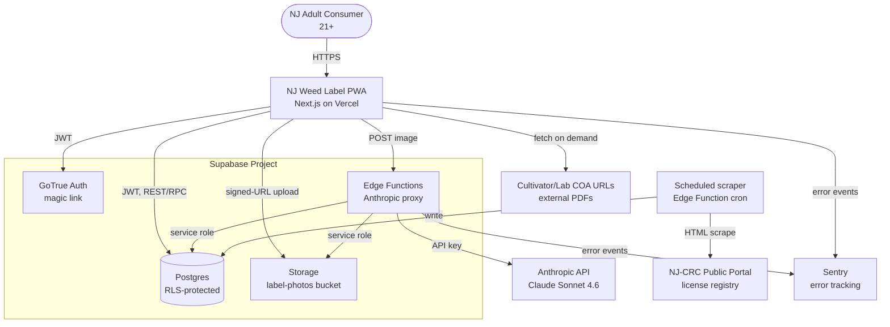
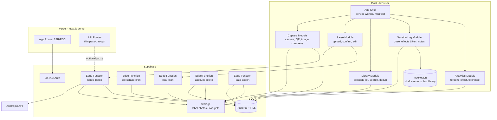
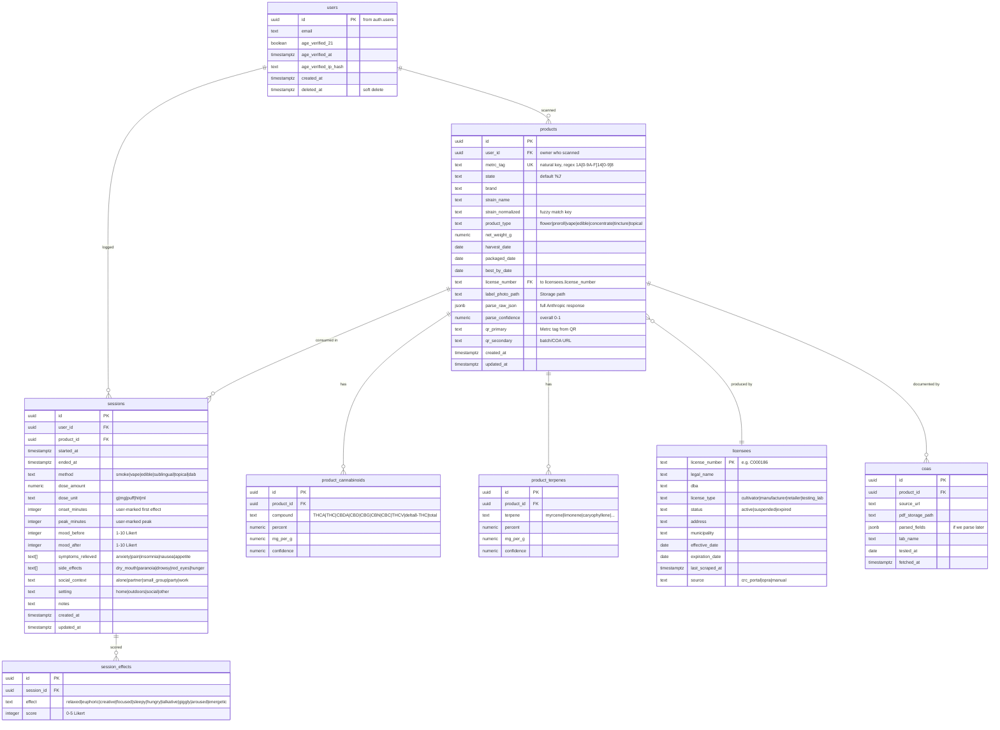
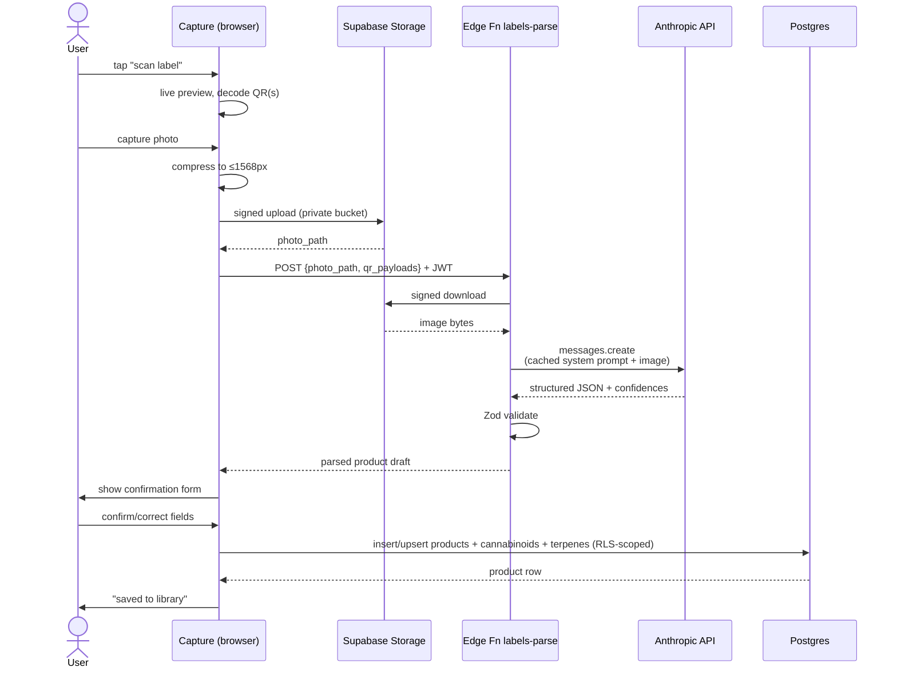
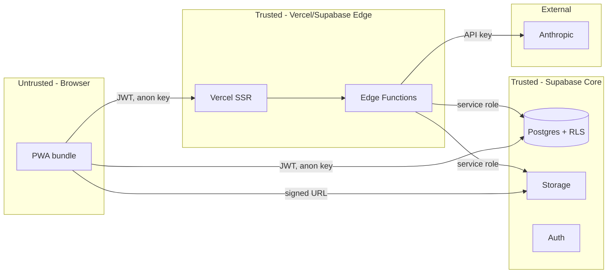

# Software Architecture: NJ Weed Label Reader & Reporter (PWA)

**Version:** 0.1
**Last Updated:** 2026-05-05
**Author:** Nick DeMarco with AI assistance (Software Architecture agent)
**Status:** Draft — for review
**PRD Reference:** _PRD in parallel; this SAD assumes the feature surface in `discovery-brief.md` plus heavy session logging._
**Discovery Reference:** [`./discovery-brief.md`](./discovery-brief.md)

---

## 1. Executive Summary

### 1.1 System Overview

A Progressive Web App that lets a New Jersey adult-use cannabis consumer photograph a product label, automatically extracts the structured fields on that label (Metrc tag, cannabinoid table, terpene table, strain, harvest date, license #, brand) via Claude Sonnet 4.6 vision, and then logs detailed consumption sessions tied to that product over time. The user gets a private, searchable library of products they've tried, plus longitudinal analytics — "which terpene profiles correlate with my best mood lift," "how my onset/peak shift with tolerance," "which licensees consistently report accurate THCA."

The system is intentionally **PWA-only** for MVP — no native shells. This keeps a single codebase, sidesteps App Store cannabis-policy risk, and exploits modern iOS Safari (16.4+) and Chrome capabilities for camera, file capture, and barcode scanning. Cloud backend is **Supabase** (Postgres + Auth + Storage + Edge Functions). The Anthropic API key never touches the client; all vision calls go through a Supabase Edge Function that enforces auth and rate limits.

It is **NJ-only** in scope but the data model is structured so a future state column on `products` and `licensees` can lift the constraint without a rewrite.

### 1.2 Key Architectural Decisions

| # | Decision | Choice | Rationale |
|---|---|---|---|
| 1 | Client platform | **PWA (Next.js App Router)** | One codebase, sidesteps App Store cannabis policy, modern mobile browsers cover the camera+barcode surface |
| 2 | Hosting | **Vercel** | First-class Next.js + edge runtime + image optimization + simpler env story than Cloudflare Pages for App Router; revisit if egress cost dominates |
| 3 | Backend | **Supabase** (Postgres, Auth, Storage, Edge Functions) | RLS gives us per-user isolation by default; Postgres handles the analytical joins (terpene → effect); single vendor for data + auth + blob + serverless |
| 4 | Auth | **Supabase email + magic link**, with 21+ self-attestation gate | Lowest-friction; magic link avoids password storage; explicit attestation captured at signup with timestamp |
| 5 | Vision | **Claude Sonnet 4.6 via Anthropic API**, single call image → typed JSON, with prompt caching on the system prompt | One round-trip; LLM tolerates label-layout drift; prompt caching cuts cost ~80% on the static schema portion |
| 6 | Storage | Supabase Storage, **private bucket** with signed URLs | Photos are sensitive; never publicly addressable |
| 7 | Cannabinoids/terpenes | **Hybrid: normalized rows in `product_cannabinoids` / `product_terpenes`, plus `parse_raw_json` on `products`** for round-trip fidelity | Analytics joins (terpene → effect) need normalized columns; raw JSON preserves what the LLM saw |
| 8 | QR scanning | `BarcodeDetector` API, `@zxing/browser` polyfill on iOS Safari | Native where supported, polyfill where not — both decode QR + Code-128 |
| 9 | Camera | `getUserMedia` for live preview + `<input type=file capture>` fallback | Live preview where supported; native picker is universal escape hatch |
| 10 | Privacy posture | RLS on every table, encrypted-at-rest (Supabase default AES-256), signed URLs, account-deletion + data-export endpoints | Cannabis data is sensitive; cloud sync is a hard requirement, so isolation must be RLS-enforced not app-enforced |

### 1.3 Technology Stack Summary

| Layer | Technology |
|---|---|
| Frontend | Next.js 15 (App Router), React 19, TypeScript, Tailwind CSS, shadcn/ui |
| PWA shell | `next-pwa` (or hand-rolled service worker), Web App Manifest, IndexedDB (Dexie) for offline draft sessions |
| Camera / scan | `getUserMedia`, `BarcodeDetector`, `@zxing/browser` (iOS fallback), `browser-image-compression` for resize |
| State / data | TanStack Query, Supabase JS client v2, Zod for schema validation |
| Backend | Supabase (managed Postgres 15, GoTrue Auth, Storage, Edge Functions on Deno) |
| LLM | Anthropic API, `claude-sonnet-4-6` model, prompt caching, structured output via tool-use |
| Observability | Sentry (browser + Edge Functions), Vercel Analytics, Supabase logs |
| CI/CD | GitHub Actions → Vercel preview per PR, Supabase migrations via `supabase db push` |

---

## 2. System Context

### 2.1 Context Diagram



### 2.2 External Systems

| System | Purpose | Integration Type | Failure Mode |
|---|---|---|---|
| Anthropic API | Vision extraction of label fields | HTTPS REST, server-to-server from Edge Function | Retry once on 429/5xx; if persistent failure, return parse-failed status, let user enter manually |
| NJ-CRC Public Portal | Source-of-truth for license validity | Scheduled scrape (weekly cron Edge Function) | If scrape fails, last cached registry remains usable; license validation is best-effort, not blocking |
| Cultivator/lab COA URLs | Resolve QR-encoded links to lab PDFs | Direct browser fetch (CORS-permitting) or server-side fetch+cache fallback | Many will be CORS-blocked; server-side fetch on Edge Function caches the PDF in Storage |
| Sentry | Error/perf telemetry | SDK | Non-critical; degrade silently |

### 2.3 Users & Actors

| Actor | Description | Interactions |
|---|---|---|
| Consumer (primary) | NJ adult, 21+, recreational or medical user | Capture, parse, library, log sessions, view analytics |
| System (cron) | Scheduled job runner | Scrape CRC registry, refresh license cache, prune orphan photos |
| Admin (future) | Operator for moderation/abuse | Read-only via Supabase Studio for v0.1; no in-app admin UI |

---

## 3. Component Architecture

### 3.1 Component Diagram



### 3.2 Component Descriptions

#### Capture Module
- **Purpose:** Get a high-quality label image and any QR payloads from the user's camera.
- **Responsibilities:** request camera permission, render live preview via `getUserMedia`, run multi-frame `BarcodeDetector` (or `@zxing/browser` on iOS), client-side resize/compress to ≤1568px on the longest edge (Anthropic's optimal vision input), present a fallback `<input type=file accept=image/* capture=environment>` for unsupported browsers, upload to Supabase Storage with a signed upload URL.
- **Technology:** Browser Web APIs, `@zxing/browser`, `browser-image-compression`.
- **Inputs:** User camera stream / file picker.
- **Outputs:** `{ photoStoragePath, qrPayloads: string[], capturedAt }` handed to the Parse Module.

#### Parse Module
- **Purpose:** Turn an uploaded photo into a structured product record the user can confirm.
- **Responsibilities:** call `POST /functions/v1/labels-parse` with the photo path + QR payloads, render a confirmation form with each field pre-filled and per-field confidence indicators, allow inline correction, submit to `POST /api/labels/confirm` to persist the product (deduping on Metrc tag).
- **Inputs:** `{ photoStoragePath, qrPayloads }`.
- **Outputs:** Persisted `products` row + Metrc-tag-keyed library entry.

#### Library Module
- **Purpose:** Browse products the user has previously scanned.
- **Responsibilities:** list, search (strain, brand, license), filter (by THCA range, terpene), open product detail, open a new session from a product.
- **Inputs:** Supabase query with RLS-scoped `user_id`.
- **Outputs:** UI; navigation events.

#### Session Log Module
- **Purpose:** Capture the heavy consumption record per use.
- **Responsibilities:** start a session timer, capture dose (amount + unit), method (smoke/vape/edible/topical/sublingual), real-time onset and peak markers, post-session Likert effects, mood pre/post, symptoms relieved, side effects, social context, freeform notes; supports offline draft (IndexedDB) sync on reconnect.
- **Inputs:** User input + optional product link.
- **Outputs:** `sessions` row + `session_effects` rows (or jsonb).

#### Analytics Module
- **Purpose:** Surface patterns over time.
- **Responsibilities:** terpene-vs-effect cross-tab, tolerance curve (effective dose vs. time), favorite cultivars, mood delta distributions; client renders, server provides aggregated views/RPCs.
- **Inputs:** Supabase RPC calls (`get_terpene_effects`, `get_tolerance_curve`).
- **Outputs:** Charts (e.g., Recharts).

#### Edge Function: `labels-parse`
- **Purpose:** Server-side proxy that does the only thing the Anthropic key is allowed to do.
- **Responsibilities:** verify Supabase JWT, check per-user rate limit, fetch image from Storage, call Anthropic with cached system prompt, validate response with Zod, return typed JSON.
- **Inputs:** `{ photo_path: string, qr_payloads: string[] }`.
- **Outputs:** Parsed product fields + confidences + raw JSON.

#### Edge Function: `crc-scrape` (cron)
- **Purpose:** Maintain the licensee reference table.
- **Responsibilities:** scheduled (weekly) scrape of the NJ-CRC public portal, upsert rows into `licensees`, mark stale rows, log diffs.
- **Inputs:** none (cron-triggered).
- **Outputs:** Updated `licensees` table + scrape audit log.

#### Edge Function: `coa-fetch`
- **Purpose:** Server-side fetch + cache of cultivator/lab COA PDFs (works around CORS, fights link rot).
- **Inputs:** `{ url, product_id }`.
- **Outputs:** `coas` row with `pdf_storage_path`.

#### Edge Function: `account-delete` & `data-export`
- **Purpose:** GDPR-style user rights (even though NJ has no GDPR, this is best-practice + sets up CCPA/MDPHA compliance).
- **Inputs:** Authenticated user.
- **Outputs:** Deletion runs cascade; export returns a signed URL to a JSON+ZIP archive of all user data.

---

## 4. Data Architecture

### 4.1 Data Model (ERD)



### 4.2 Schema Notes & Indexes

**Cannabinoids/terpenes — JSONB vs normalized:** **Normalized** (`product_cannabinoids`, `product_terpenes`) plus a `parse_raw_json` blob on `products` for round-trip fidelity. Rationale below in ADR-004; the short version is that the analytics module's killer feature is "show me effects when myrcene > 0.5%", which demands a real column, real index, and real `JOIN`. JSONB makes that query write-time-cheap but read-time-painful.

**Indexes (v0.1):**
- `products(user_id, created_at desc)` — library list pagination
- `products(metrc_tag)` UNIQUE — dedup natural key
- `products(strain_normalized)` — fuzzy library search; consider `pg_trgm` GIN
- `product_cannabinoids(product_id, compound)` and `(compound, percent)` — analytics range scans
- `product_terpenes(product_id, terpene)` and `(terpene, percent)` — terpene-effect joins
- `sessions(user_id, started_at desc)` — session timeline
- `sessions(product_id)` — "all my sessions on this product"
- `session_effects(session_id, effect)` — per-session effect lookup
- `licensees(license_number)` PK; `licensees(status)` partial index where `status = 'active'`
- `coas(product_id, fetched_at desc)`

**Extensions to enable:** `uuid-ossp`, `pgcrypto`, `pg_trgm` (fuzzy strain match), `pg_cron` (scheduled scrape if not using Edge Function cron).

### 4.3 Data Flow — "scan a label"



### 4.4 Data Retention & Deletion

| Data | Retention | Deletion strategy |
|---|---|---|
| `users` | Indefinite while active | Soft-delete (`deleted_at`); hard delete after 30-day grace via `account-delete` Edge Function |
| `products`, `sessions`, etc. | Indefinite while user active | Cascade-delete on user hard-delete |
| Label photos | Indefinite by default; **user-toggleable "delete photo after parse"** in settings | If toggled, Edge Function deletes the Storage object after a successful parse |
| COA PDFs | Indefinite (small) | Cascade with product |
| Auth logs | Supabase default (30d) | Supabase-managed |
| App logs | 30 days hot, then dropped | No PII (see §8) |

---

## 5. API Design

### 5.1 API Style

Hybrid:
- **Direct Supabase REST/RPC** from the browser for ordinary CRUD (RLS enforces security; no need to write a wrapper).
- **Supabase Edge Functions** (Deno, HTTPS) for anything requiring a server secret (Anthropic key, scraping) or non-trivial business logic.
- **Next.js API routes** are a thin optional pass-through if we want CSRF-protected same-origin endpoints; v0.1 keeps it minimal.

All endpoints require a valid Supabase JWT in the `Authorization: Bearer` header. RLS enforces that `user_id = auth.uid()` on all user-scoped tables.

### 5.2 Authentication & Authorization

- **Authentication:** Supabase Auth, email + magic link. JWT (RS256), 1-hour access token, 30-day refresh token. Magic link expires in 15 minutes.
- **Authorization:** RLS policies (see §7). No app-level roles in v0.1 beyond "authenticated user owns their rows." A future `is_admin` boolean on `users` enables a moderation policy if/when needed.
- **Age gate:** signup form requires `age_verified_21 = true`; trigger sets `age_verified_at = now()` and stores `sha256(client_ip)` for audit. RLS denies all data writes if `age_verified_21 IS NOT TRUE`.

### 5.3 Key Endpoints

#### Edge Functions (server-secret required)

| Method | Path | Purpose |
|---|---|---|
| POST | `/functions/v1/labels-parse` | Image (path) + QR payloads → structured product JSON with confidences. **Multipart not used; client uploads to Storage first, then sends the path.** |
| POST | `/functions/v1/coa-fetch` | Server-side fetch + cache of a COA PDF URL |
| POST | `/functions/v1/account-delete` | Hard delete current user + all owned data |
| GET | `/functions/v1/data-export` | Returns signed URL to a ZIP archive of all user data |
| POST | `/functions/v1/crc-scrape` | Cron-triggered (auth via service role); refreshes `licensees` |

#### Direct PostgREST / RPC (browser-callable, RLS-protected)

| Method | Path | Purpose |
|---|---|---|
| POST | `/rest/v1/products` | Confirm and persist a parsed product (insert; on conflict on `metrc_tag`, update) |
| GET | `/rest/v1/products?select=...` | List/search products (RLS auto-scopes to user) |
| GET | `/rest/v1/products?id=eq.{id}` | Get product detail |
| POST | `/rest/v1/sessions` | Create a session |
| PATCH | `/rest/v1/sessions?id=eq.{id}` | Update an in-progress session (mark onset/peak, end it) |
| GET | `/rest/v1/sessions?select=...` | List sessions, filter by product/date |
| POST | `/rest/v1/rpc/get_terpene_effects` | Aggregated terpene-vs-effect view |
| POST | `/rest/v1/rpc/get_tolerance_curve` | Effective-dose-over-time aggregation |
| GET | `/rest/v1/licensees?license_number=eq.C000186` | Validate a license (read-only public-ish via a view) |

#### Sample Request / Response — `labels-parse`

Request:
```json
POST /functions/v1/labels-parse
Authorization: Bearer <jwt>
Content-Type: application/json

{
  "photo_path": "label-photos/u_abc/2026-05-05T12-00-00Z.jpg",
  "qr_payloads": ["1A4110300008C8D000041730", "9-120925"]
}
```

Response (200):
```json
{
  "product": {
    "metrc_tag": "1A4110300008C8D000041730",
    "brand": "Fresh Grow",
    "strain_name": "Blueberry Caviar",
    "product_type": "flower",
    "net_weight_g": 3.5,
    "harvest_date": "2025-12-10",
    "packaged_date": "2025-12-12",
    "license_number": "C000186",
    "cannabinoids": [
      { "compound": "THCA", "percent": 29.73, "confidence": 0.92 },
      { "compound": "THC", "percent": 0.45, "confidence": 0.88 },
      { "compound": "Total", "percent": 26.50, "confidence": 0.95 }
    ],
    "terpenes": [
      { "terpene": "myrcene", "percent": 0.81, "confidence": 0.90 },
      { "terpene": "caryophyllene", "percent": 0.42, "confidence": 0.87 }
    ]
  },
  "overall_confidence": 0.89,
  "low_confidence_fields": ["packaged_date"],
  "raw_json": { "...": "..." }
}
```

### 5.4 Error Handling

All errors follow a single shape:
```json
{
  "error": {
    "code": "PARSE_LOW_CONFIDENCE",
    "message": "Vision parse completed but confidence < 0.5",
    "details": { "fields": ["cannabinoids[0].percent"] }
  }
}
```

Standard codes: `UNAUTHORIZED`, `FORBIDDEN`, `RATE_LIMITED`, `VALIDATION_ERROR`, `PARSE_FAILED`, `PARSE_LOW_CONFIDENCE`, `UPSTREAM_ERROR`, `NOT_FOUND`, `CONFLICT_DUPLICATE_TAG`.

### 5.5 Rate Limiting

| Endpoint | Limit | Mechanism |
|---|---|---|
| `labels-parse` | 30 / hour / user, 200 / day / user | Edge Function + Postgres `rate_limits` table |
| `coa-fetch` | 10 / hour / user | same |
| `data-export` | 5 / day / user | same |
| `account-delete` | 1 / day / user | same |
| Direct PostgREST | Supabase project default (unauth 1k/h, auth 60k/h) | Supabase platform |

---

## 6. The Vision Pipeline (in detail)

### 6.1 Why this gets its own section

This is the highest-cost, highest-risk path in the system. Every photo costs money and every misparse erodes user trust. Worth designing carefully.

### 6.2 Client-side image preprocessing

Performed in the browser **before** upload, in this order:

1. **EXIF auto-rotate** — many phones write portrait images with rotation flags; normalize.
2. **Resize** to max 1568px on the longest edge. Anthropic vision is optimized at this size; bigger images cost more tokens with no accuracy gain.
3. **JPEG quality 85**. Below 80 starts to garble small terpene-table digits.
4. **Optional: dual capture.** Phase 2 — take two frames (auto-exposure + −1 EV) and let the LLM pick the better-readable one. Skipped in v0.1.
5. Upload via signed PUT to Supabase Storage.

Library: `browser-image-compression`. Target: ≤500KB per image after compression.

### 6.3 Prompt strategy

The Edge Function calls Anthropic with **two messages**:

1. **System message (cached via `cache_control: ephemeral`)** — contains the NJ label schema, parsing rules ("THCA and Δ9-THC are separate compounds; do not sum them"), formatting rules (numbers as numbers not strings, dates as ISO 8601), confidence rubric, and the JSON schema. ~2,500 tokens. Cached once per 5-minute window → ~80% cost reduction on repeated calls.

2. **User message** — the image plus the optional QR payloads as structured hints: `"QR codes detected on this label: [{tag, payload}]. Use them to populate metrc_tag and cross-check the license number if possible."`

**Structured output** is requested via Anthropic's tool-use mechanism: a single tool `extract_label` is offered, with a Zod-derived JSON schema, and the model is instructed (via `tool_choice: {type: "tool", name: "extract_label"}`) to always invoke that tool. This is more reliable than asking for JSON in free-form text.

### 6.4 Confidence scoring

The schema requires a `confidence` (0–1) on every cannabinoid percent, every terpene percent, and every date. The model is instructed:
- 1.0 = printed value clearly readable
- 0.7–0.9 = readable but minor glare/skew
- 0.4–0.6 = legible but partial occlusion or layout ambiguity
- <0.4 = guessing — return `null` and confidence

`overall_confidence` = mean of all field confidences, clamped to the minimum if any required field is below 0.4.

### 6.5 Low-confidence fallback

In the confirmation form, fields with confidence < 0.7 are visually highlighted (yellow border) and the user is gently prompted to verify. Fields with confidence < 0.4 are blanked and shown as "(could not read — please enter)". Nothing is persisted until the user taps **Confirm**.

### 6.6 Cost estimate

Anthropic Sonnet 4.6 vision pricing (as of the SDK current at writing): $3 / 1M input tokens, $15 / 1M output tokens, with prompt caching at $0.30 / 1M cache reads.

Per scan, typical:
- Image at 1568px ≈ ~1,200 tokens
- System prompt cached ≈ 2,500 tokens (cache read at $0.30/M ≈ negligible)
- User text (QR hints) ≈ 100 tokens
- Output (structured JSON) ≈ 600 tokens

Per-scan cost: `(1,300 × $3 + 2,500 × $0.30 + 600 × $15) / 1,000,000` ≈ **~$0.014 per scan**, dropping to ~$0.005 if the system prompt is cache-hit.

At 10 scans/user/week × 1,000 users = 40k scans/month ≈ **$200–$560/month** in Anthropic spend at MVP scale. Well within tolerable.

### 6.7 Error & retry

| Failure | Handling |
|---|---|
| 429 from Anthropic | Exponential backoff, 1 retry, then return `RATE_LIMITED` |
| 5xx from Anthropic | 1 retry with jitter, then `UPSTREAM_ERROR` |
| Zod validation fails on response | Log raw response + photo path to Sentry, return `PARSE_FAILED`, let user enter manually |
| `overall_confidence < 0.5` | Return `PARSE_LOW_CONFIDENCE`; client renders the manual-entry path with the partial fill as a starting point |
| Network failure mid-upload | IndexedDB saves the photo blob; retry on next online |

---

## 7. Infrastructure & Deployment

### 7.1 Hosting Decision: Vercel vs Cloudflare Pages

**Pick: Vercel.**

| Factor | Vercel | Cloudflare Pages | Winner |
|---|---|---|---|
| Next.js App Router support (RSC, streaming, ISR) | First-class — Next.js is a Vercel project | Functional but lags on RSC + ISR niceties | Vercel |
| Edge runtime | Yes (Vercel Edge Functions) | Yes (Workers) | Tie |
| Image optimization (we display label thumbs) | Built in | Requires `next-on-pages` workarounds or external service | Vercel |
| Egress cost | More expensive | Cheaper | Cloudflare |
| Auth / env story | Simpler | Comparable | Tie |
| Preview deploys per PR | Excellent | Good | Vercel |

The image-optimization story alone is worth it given the photo-heavy UX. Egress concerns are a v1+ problem. If we hit a billing wall, migrate to Cloudflare with R2 for storage.

### 7.2 Environments

| Environment | URL pattern | Supabase project | Purpose |
|---|---|---|---|
| Local | `localhost:3000` | `supabase start` (local) | Dev |
| Preview | `nj-weed-pr-<n>.vercel.app` | Shared `staging` Supabase project | Per-PR review |
| Staging | `staging.njweed.app` | `staging` project | Pre-prod, real Anthropic key with low limit |
| Production | `njweed.app` (placeholder) | `production` project | Live |

### 7.3 Environment variables

```
# Public (NEXT_PUBLIC_*)
NEXT_PUBLIC_SUPABASE_URL
NEXT_PUBLIC_SUPABASE_ANON_KEY
NEXT_PUBLIC_SENTRY_DSN

# Server-only (never exposed)
SUPABASE_SERVICE_ROLE_KEY        # Edge Functions only
ANTHROPIC_API_KEY                 # Edge Functions only
SENTRY_AUTH_TOKEN                 # CI only
```

The `ANTHROPIC_API_KEY` lives in Supabase Edge Function secrets (`supabase secrets set`), **never** as a Vercel env var. There is no Next.js code path that has access to it.

### 7.4 Supabase project structure

- One Supabase project per environment.
- Migrations in `supabase/migrations/` versioned in git, applied via `supabase db push` in CI.
- RLS policies in migrations, not Studio (for review).
- Edge Functions in `supabase/functions/<name>/index.ts`.
- Storage buckets:
  - `label-photos` — private, 5 MB max object size, image MIME only
  - `coa-pdfs` — private, 25 MB max, application/pdf only
  - `exports` — private, 90-day TTL via lifecycle, generated archives only

### 7.5 Scaling notes

- Supabase Free → Pro ($25/mo) at first paying user; gives us 8 GB DB, 100 GB storage, 2M Edge Function invocations.
- Edge Functions scale automatically; no warm-pool concerns.
- Postgres scaling: vertical for v0.1 (up to a 4-core compute add-on); horizontal read-replicas if analytics queries dominate.

---

## 8. Security Architecture

### 8.1 Trust boundaries



The key trust property: **the browser never sees the Anthropic API key or the Supabase service role key**, and Postgres never trusts the JWT alone — RLS enforces row-level isolation regardless of what the client claims.

### 8.2 RLS Policies (overview)

For every user-scoped table (`products`, `sessions`, `session_effects`, `product_cannabinoids`, `product_terpenes`, `coas`):

```sql
ALTER TABLE products ENABLE ROW LEVEL SECURITY;

CREATE POLICY "owner_select" ON products
  FOR SELECT USING (user_id = auth.uid());

CREATE POLICY "owner_insert" ON products
  FOR INSERT WITH CHECK (
    user_id = auth.uid()
    AND EXISTS (
      SELECT 1 FROM users
      WHERE id = auth.uid() AND age_verified_21 = TRUE
    )
  );

CREATE POLICY "owner_update" ON products
  FOR UPDATE USING (user_id = auth.uid())
  WITH CHECK (user_id = auth.uid());

CREATE POLICY "owner_delete" ON products
  FOR DELETE USING (user_id = auth.uid());
```

`licensees` is read-only public to authenticated users (no `user_id`); writes restricted to service role.

### 8.3 Authentication details

- Magic link only (no passwords means no password-reuse compromise).
- JWT validation on every Edge Function via Supabase's helper.
- Refresh tokens rotate; on refresh failure user is logged out and prompted to re-authenticate.
- Brute-force protection: Supabase platform default + per-IP rate limit on signup.

### 8.4 Age-gate enforcement

- Signup form: "I confirm I am 21 or older" checkbox + DOB entry (validated client- and server-side).
- Trigger on `auth.users` insert mirrors a row into `public.users` with `age_verified_21 = true` and `age_verified_at = now()`.
- A hashed client IP (sha256) is stored for audit only, not for IP geolocation.
- RLS on all writes additionally checks `age_verified_21 = TRUE` (defense in depth).

### 8.5 Photo storage privacy

- Bucket is **private**. No anonymous reads.
- Reads happen via short-lived signed URLs (60s TTL) generated server-side or via the Supabase JS client (which passes the user's JWT).
- A scheduled Edge Function (`storage-prune`) deletes orphaned objects (Storage paths with no matching `products.label_photo_path`) older than 24 hours.

### 8.6 Data subject rights

- **Export:** `GET /functions/v1/data-export` returns a signed URL to a ZIP containing `users.json`, `products.json`, `sessions.json`, `session_effects.json`, plus the user's photos.
- **Delete:** `POST /functions/v1/account-delete` soft-deletes immediately (sets `deleted_at`); a daily cron hard-deletes rows past 30-day grace, including Storage objects.

### 8.7 Data classification

| Data | Class | Protection |
|---|---|---|
| Email, IP hash, age verification | PII | RLS, encrypted at rest, never logged |
| Label photos | Personal data | Private bucket, signed URLs |
| Sessions, dose, effects | **Sensitive personal health-adjacent** | RLS, no PII in logs, opt-in retention controls |
| Metrc tags, license numbers | Public-ish | No special handling |

---

## 9. Cross-Cutting Concerns

### 9.1 Logging

- **Browser:** structured `console.info`/`error`, captured by Sentry; no user content (no notes, no photo data, no email).
- **Edge Functions:** `console.log` is captured by Supabase Logflare; structured JSON `{ level, msg, request_id, user_id_hash, latency_ms, ... }`. **Never log raw photo bytes, raw Anthropic response, or notes.**
- Correlation: every Edge Function generates an `x-request-id`, returned to client, stored in client logs, propagated to Anthropic call.

### 9.2 Monitoring & alerting

| Metric | Source | Alert |
|---|---|---|
| `labels-parse` p95 latency | Supabase logs | >5s for 10 min |
| `labels-parse` error rate | Supabase logs | >5% for 5 min |
| Anthropic spend | Manual + Anthropic dashboard | >$50/day, weekly review |
| Postgres connection saturation | Supabase metrics | >80% for 5 min |
| Storage usage | Supabase metrics | >75% of plan |

### 9.3 Error tracking

Sentry — both browser SDK (`@sentry/nextjs`) and Edge Functions (`@sentry/deno`). PII scrubbing config explicitly drops `email`, `notes`, `address`, `dose_*`, and any field path matching `*_jsonb`.

### 9.4 Configuration

- All secrets via Supabase secrets and Vercel env vars; no `.env` checked in.
- Feature flags via a simple `feature_flags` table queried at boot (e.g., `enable_coa_fetch`, `enable_analytics_v2`); Vercel Edge Config considered for v0.2.

### 9.5 Offline behavior

- App shell precached by service worker.
- Library list and last 50 sessions cached in IndexedDB (TanStack Query persistence).
- Session drafts written to IndexedDB first, synced when online (queue with retry).
- Label parse **requires online** — explicitly told to user; the photo is queued if offline.

---

## 10. Architectural Decision Records

### ADR-001: PWA over native iOS/Android

**Status:** Accepted
**Date:** 2026-05-05

**Context:** The discovery brief recommended React Native + Expo. The product owner has elected to ship PWA-only for MVP.

**Decision:** Build as a Next.js PWA. No native shells in v0.1.

**Consequences:**
- (+) One codebase, one deploy pipeline, no app-store review queue.
- (+) Sidesteps Apple's history of rejecting cannabis-tracking apps.
- (+) Instant updates — no version pinning/forced upgrade flows.
- (−) iOS Safari quirks (BarcodeDetector unavailable, intermittent `getUserMedia` issues) require polyfills.
- (−) Push notifications on iOS require iOS 16.4+ and home-screen install — discoverability/retention friction.
- (−) Camera quality slightly behind native APIs (no manual focus / exposure control yet).

**Alternatives considered:**

| Option | Pros | Cons |
|---|---|---|
| React Native + Expo | Best camera/scan APIs; native feel | App-store policy risk; two build pipelines; more code |
| Native iOS-first | Best OCR (Apple Vision); excellent UX | Cuts user base in half; Apple cannabis policy risk |
| Flutter | Cross-platform; good camera | Smaller ecosystem; team has no Dart experience |

---

### ADR-002: Supabase over Firebase + custom backend

**Status:** Accepted
**Date:** 2026-05-05

**Context:** Need cloud sync, auth, storage, and a server-side Anthropic proxy. Don't want to operate a custom Node API for v0.1.

**Decision:** Supabase for Postgres + Auth + Storage + Edge Functions.

**Consequences:**
- (+) Postgres is the right model for our analytics joins (terpene → effect, tolerance over time). Firestore would force denormalization.
- (+) RLS gives us per-user isolation by default; a single misconfigured policy is a smaller blast radius than a misconfigured server.
- (+) Edge Functions cover the Anthropic proxy without a separate service.
- (+) Open-source; can self-host later.
- (−) Edge Function ecosystem (Deno) is smaller than Node's; some libraries unavailable.
- (−) Single-vendor risk; mitigated by Postgres being portable.

**Alternatives considered:**

| Option | Pros | Cons |
|---|---|---|
| Firebase + Cloud Functions | Mature; great mobile SDK | Firestore poor for analytics; vendor lock-in stronger |
| Custom Node + Postgres on Render/Fly | Full control | More to operate; need to build auth/storage/RLS-equivalent |
| Cloudflare D1 + Workers + KV | Edge-fast; cheap | D1 is SQLite-flavored; no RLS; auth requires extra work |

---

### ADR-003: LLM vision over traditional OCR for v1 extraction

**Status:** Accepted
**Date:** 2026-05-05

**Context:** NJ label layouts are highly variable; cannabinoid/terpene tables include Greek letters, superscripts, and rotated text. Discovery brief compared Apple Vision, ML Kit, Document AI, Textract, and LLM-only paths.

**Decision:** Use Claude Sonnet 4.6 vision as the sole extraction path for v0.1, called from a Supabase Edge Function with prompt caching and tool-use structured output.

**Consequences:**
- (+) One round-trip; image → typed JSON; tolerates layout drift.
- (+) Prompt caching cuts cost by ~80%.
- (+) Per-field confidence enables a clean confirmation UX.
- (−) ~$0.01–$0.014 per scan, vs free on-device OCR.
- (−) Requires online; offline capture queues for later parse.
- (−) Occasional hallucinations on faint numbers (mitigated by confidence threshold + user confirm).

**Alternatives considered:**

| Option | Pros | Cons |
|---|---|---|
| On-device only (ML Kit Web / Tesseract.js) | Free; offline | No semantic field mapping; brittle on tables; weak on rotated text |
| Hybrid (browser OCR → LLM structuring) | Cheap; offline-ish | Two failure points; defer to v0.2 once we have ground truth |
| Document AI / Textract | Best raw table accuracy | $0.01–$0.05/page; no semantic mapping; same online dependency without the layout tolerance benefit |

---

### ADR-004: Cannabinoids / terpenes — normalized rows + raw JSONB

**Status:** Accepted
**Date:** 2026-05-05

**Context:** Each product has a list of cannabinoids and a list of terpenes with percentages. The analytics module's headline use case is "find sessions where myrcene > 0.5% and rank by relaxed score." This is the central decision for whether the analytics layer is fast or painful.

**Decision:** Store normalized child tables `product_cannabinoids` and `product_terpenes`. Also store the full Anthropic response as `products.parse_raw_json` (JSONB) for round-trip fidelity / audit.

**Consequences:**
- (+) Indexable. `(terpene, percent)` is a real B-tree index; range queries are O(log n).
- (+) Joins to `sessions` and `session_effects` are straightforward SQL.
- (+) Adding a new cannabinoid (e.g., THCV) doesn't require schema migration — it's a row.
- (+) `parse_raw_json` preserves ordering and any unrecognized fields the LLM returned.
- (−) Two extra tables; slightly more write code.
- (−) Doubles storage vs JSONB-only (small in absolute terms).

**Alternatives considered:**

| Option | Pros | Cons |
|---|---|---|
| JSONB only | Simpler writes; one table | GIN index works for membership, not range; analytics queries get ugly fast |
| Normalized only (no raw JSONB) | Simpler model | Lose round-trip fidelity for debugging; LLM-returned context lost |
| Wide columns on `products` (myrcene_pct, limonene_pct, …) | Trivial queries | Brittle; new compound = migration; sparse columns |

---

### ADR-005: NJ license registry seeding strategy

**Status:** Accepted (with v0.2 fallback)
**Date:** 2026-05-05

**Context:** Discovery brief established no public NJ-CRC license API. We still need to validate that `C000186` is a real, active license.

**Decision (v0.1):** **Manual seed + scheduled scrape.**
1. Manually seed `licensees` from CRC press releases and the public portal HTML, captured once at launch (a one-time CSV import).
2. Add a weekly Edge Function cron that scrapes `nj-crc-public.nls.egov.com` and upserts diffs.
3. In parallel, file an OPRA request for the active-licensee CSV; if/when granted, switch the seed source.
4. License "validation" in v0.1 is **best-effort**: an unknown license number is shown to the user with a "Not found in CRC registry — could be stale data" warning, never a hard block.

**Consequences:**
- (+) Working validation on day one without waiting on OPRA.
- (+) Clear path to a better source later.
- (−) Scrape is fragile; the CRC could change their portal at any time.
- (−) Missing-license false positives possible while data is stale.

**Alternatives considered:**

| Option | Pros | Cons |
|---|---|---|
| Wait for OPRA-fulfilled CSV | Authoritative | Indefinite delay; OPRA fulfillment can take months |
| No license validation | Zero engineering | Loses a useful trust signal |
| Crowdsource from users | Self-healing | Quality risk; abuse vector; needs moderation tooling we don't have |

---

## 11. Open Questions & Risks

1. **iOS Safari `getUserMedia` reliability.** Sustained camera sessions with QR detection can stall on older iPhones; need a real-device test matrix (iPhone 12–15, iOS 16.4 / 17 / 18 / 26). Fallback: `<input capture>` always works.
2. **CRC scraper longevity.** If the egov portal blocks scraping or changes layout, the licensee table goes stale. Mitigation: manual override + a watchdog alert when scrape diffs are 0 for 3 consecutive weeks (suggests we're being blocked).
3. **Anthropic cost overrun.** A power user scanning every joint hits $1–$3/month at our rates; if abuse occurs (script-driven scanning), per-user rate limits cap exposure but a hard monthly cap may be needed in v0.2.
4. **Strain-name normalization** is deferred. v0.1 stores `strain_name` verbatim and computes `strain_normalized` as a lower-cased trigram-friendly form; semantic clustering ("Blueberry Caviar #2" = "BB Caviar") is an analytics-quality issue we'll revisit with embeddings post-MVP.
5. **COA link rot.** Any COA URL we don't capture today could be gone tomorrow. The `coa-fetch` function downloads on demand, but there's no auto-fetch on label parse in v0.1 — opt-in only. May need to flip to auto-fetch by default in v0.2 if users complain.
6. **Federal-illegal posture / legal hosting.** Vercel, Supabase, and Anthropic all permit cannabis-related apps (subject to ToS), but we should re-read each ToS pre-launch and have a contingency plan if any provider deplatforms us.
7. **PWA discoverability.** Without an app-store presence, install-to-home-screen is the engagement model. Conversion rates are 5–15% even with an A2HS prompt. May need an explicit onboarding step that walks through the install. v0.2 to consider a Capacitor wrapper for app-store distribution as a side-channel.

---

## 12. Revision History

| Version | Date | Author | Changes |
|---|---|---|---|
| 0.1 | 2026-05-05 | Nick DeMarco + AI | Initial draft, derived from `discovery-brief.md` and confirmed decisions |
